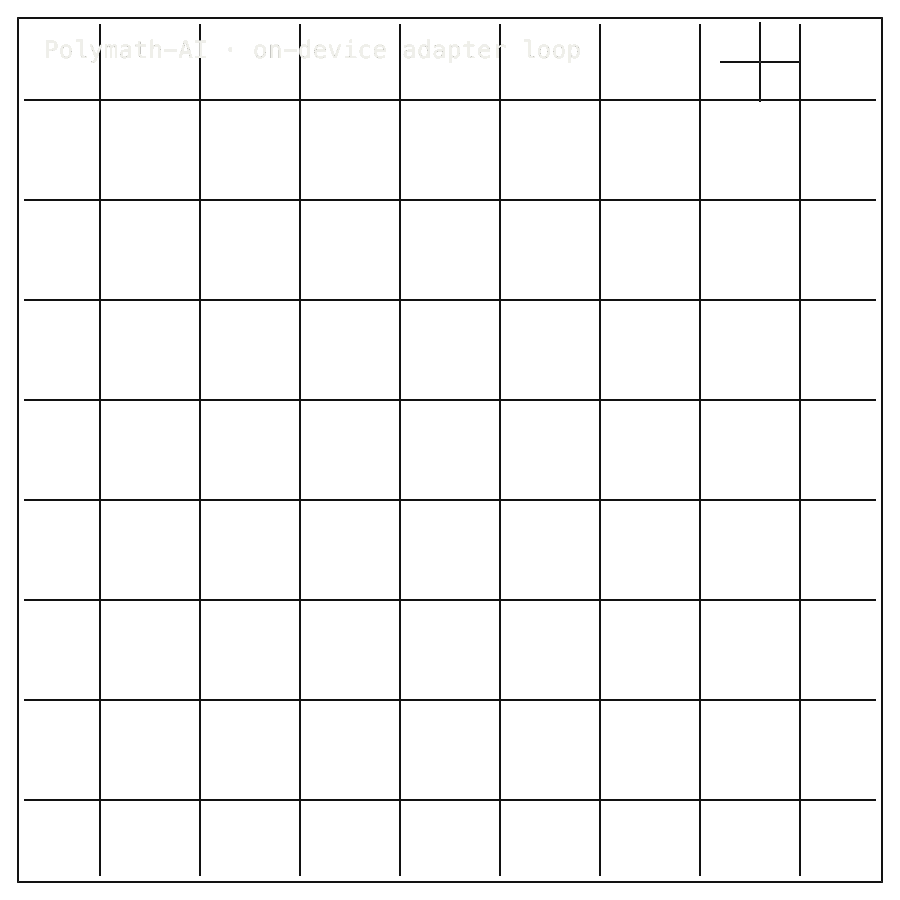

# Polymath-AI

<table>
<tr>
<td colspan="7" valign="top">
01 · Bento cell · b-cell b-hero cell-7 row-2

<b>00 · POLYMATH-AI</b> · MOBILE LLM TRAININGLIVE LANE · 081431Z

      <h1>A research lane for phone-side LLM training.</h1>
      
On-device language-model training research lane &middot; Polymath-AI &middot; PyPI 0.1.0 &middot; Snapdragon 8 Elite target

      
Polymath-AI is a training harness aimed at the <strong>Snapdragon 8 Elite (SM8750)</strong> phone chip. It trains only the first and last layers of a language model while the middle stays sealed and SHA-checked. The host smoke runs cleanly on Qwen 2.5 1.5B with the frozen middle showing <em>zero weight changes</em>. Phone compilation, licensed multilingual corpora, sustained device telemetry, and a public checkpoint are all open. This is a route, not a product.

</td>
<td colspan="5" valign="top">
02 · Polymath AI animated mechanics diagram · b-cell b-codec-mechanics cell-5 row-2
<figure>
        

        <figcaption><b>Scope:</b> host harness and selective layer training. Phone compile, sustained telemetry, licensed corpora, and public checkpoint remain open.</figcaption>
      </figure>
</td>
</tr>
<tr>
<td colspan="4" valign="top">
03 · Bento cell · b-cell b-title cell-4

<b>01 · THE GAP</b>PHONE RUN MISSING

      <h2>&ldquo;Training a language model on a phone still has no measured path from corpus to battery.&rdquo;</h2>
</td>
<td colspan="5" valign="top">
04 · Bento cell · b-cell b-fig cell-5

<b>02 · MARKETS</b>USER FIT

      

        

          
Research infra teamsbest fit

          
Mobile runtime teamsadjacent

          
Corpus &amp; license opsopen

          
Production edge AInot now

          
Consumer appsnot now

        

      

      
Best fit is the research-infrastructure and mobile-runtime audience deciding what to staff; no model-revenue claim is made.

</td>
<td colspan="3" valign="top">
05 · Bento cell · b-cell b-stat cell-3

<b>03 · VALUE</b>

      
OPENNOW

      
Public repo and PyPI exist; <b>the value is the training harness and its constraints, not a phone-trained model.</b>

</td>
</tr>
<tr>
<td colspan="3" valign="top">
06 · Bento cell · b-cell b-title is-centered cell-3

<b>04 · INSIGHT</b>

      <h2>A training harness, not a finished model.</h2>
</td>
</tr>
<tr>
<td colspan="12" valign="top">
07 · Bento cell · b-cell b-prose is-technical b-tech-panel

<b>05.0 · CURRENT TECH</b>HOST, CPU, NATIVE

        
Mobile language-model work usually means inference on the chip, with training kept in the cloud. The conventional route ships a trained model down to the device and never lets it learn there.

</td>
</tr>
<tr>
<td colspan="12" valign="top">
08 · Bento cell · b-cell b-prose is-technical b-tech-panel

<b>05.1 · OUR TECH</b>SELECTIVE LAYER TRAINING

        
Polymath trains only the boundary layers of a language model &mdash; layer 0, the final layer, and the language-model head &mdash; while every middle layer stays sealed and SHA-checked at <strong>frozen_changes = 0</strong>. Host smoke passes on <strong>Qwen 2.5 1.5B</strong>, with loss falling from <strong>14.515 to 4.449 in five steps</strong> and the middle bit-identical across the run.

</td>
</tr>
<tr>
<td colspan="3" valign="top">
09 · Bento cell · b-cell b-fig b-benchmark-mini cell-3

<b>05.2 · BENCHMARKS</b>HOST HARNESS

      

        

          
Host tests<b>PASS</b><small>reported host</small>

          
Smoke base<b>Qwen 2.5</b><small>1.5B params</small>

          
Checks<b>19</b><small>listed</small>

          
SoC<b>SM8750</b><small>SD 8 Elite resolved</small>

        

        

          
Host harnesspass

          
Frozen middle0 changes

          
Phone compileunsupported

        

      

      
<b>Device status:</b> five SM8750 phone-compile rows currently measured unsupported; host harness passes.

</td>
<td colspan="4" valign="top">
10 · Bento cell · b-cell b-title cell-4

<b>06 · MEASUREMENT</b>HOST ELO SMOKE

      <h2>Host smoke passes, phone compile remains unsupported.</h2>
</td>
</tr>
<tr>
<td colspan="8" valign="top">
11 · Bento cell · b-cell b-fig cell-8

<b>06.1 · COMPARATIVE PERFORMANCE &middot; HOST VS DEVICE STATUS</b>

      

        

          
Host harnessreported pass

          
QNN/LiteRT compileunsupported

          
Device telemetryopen

          
Licensed corpusopen

        

      

      
Host smoke &middot; <b>Qwen 2.5 1.5B, 5 training steps, loss 14.515 to 4.449</b>, frozen middle unchanged. Phone compile, licensed corpus ingestion, and sustained device telemetry are not yet measured.

</td>
</tr>
<tr>
<td colspan="12" valign="top">
12 · Bento cell · b-cell b-row-label cell-12

<b>07 · KEY METRICS</b>POLYMATH-AI HOST HARNESS &middot; PYPI 0.1.0 STALE

</td>
</tr>
<tr>
<td colspan="12" valign="top">
13 · Bento cell · b-cell b-stat

<b>07.1 · HOST TEST SURFACE</b>

      
PASS

      
Host harness pass &middot; <b>reported on developer machine</b>

</td>
</tr>
<tr>
<td colspan="12" valign="top">
14 · Bento cell · b-cell b-stat

<b>07.2 · SMOKE BASE</b>

      
Qwen 2.5&middot;1.5B

      
Smoke base model &middot; <b>frozen_changes = 0</b>

</td>
</tr>
<tr>
<td colspan="12" valign="top">
15 · Bento cell · b-cell b-stat

<b>07.3 · CHECK ROWS</b>

      
19

      
Listed status rows &middot; <b>documentation coverage</b>

</td>
</tr>
<tr>
<td colspan="12" valign="top">
16 · Bento cell · b-cell b-stat

<b>07.4 · TARGET SOC</b>

      
SD 8 Elite&middot;open

      
SM8750 resolved &middot; <b>phone compile blocked</b>

</td>
</tr>
<tr>
<td colspan="12" valign="top">
17 · Bento cell · b-cell b-stat

<b>07.5 · ON-DEVICE THROUGHPUT</b>

      
null

      
Metric absent &middot; <b>device path unsupported</b>

</td>
</tr>
<tr>
<td colspan="4" valign="top">
18 · Bento cell · b-cell b-title is-centered cell-4

<b>08 · DETERMINISM</b>FROZEN MIDDLE · SHA-CHECKED

      <h2>Frozen middle stays bit-stable while boundary layers train.</h2>
</td>
<td colspan="5" valign="top">
19 · Bento cell · b-cell b-prose is-technical cell-5

<b>08.1 · WHAT DETERMINISTIC MEANS</b>FROZEN_CHANGES = 0

      
Only the named boundary layers receive gradient updates &mdash; layer 0, the final layer, and the language-model head. The middle layers' weights are <strong>SHA-checked before and after every training pass</strong>; if any frozen weight moves, the run halts immediately and reports the offending tensor.

      
The unit of bit-exactness is <em>per-pass, host-side</em>. Five steps on Qwen 2.5 1.5B leave the frozen middle unchanged across the entire run. No on-device determinism claim is made yet; the Qualcomm Neural Network and LiteRT paths are not exercised.

</td>
<td colspan="3" valign="top">
20 · Bento cell · b-cell b-blocker cell-3

<b>08.2 · THE FIDELITY GAP</b>

      Honest Blocker &middot;
      
<em>QNN/LiteRT compile</em> on the Snapdragon 8 Elite is measured unsupported, so the scheduler cannot reach the device yet. On-device execution, sustained telemetry, licensed-corpus ingestion, and the next PyPI release all remain open. Tokenization currently bloats <strong>Zulu 2.68&times;</strong> and <strong>Greek 4.38&times;</strong> past target. No phone-trained model or public checkpoint exists.

</td>
</tr>
<tr>
<td colspan="4" valign="top">
21 · Bento cell · b-cell b-title cell-4

<b>09</b>

      <h2>FIVE PATHS FROM ONE PHONE-SIDE TRAINING LOOP.</h2>
</td>
<td colspan="4" valign="top">
22 · Bento cell · b-cell b-prose cell-4

<b>09.1 · THIS REPO'S AMBITION</b>

      
The hinge is selective continual pretraining under real mobile constraints. Polymath-AI does not promise a finished model. It builds the scheduler, corpus discipline, and frozen-middle guarantee needed to answer one question honestly &mdash; whether training a useful language model on a phone, under battery and thermal limits, is worth doing at all.

</td>
</tr>
<tr>
<td colspan="12" valign="top">
23 · Bento cell · b-cell b-title b-statement-card

<b>09.2 · WHAT WORKS NOW</b>

        <h2>Working now: host training harness on Qwen 2.5 1.5B, frozen-middle SHA-check, scheduler framing, and a resolved chip target.</h2>
</td>
</tr>
<tr>
<td colspan="12" valign="top">
24 · Bento cell · b-cell b-title b-statement-card

<b>09.3 · WHAT'S STILL OPEN</b>

        <h2>Still open: phone compile path, sustained device telemetry, licensed multilingual corpora, and a published checkpoint with release evidence.</h2>
</td>
</tr>
<tr>
<td colspan="12" valign="top">
25 · Bento cell · b-cell b-unlock

<b>09.4</b> &middot; ADAPTATION · NEAR-TERM (12&ndash;24 MO)

      
The fine-tune leaves the data centre

A mobile-runtime engineer who can land a boundary-layer training pass on a flagship chip stops needing a remote fine-tune to personalise a model. Adaptation becomes a battery decision on the device, not a procurement decision with a cloud vendor.

</td>
</tr>
<tr>
<td colspan="12" valign="top">
26 · Bento cell · b-cell b-unlock

<b>09.5</b> &middot; CORPUS CUSTODY · NEAR-TERM (12&ndash;24 MO)

      
Multilingual data stops travelling

When the training step runs on the handset, the multilingual text a model learns from no longer has to leave the phone. A speaker of an underrepresented language can contribute to their own model without their words crossing a corporate boundary.

</td>
</tr>
<tr>
<td colspan="12" valign="top">
27 · Bento cell · b-cell b-unlock

<b>09.6</b> &middot; PERSONAL MODELS · MID-TERM (24&ndash;48 MO)

      
One model, one person, one phone

If selective training holds at scale, a model can drift toward the person carrying it rather than the average of millions of strangers. The phone becomes a place where a small, personal model improves over months instead of being replaced quarterly.

</td>
</tr>
<tr>
<td colspan="12" valign="top">
28 · Bento cell · b-cell b-unlock

<b>09.7</b> &middot; RECEIPTS · MID-TERM (24&ndash;48 MO)

      
Mobile training answers to evidence

A regulator or platform reviewer who asks how an on-device model changed can be answered with a record &mdash; layer touched, update size, battery cost, quality movement &mdash; rather than a marketing claim. Phone training becomes something assessable, not just demonstrated.

</td>
</tr>
<tr>
<td colspan="12" valign="top">
29 · Bento cell · b-cell b-unlock

<b>09.8</b> &middot; LOCAL AGENCY · PARADIGM (48 MO+)

      
The phone becomes a knowledge instrument

Once training, telemetry, and corpus custody all fit inside the device, the phone stops being the last mile of someone else's model. It becomes a bounded place where a person's language, history, and tasks shape what their model knows.

</td>
</tr>
</table>
