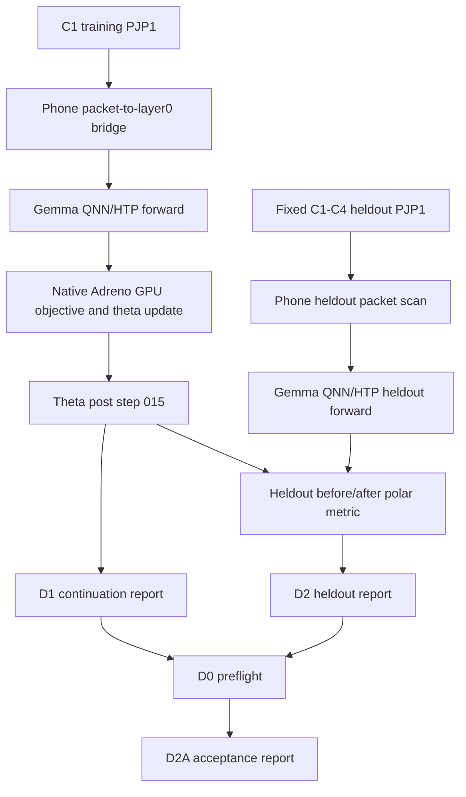

# Apex Gate D Engineering and Science Report

Date: 2026-07-05  
Repository: `/Users/Zer0pa/Polymat AI/Polymath-AI`  
Status: Gate D2A accepted for phone-local continuation plus gated fixed-heldout learning evidence.  
Primary acceptance artifact: `runtime/reports/apex_heterogeneous_cell/gate_d_acceptance_clean_c1_fullheldout_20260705T134658Z/gate_d_acceptance_report.json`  
Acceptance artifact sha256: `4e06fcc06284315fdc61528bbd4a9583740fd826cef5ca4cf4ccfd1baea09d5b`

This document is for the engineering and science team. It explains the pipeline
that was actually used, what was proven, what was not proven, why the previous
blocker existed, and what remains before any full Gemma model-quality,
language-model perplexity, or full C1/C2/C3/C4 continuation claim can be made.

## 1. Executive Summary

The current blocker was:

```text
no_accepted_phone_local_forward_backward_continuation_run_with_gated_heldout_learning_evidence
```

That blocker is now resolved for the narrow Gate D2A scope.

The accepted claim is:

```text
The RedMagic 10 Pro completed a phone-local QNN/HTP forward path plus
phone-local native Adreno GPU theta-update continuation path, then evaluated
the resulting theta state against a fixed heldout packet set with zero
train/heldout overlap and a non-positive heldout loss delta.
```

The accepted scope is intentionally narrower than the full Apex objective:

```yaml
accepted:
  phone_local_forward_backward_continuation: true
  gated_fixed_heldout_learning_evidence: true

not_accepted:
  full_gemma_model_quality: false
  language_model_perplexity: false
  full_c1_c2_c3_c4_continuation_completion: false
  comet_logging: false
```

The accepted aggregate heldout metric is:

```yaml
before_loss: 27393.12386942226
after_loss: 27090.22732081249
loss_delta: -302.8965486097695
overlap_count: 0
full_heldout_required: true
full_heldout_evaluated: true
heldout_packet_count: 2500
scanned_packet_count: 2500
evaluated_answer_bearing_steps: 2344
skipped_empty_answer_packets: 156
successful_qnn_steps: 2344
qnn_steps_match_evaluated: true
post_update_theta_sha256: 65b79f6c3127e15b26d756c352c5faa84afa81e99ff8a921f30e02b0a1b24c45
```

No raw payloads, raw phone payloads, raw phone metadata payloads, raw QNN
tensors, raw theta binaries, stdout/stderr, or secrets are embedded in the
acceptance artifact.

## 2. Artifact Index

The following artifacts are the custody anchors for this report.

| Artifact | Path | sha256 | Role |
| --- | --- | --- | --- |
| Active Apex PRD | `docs/PRD-APEX-HETEROGENEOUS-CELL-END-TO-END-2026-07-03.md` | `d90525268a264e04bb650e3bdc268630ba143132a91115031419bc74b9b81a13` | Governing execution contract after rewrite |
| Gate D2A acceptance | `runtime/reports/apex_heterogeneous_cell/gate_d_acceptance_clean_c1_fullheldout_20260705T134658Z/gate_d_acceptance_report.json` | `4e06fcc06284315fdc61528bbd4a9583740fd826cef5ca4cf4ccfd1baea09d5b` | Final accepted aggregate report |
| Gate D0 preflight | `runtime/reports/apex_heterogeneous_cell/gate_d0_preflight_clean_c1_fullheldout_20260705T134648Z/gate_d0_preflight_report.json` | `1f2fd96a8f108d4c3abb96b97e16f0d16d31a13506183f5e24a0e631fba6fee1` | Integrated readiness and binding check |
| Gate D1 continuation | `runtime/reports/apex_heterogeneous_cell/gate_d1_clean_c1_train_20260705T120052Z/gate_d1_clean_qnn_native_result.json` | `e390d5d2cd046a0da210473f1f3bf86b3eb60fe29abe0729d39a32f3ffd2939e` | Phone-local continuation mechanics |
| Gate D2 heldout | `runtime/reports/apex_heterogeneous_cell/gate_d2_clean_c1_fullheldout_20260705T120939Z/gate_d2_heldout_polar_result.json` | `77239ce6d2bb047779c34f54a86444d89e435f8ee1f8b7f7366e40b7d50e6778` | Full fixed-heldout evaluation |

## 3. What the Original Blocker Meant

The earlier blocker name was:

```text
gate_c_layer_cyclic_step_evidence_absent
```

In practical terms, that meant the reports had not proven the existence of a
real per-step ledger tying layer-cyclic forward/backward work to actual
execution. A schedule or intended loop was not enough. The gate needed
accepted step records with:

- real QNN/HTP forward evidence;
- real native Adreno update evidence;
- theta-only state mutation;
- finite loss and update norms;
- no CPU fallback claim;
- SHA continuity between produced tensors and consumed tensors;
- per-layer counts that met the gate floor.

The later blocker was broader and more important:

```text
no_accepted_phone_local_forward_backward_continuation_run_with_gated_heldout_learning_evidence
```

That was not a permanent provider blocker. It was an evidence-contract gap. The
pipeline had source evidence fragments and partial outputs, but it did not yet
have a single accepted phone-local continuation run bound to a fixed heldout
metric. The resolution was to build on the existing Gate C, Phase 1/2, QNN/HTP,
and native Adreno foundations and add the missing acceptance layer.

## 4. Systems and Roles

The executed pipeline used the existing provider split:

| System | Role in this Gate D execution |
| --- | --- |
| Mac | Control plane, report generation, validation, host-side staging, custody hashes |
| RedMagic 10 Pro | Authority execution target for phone-local QNN/HTP forward and native Adreno theta-update evidence |
| RunPod RTX 6000 Ada | Source/tool surface available for QNN tooling and future source/training work, not the authority surface for this accepted phone-local run |
| Hugging Face | Model/corpus provenance surface, not the source of an accepted model-quality claim in this run |
| Comet | Not used. Dashboard output is not evidence. Numeric-only logging remains deferred |

The current successful path is backend-neutral at the requirements level but
uses Adreno/Vulkan in the accepted implementation. Vulkan should be read as an
implementation choice that worked for the current native phone path, not as a
permanent scientific requirement. OpenCL, QNN custom ops, NNAPI, or another
phone-local backend can be substituted later if they produce equivalent or
stronger authority evidence.

## 5. Pipeline Map

The accepted evidence chain is:

```text
C1 training packet material
  -> phone-local packet-to-layer0 bridge
  -> QNN/HTP Gemma forward output
  -> native Adreno GPU theta objective/gradient/update
  -> chained theta-only adapter state
  -> fixed C1-C4 heldout packet material
  -> phone-local QNN/HTP heldout forward output
  -> heldout metric before/after the accepted theta
  -> D0 preflight binding check
  -> D2A aggregate acceptance report
```

The acceptance report states the authority metric as:

```text
corpus row -> tokenizer/FSM/JL packet -> Gemma QNN/HTP forward evidence ->
Adreno GPU objective/gradient/update -> theta-only adapter state change ->
fixed heldout before/after metric
```

### 5.1 Diagram



## 6. Engineering Changes Made

The work deliberately used existing foundations rather than replacing the
pipeline with an ad hoc path.

### 6.1 PRD rewrite

The Apex PRD was rewritten as an active single-agent Gate D execution contract:

```text
docs/PRD-APEX-HETEROGENEOUS-CELL-END-TO-END-2026-07-03.md
```

The PRD now distinguishes:

- Gate D0: integrated preflight and source binding;
- Gate D1: phone-local forward/backward continuation mechanics;
- Gate D2: heldout learning evidence;
- Gate D2A: metadata-only acceptance report;
- Gate D3: research-quality comparators and stronger scientific tests.

### 6.2 Native theta-update fix

The native Adreno/Vulkan theta update path was repaired so the objective is
theta-dependent. Without this, a theta update can be mechanically executed but
the science signal is weak because the objective does not properly depend on
the trained parameter.

Relevant files:

```text
native/apex_heterogeneous_cell/apex_vulkan_theta_update.comp
native/apex_heterogeneous_cell/apex_vulkan_theta_update_runner.cpp
native/apex_heterogeneous_cell/apex_vulkan_theta_adapter.cpp
native/apex_heterogeneous_cell/apex_vulkan_theta_update_spv.h
```

The important semantic change is that the prediction includes the theta term:

```text
prediction = qnn_value + theta
```

This does not create a full Gemma training loop. It establishes a theta-only
adapter objective/update path that is sensitive to the adapter state.

### 6.3 Packetizer compatibility repair

The fixed heldout material used legacy `source_kind=0`. The native packetizer
previously rejected this. The guard was repaired to preserve legacy material
instead of forcing a new corpus path:

```text
native/polar_phase2_packetizer/phase2b_native_packetizer.cpp
```

This let the existing fixed heldout material become packetized evidence without
changing the scientific target after the fact.

### 6.4 Clean D1 runner

A clean Gate D1 host runner was added:

```text
scripts/host/run_apex_gate_d_qnn_native_continuation.py
```

It stages the existing phone bridge, runs QNN/HTP forward evidence from clean C1
training packets, sanitizes QNN metadata, writes the bounded step source to the
phone, and then invokes the existing native continuation path.

The accepted D1 report status is:

```text
gate_d1_clean_qnn_native_continuation_pass
```

Key D1 facts:

```yaml
continuation_steps: 16
theta_chained_between_steps: true
final_theta_post_sha256: 65b79f6c3127e15b26d756c352c5faa84afa81e99ff8a921f30e02b0a1b24c45
raw_stdout_stderr_embedded: false
raw_qnn_tensors_embedded: false
raw_theta_binaries_embedded: false
```

### 6.5 Full-heldout D2 evaluator

The D2 evaluator and host wrapper were added:

```text
scripts/termux/run_apex_gate_d_heldout_polar_evaluator.py
scripts/host/run_apex_gate_d_heldout_polar_evaluation.py
```

The evaluator computes a phone-local aggregate heldout objective over QNN output
plus the accepted theta state against the fixed target polar material. It emits
metadata only.

The packet-to-layer0 bridge was extended with a controlled option to skip
empty-answer packets while still proving that the full heldout packet set was
scanned:

```text
scripts/termux/run_apex_packet_to_layer0_bridge.py
```

That option is important because the fixed heldout set has 2500 packets, of
which 156 are empty-answer packets. The accepted full-heldout predicate is:

```text
evaluated_answer_bearing_steps + skipped_empty_answer_packets == scanned_packet_count == heldout_packet_count
```

In the accepted run:

```text
2344 + 156 == 2500 == 2500
```

### 6.6 Gate D validator and D2A acceptance layer

The validator module was added and extended:

```text
polymath_ai/polar/apex_gate_d.py
```

The final acceptance runner was added:

```text
scripts/host/run_apex_gate_d_acceptance_report.py
```

The acceptance layer exists to prevent a preflight pass, a partial D1 pass, or a
prefix D2 run from being promoted as final authority evidence. D2A fails closed
unless all of the following are true:

- D0 is ready with no blockers;
- D1 validates as phone-local continuation with at least 16 steps;
- D2 validates as full-heldout, not prefix-heldout;
- D2 QNN step count matches evaluated answer-bearing heldout steps;
- D0, D1, and D2 bind to the same post-update theta SHA;
- heldout loss delta is finite and non-positive;
- train/heldout overlap is zero;
- raw-boundary predicates are clean.

## 7. Accepted Run Details

### 7.1 D0 preflight

Path:

```text
runtime/reports/apex_heterogeneous_cell/gate_d0_preflight_clean_c1_fullheldout_20260705T134648Z/gate_d0_preflight_report.json
```

Status:

```text
gate_d0_preflight_ready
```

The D0 report binds:

```yaml
authority_theta_post_sha256: 65b79f6c3127e15b26d756c352c5faa84afa81e99ff8a921f30e02b0a1b24c45
continuation_theta_post_sha256: 65b79f6c3127e15b26d756c352c5faa84afa81e99ff8a921f30e02b0a1b24c45
heldout_bound_to_authority_post_theta: true
```

D0 itself is not an acceptance claim. It is a readiness and binding report.

### 7.2 D1 continuation

Path:

```text
runtime/reports/apex_heterogeneous_cell/gate_d1_clean_c1_train_20260705T120052Z/gate_d1_clean_qnn_native_result.json
```

Status:

```text
gate_d1_clean_qnn_native_continuation_pass
```

Accepted facts:

```yaml
successful_steps: 16
theta_chained_between_steps: true
initial_theta_source: zeros_via_native_runner_none_arg
final_theta_post_sha256: 65b79f6c3127e15b26d756c352c5faa84afa81e99ff8a921f30e02b0a1b24c45
```

Science interpretation:

The D1 run proves a phone-local adapter-continuation mechanism exists and can
chain theta state through multiple steps using QNN/HTP forward evidence and
native Adreno update work. It does not prove general language-model
improvement. It does not prove full Gemma parameter training.

### 7.3 D2 full fixed-heldout evaluation

Path:

```text
runtime/reports/apex_heterogeneous_cell/gate_d2_clean_c1_fullheldout_20260705T120939Z/gate_d2_heldout_polar_result.json
```

Status:

```text
gate_d2_heldout_pass
```

Accepted facts:

```yaml
full_heldout_required: true
full_heldout_evaluated: true
heldout_packet_count: 2500
scanned_packet_count: 2500
evaluated_answer_bearing_steps: 2344
skipped_empty_answer_packets: 156
active_answer_slots: 31944
scalar_count: 8177664
overlap_count: 0
no_train_heldout_overlap: true
before_loss: 27393.12386942226
after_loss: 27090.22732081249
loss_delta: -302.8965486097695
measurement_real_evidence: true
fabricated_metric: false
synthetic_metric: false
```

Science interpretation:

The D2 metric is a polar adapter heldout objective, not language-model
perplexity. It shows that, under the declared polar objective and fixed heldout
material, the accepted post-update theta reduces the heldout aggregate loss
relative to the before-theta baseline.

### 7.4 D2A acceptance

Path:

```text
runtime/reports/apex_heterogeneous_cell/gate_d_acceptance_clean_c1_fullheldout_20260705T134658Z/gate_d_acceptance_report.json
```

Status:

```text
gate_d2_phone_local_heldout_learning_evidence_pass
```

D2A is the final authority report for this stage. It accepts only:

```yaml
phone_local_forward_backward_continuation: true
gated_fixed_heldout_learning_evidence: true
```

D2A explicitly does not accept:

```yaml
c1_c4_corpus_continuation_complete: false
full_gemma_model_quality: false
language_model_perplexity: false
comet_logging: false
```

## 8. Scientific Meaning of the Result

The result is meaningful because it closes a specific causal loop:

1. A training packet source was used for a phone-local continuation run.
2. The phone generated QNN/HTP forward evidence.
3. The native Adreno path used that evidence in a theta-dependent objective.
4. Theta state changed through a chained continuation path.
5. The exact accepted theta SHA was then used in the full fixed-heldout
   evaluation.
6. Heldout material had zero overlap with the training records used for the D1
   continuation.
7. The heldout aggregate objective improved under the declared metric.

This is a real engineering milestone. It is the first accepted phone-local
forward/backward-style continuation run with gated heldout learning evidence in
this project line.

It is not yet a full model-training result. The current trainable state is a
theta-only polar adapter objective, not the complete Gemma parameter set. The
metric is an internal polar heldout loss, not standard language-model
perplexity. The run is bounded and small relative to a full C1/C2/C3/C4
continuation.

## 9. Why This Is Not Yet a Full Gemma Model-Quality Claim

A full Gemma model-quality claim would require showing that the resulting model
is better as a language model, not merely that a polar adapter objective
improves under a heldout polar metric.

Current gaps:

| Gap | Current state | Required for full model-quality claim |
| --- | --- | --- |
| Trainable surface | Theta-only adapter state | Clearly defined Gemma trainable surface, such as adapter, LoRA, selected blocks, or full weights |
| Objective | Polar adapter MSE-style objective over QNN output plus theta | Language-model objective or a validated surrogate shown to correlate with LM quality |
| Evaluation | Fixed heldout polar metric | LM benchmarks, perplexity, task metrics, or validated domain metrics |
| Scale | 16 continuation training steps and full fixed heldout evaluation | Sustained training schedule with enough steps/tokens to support model-quality inference |
| Baselines | Before/after theta comparison | Comparators against no-update, random theta, CPU reference, conventional adapter, and possibly RunPod GPU training reference |
| Statistical strength | One accepted full-heldout aggregate | Repeated seeds/shards, confidence intervals, regression checks, and ablations |
| Model artifact | Theta binary remains phone-local and raw-boundary protected | Custodied deployable model or adapter artifact with reproducible provenance, if release is intended |

Minimum next evidence for a bounded model-quality claim:

```yaml
model_quality_gate:
  model_surface: explicitly declared adapter or weight subset
  tokenizer_and_eval_corpus: fixed before training
  baseline: frozen no-update model and at least one conventional adapter baseline
  metric: task metric or perplexity-like loss tied to text prediction
  evaluation_scope: disjoint heldout corpus with no overlap
  repetitions: multiple runs or enough shard coverage for stability
  raw_boundary: no raw data or secrets in reports
```

## 10. Why This Is Not Yet a Language-Model Perplexity Claim

Perplexity has a specific meaning: it is derived from token-level negative
log-likelihood under the language-model distribution. The accepted Gate D2
metric is not that. It is a polar heldout objective computed over phone-local
QNN output plus theta against target polar material.

Current metric:

```text
polar heldout before/after objective
```

Missing for perplexity:

- decoder/logit path from the trained state to token probabilities;
- target next-token labels under a fixed text corpus;
- log-softmax or equivalent probability computation;
- masking and sequence accounting compatible with standard LM evaluation;
- exact token count and NLL aggregation;
- comparison to before-state perplexity and frozen baseline;
- proof that all evaluated text is disjoint from train material;
- stable handling of BOS/EOS, padding, packed sequences, and answer masks;
- calibration that the polar surrogate improvement maps to perplexity
  improvement, if a direct perplexity path remains unavailable.

The shortest path to a real perplexity claim is likely:

1. Preserve the accepted D1/D2 theta-binding discipline.
2. Add a decoder/logit evaluation surface that consumes the post-update adapter
   state.
3. Run a fixed text heldout set with token-level targets.
4. Emit metadata-only NLL/perplexity aggregates.
5. Validate overlap exclusion, finite metrics, and before/after delta.

Until that exists, the correct phrase is:

```text
accepted polar heldout learning evidence
```

not:

```text
accepted language-model perplexity improvement
```

## 11. Why This Is Not Yet C1/C2/C3/C4 Continuation Completion

The accepted clean D1 continuation used a clean C1 training source for a bounded
16-step run. The heldout material is fixed C1-C4 heldout material. This does not
mean the C1, C2, C3, and C4 continuation program is complete.

Current accepted continuation scope:

```yaml
training_source_used_for_clean_d1: C1 packet material
training_steps: 16
heldout_scope: fixed C1-C4 heldout PJP1
heldout_packets: 2500
accepted_continuation_complete_for_all_corpora: false
```

Remaining corpus-continuation gaps:

| Gap | Why it matters | Required closure |
| --- | --- | --- |
| C2 continuation | Need evidence beyond C1-only update | Run C2 continuation with same D1/D2A discipline |
| C3 continuation | Need later corpus stage coverage | Run C3 continuation with same D1/D2A discipline |
| C4 continuation | Need final corpus stage coverage | Run C4 continuation with same D1/D2A discipline |
| Cross-stage custody | Need prove C1 -> C2 -> C3 -> C4 theta lineage | Immutable theta chain and report hash chain across stages |
| No catastrophic regression | Later stages may regress earlier heldouts | Evaluate per-stage and cumulative heldout sets |
| Schedule definition | Need know whether continuation is sequential, interleaved, or layer-cyclic | Declare schedule before execution and validate step ledger |
| Stop criteria | Need objective stop, not process stop | Predeclare metric floors, regression bounds, thermal/time budgets |

A complete C1-C4 continuation claim should require at least:

```yaml
c1_c4_completion_gate:
  stage_order: declared before execution
  per_stage_d1: pass
  per_stage_d2: pass
  cumulative_d2a: pass
  theta_chain:
    c1_post == c2_pre
    c2_post == c3_pre
    c3_post == c4_pre
  heldout:
    fixed_per_stage: true
    fixed_cumulative: true
    overlap_count: 0
  regression_policy:
    no_stage_regression_without_falsification_report: true
```

## 12. Engineering Gaps Before Next Acceptance Level

The accepted Gate D2A report should become the foundation for the next gates,
not the end of the project.

### 12.1 Reproducibility

Need:

- one-command host orchestration for D0 -> D1 -> D2 -> D2A;
- manifest that records exact scripts, hashes, argv hashes, return codes, and
  allowed output boundaries;
- independent rerun on a fresh run directory;
- deterministic report minimization so per-step metadata does not bloat
  aggregate reports.

### 12.2 Backend abstraction

Current success uses Adreno/Vulkan. The PRD is backend-neutral, but the code
still has Vulkan-specific paths.

Need:

- backend interface for `objective_gradient_update`;
- equivalent Adreno/OpenCL or QNN custom-op implementation if it is faster or
  more robust;
- backend-specific validator fields that do not assume Vulkan;
- no CPU fallback acceptance for any claimed phone-local accelerator backend.

### 12.3 Training surface expansion

Current theta is small and adapter-like.

Need:

- explicit trainable parameter contract;
- multi-theta or low-rank adapter expansion;
- proof that updates remain bounded and finite;
- state-delta accounting for each trainable component;
- memory, thermal, and throughput envelope.

### 12.4 Metric expansion

Current metric is useful but internal.

Need:

- direct LM NLL/perplexity path;
- task-level heldout metrics if perplexity is not sufficient;
- random/no-update/conventional adapter controls;
- repeated runs and confidence intervals.

### 12.5 Custody and publication readiness

Need:

- final manifest for accepted metadata artifacts;
- no raw payloads in git;
- model or adapter artifact policy;
- Comet numeric-only logging decision and payload review;
- GitHub custody commit or PR with only code/docs/metadata-safe reports.

## 13. Science Gaps and Proposed D3 Tests

D3 should answer whether the accepted polar-adapter learning signal is robust,
useful, and worth scaling.

### 13.1 Surrogate validity

Question:

```text
Does the polar heldout objective predict downstream language-model or task
quality?
```

Tests:

- compare polar loss delta to direct NLL/perplexity delta once decoder eval
  exists;
- run no-update and random-theta controls;
- run multiple shards and check whether polar loss improvement is stable;
- test whether improvement survives heldout set changes.

### 13.2 Layer-cyclic schedule value

Question:

```text
Does fixed layer-cyclic selective backpropagation help, or is it just a
mechanical schedule?
```

Tests:

- fixed cyclic schedule versus random layer schedule;
- layer 0 only versus layer 1 only versus alternating layers;
- data-driven sparse update schedule if a reliable signal exists;
- compare update norm, heldout delta, and thermal/time cost.

### 13.3 Binary/JL projection signal

Question:

```text
Does the binary/JL/polar projection preserve useful adaptation signal?
```

Tests:

- polar objective versus float embedding target;
- binary projection dimensionality sweep;
- answer-mask sensitivity;
- target-polar stability under tokenizer and packetization changes.

### 13.4 Phone-local efficiency

Question:

```text
Can this run long enough on the RedMagic 10 Pro to be useful?
```

Tests:

- sustained steps/hour;
- thermal throttling;
- storage write amplification;
- QNN/HTP latency distribution;
- Adreno update latency distribution;
- battery and power envelope if measurable.

### 13.5 RunPod reference comparison

Question:

```text
Does the phone-local path produce a comparable update direction to a known
GPU reference?
```

Tests:

- bounded RunPod RTX 6000 Ada reference on the same packet subset;
- compare gradient or theta-delta direction where allowed;
- compare heldout metric delta under the same theta shape;
- use RunPod for source/tool validation, not as authority substitute for
  phone-local claims.

## 14. Recommended Next Execution Plan

The next phase should not restart the architecture. It should build directly on
Gate D2A.

### Step 1: Freeze Gate D2A custody

Create a metadata-only manifest that includes:

- PRD hash;
- D0/D1/D2/D2A hashes;
- script hashes;
- test command results;
- raw-boundary statement;
- nonclaims.

Do not include raw payloads or theta binaries.

### Step 2: Make D0 -> D1 -> D2 -> D2A a single bounded command

Build a host runner that executes the full accepted path with explicit bounds:

```text
scripts/host/run_apex_gate_d_full_authority_path.py
```

The runner should only emit aggregate metadata and should fail closed on the
first missing green field.

### Step 3: Run C2 continuation under the same D2A discipline

Use the C1 run as the template. For C2:

- predeclare train source;
- predeclare heldout source;
- prove overlap count zero;
- run D1 continuation;
- run full D2 heldout;
- produce D2A acceptance or falsification.

Do not promote C2 until its own D2A passes.

### Step 4: Add direct perplexity evaluation path

This is the major science gap. The team should add a separate gate:

```text
Gate E: token-level heldout NLL/perplexity evaluation
```

Gate E should consume the accepted theta state and evaluate a fixed heldout text
corpus with next-token targets.

### Step 5: Add D3 comparators

Run the comparator suite only after the single-command Gate D path is stable.
The first comparators should be:

- no-update theta;
- random theta;
- conventional small adapter baseline;
- RunPod reference update on the same packet subset;
- alternate layer schedule.

## 15. What the Team Should Say Now

Correct:

```text
We have accepted metadata-only evidence for a RedMagic 10 Pro phone-local
QNN/HTP plus native Adreno theta-update continuation path, with full fixed
heldout polar learning evidence and zero train/heldout overlap.
```

Correct:

```text
The heldout polar metric improved from 27393.12386942226 to
27090.22732081249, delta -302.8965486097695, over 2344 answer-bearing
heldout steps from 2500 scanned heldout packets.
```

Incorrect:

```text
We trained Gemma to better language-model quality.
```

Incorrect:

```text
We have a perplexity improvement.
```

Incorrect:

```text
C1/C2/C3/C4 continuation is complete.
```

Incorrect:

```text
Comet proves the result.
```

## 16. Verification Run

The targeted code validation for the Gate D acceptance layer passed:

```text
python3 -m py_compile \
  polymath_ai/polar/apex_gate_d.py \
  scripts/host/run_apex_gate_d_acceptance_report.py \
  scripts/host/run_apex_gate_d_preflight.py \
  scripts/termux/run_apex_packet_to_layer0_bridge.py \
  scripts/termux/run_apex_gate_d_heldout_polar_evaluator.py \
  scripts/host/run_apex_gate_d_qnn_native_continuation.py \
  scripts/host/run_apex_gate_d_heldout_polar_evaluation.py
```

Result:

```text
pass
```

Targeted tests:

```text
python3 -m pytest -q tests/test_apex_gate_d.py
```

Result:

```text
6 passed
```

## 17. Bottom Line

The project now has a real accepted Gate D2A evidence point. It proves the
phone-local continuation and gated fixed-heldout polar learning path, not full
Gemma quality. The right next move is to freeze this as the new foundation,
make it reproducible as a single bounded command, then extend across C2/C3/C4
and add a direct language-model perplexity gate.
