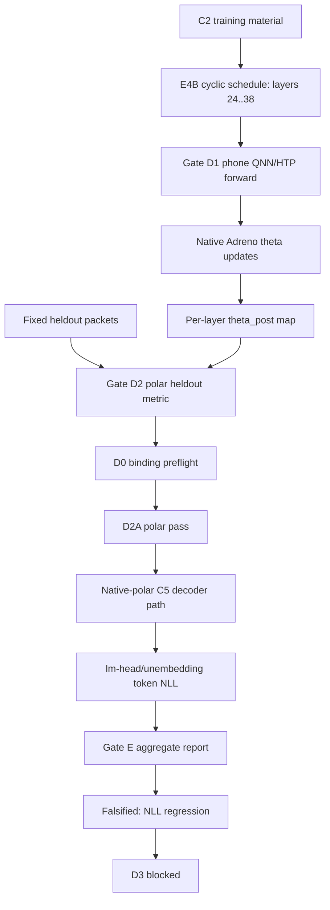

# Apex Gate E Native-Polar Falsification Engineering and Science Report

Date: 2026-07-06

Repository: `/Users/Zer0pa/Polymat AI/Polymath-AI`

Prior reports extended:

```text
docs/APEX-GATE-D-ENGINEERING-SCIENCE-REPORT-2026-07-05.md
docs/APEX-GATE-D-TO-E-ENGINEERING-SCIENCE-REPORT-2026-07-05.md
```

Prior report hashes at this report time:

```text
013d91b8d7f5150f7a176a7bb595dd9a3a553f520967e91381288fdd2808adac  docs/APEX-GATE-D-ENGINEERING-SCIENCE-REPORT-2026-07-05.md
d2db04605ecad4e531b50886fd8b4bffc4cfcdd08b2d5f229ec5916ba189af7f  docs/APEX-GATE-D-TO-E-ENGINEERING-SCIENCE-REPORT-2026-07-05.md
```

Governing PRD:

```text
docs/PRD-APEX-HETEROGENEOUS-CELL-END-TO-END-2026-07-03.md
```

Governing PRD sha256 at this report time:

```text
b12e64b57a700e70243b6b88aa47e880bb3eeec07c107cbde4f90db9da069a84
```

Primary Gate E artifact:

```text
runtime/reports/apex_heterogeneous_cell/gate_e_native_polar_c2_20260705T223535Z/gate_e_token_nll_perplexity_report.json
```

Primary Gate E artifact sha256:

```text
ac04824d30948f096efdd8767a5c140407954063743c3cd889e29fc618ed8217
```

Current verdict:

```yaml
c2_gate_d2a:
  status: passed
  metric: fixed_heldout_polar_loss_delta
  before_loss: 3040.3564704610885
  after_loss: 3037.742842791428
  loss_delta: -2.613627669660673
  theta_identity: per_layer_24_38

c2_gate_e_native_polar:
  infrastructure_status: executed
  native_polar_consumed_by_logits: true
  rank16_cartesian_materialization_used: false
  lm_head_or_unembedding_present: true
  final_status: falsified
  first_missing_green_field: gate_e_nll_regression

c2_gate_e_authority_metric:
  before_nll_per_token: 14.538868526231177
  after_nll_per_token: 14.541084249294583
  nll_delta_per_token: 0.0022157230634061165
  before_perplexity: 2061343.5279915193
  after_perplexity: 2065915.9581368894
  perplexity_delta: 4572.4301453700755

surrogate_validity:
  polar_loss_delta: -2.613627669660673
  nll_delta_per_token: 0.0022157230634061165
  direction_agreement: false
  verdict: polar_nll_direction_diverge

gate_d3:
  status: blocked_fail_closed
  reason: Gate E did not pass

c3_full_continuation:
  status: not_started
  measured_e4b_tokens_per_second: 3.8524271594921284
  projected_single_pass_hours: 64.76494217612007
  projected_single_pass_days: 2.698539257338336
```

This is not a success narrative. It is the latest science state after the
native-polar Gate E path was implemented far enough to answer the real question.
The answer is negative for the current C2 theta state: the polar surrogate
improved, but token-level language-model NLL worsened.

## 1. Executive Summary

The previous Gate D reports established phone-local continuation mechanics and
fixed-heldout polar improvement. They did not establish language-model quality.
The July 5 D-to-E report then isolated the next hard blocker: the C5 full
decoder scorer expected a rank-16 Cartesian adapter payload, while the accepted
polar theta state is native 1024-byte per-layer polar state. The rank-16 shim
was explicitly rejected because it would change the trained representation and
turn Gate E into a surrogate adapter test.

That interface blocker is now resolved for C2 Gate E. The C5/Gate E path
consumed native polar r/theta state directly, bound the theta state per layer
over the E4B 24..38 cyclic schedule, found the lm-head/unembedding surface, and
computed token-level before/after NLL and perplexity.

The result falsified promotion:

```text
polar heldout loss improved:       -2.613627669660673
token NLL per token worsened:      +0.0022157230634061165
perplexity worsened:               +4572.4301453700755
surrogate direction agreement:     false
```

The scientific conclusion is narrow and important:

```text
For the C2 E4B layer-24..38 native-polar theta state measured here, the Gate D
polar surrogate is not a valid promotion signal for token-level language-model
NLL. Gate E correctly prevents D3 and full C3/C4 continuation from being
treated as progress.
```

Accepted in this report:

```yaml
accepted:
  c2_gate_d2a_polar_pass: true
  c5_native_polar_consumption_path: true
  rank16_cartesian_shim_rejected_and_unused: true
  per_layer_theta_identity_24_38_bound: true
  lm_head_or_unembedding_present: true
  token_level_nll_and_perplexity_computed: true
  gate_e_falsification_logged_to_comet: true
  c3_throughput_checkpoint_measured_from_authority_telemetry: true
  layer24_jl_vs_raw_materialization_ablation_measured: true
```

Not accepted:

```yaml
not_accepted:
  gate_e_pass: false
  language_model_quality_improvement: false
  surrogate_validity_for_c2: false
  d3_comparator_execution: false
  full_c3_continuation_start: false
  binary_jl_qnn_execution_claim: false
  c2_ple_stall_fraction_measured: false
```

## 2. Artifact Index

All artifacts below are metadata reports or bounded evidence reports. They do
not embed raw QNN tensors, raw theta binaries, model weights, service tokens,
raw stdout/stderr, or raw corpus payloads.

| Artifact | Path | sha256 | Role |
| --- | --- | --- | --- |
| Governing PRD | `docs/PRD-APEX-HETEROGENEOUS-CELL-END-TO-END-2026-07-03.md` | `b12e64b57a700e70243b6b88aa47e880bb3eeec07c107cbde4f90db9da069a84` | Current authority contract |
| Prior Gate D report | `docs/APEX-GATE-D-ENGINEERING-SCIENCE-REPORT-2026-07-05.md` | `013d91b8d7f5150f7a176a7bb595dd9a3a553f520967e91381288fdd2808adac` | C1 Gate D mechanism report |
| Prior D-to-E report | `docs/APEX-GATE-D-TO-E-ENGINEERING-SCIENCE-REPORT-2026-07-05.md` | `d2db04605ecad4e531b50886fd8b4bffc4cfcdd08b2d5f229ec5916ba189af7f` | Pre-native-polar Gate E blocker report |
| Latest handoff | `docs/HANDOFF-APEX-GATE-E-C2-NATIVE-POLAR-FALSIFIED-2026-07-06.md` | `436daeb81850c8a20303ba26f628f78961f06ea18a22cf6227d87bca23776ce8` | Operational takeover packet |
| C2 D1 continuation | `runtime/reports/apex_heterogeneous_cell/gate_d1_e4b_c2_20260705T223535Z/gate_d1_chained_vulkan_host_result.json` | `a83335a2aae4f1d9813225646dcfce323db41730fb4a4cbab61aacdad5e0a977` | Phone-local layer-cyclic continuation |
| C2 D2 heldout | `runtime/reports/apex_heterogeneous_cell/gate_d2_e4b_c2_full2500_20260705T223535Z/gate_d2_heldout_polar_result.json` | `0a303d80be6a8915bca422625913c11355219e1d5a43bed7cb967ff6cece8e82` | Fixed-heldout polar evaluation |
| C2 D0 preflight | `runtime/reports/apex_heterogeneous_cell/gate_d0_e4b_c2_full2500_20260705T223535Z/gate_d0_preflight_report.json` | `f9fa482c02e4474798cb229d11bb8b91d42ad6bd2f040ac0cf00c93c5cdd7b01` | Binding/preflight check |
| C2 D2A acceptance | `runtime/reports/apex_heterogeneous_cell/gate_d2a_e4b_c2_full2500_20260705T223535Z/gate_d_acceptance_report.json` | `2353369e19c09f56fcb4161699825cc13b2902a5f0926bb2470abb1bb92ae999` | Polar pass accepted for Gate D scope |
| Gate E heldout split identity | `runtime/reports/apex_heterogeneous_cell/gate_e_native_polar_c2_20260705T223535Z/gate_e_heldout_split_identity.json` | `4e5eb8ca097640daee5477c0f321719af8e853d2319209e04abb1d0506280bf5` | Fixed token-NLL heldout identity |
| Native-polar scorer report | `runtime/reports/apex_heterogeneous_cell/gate_e_native_polar_c2_20260705T223535Z/native_polar_scorer_report.json` | `27c899e929c6d7e3d3789e651068d69cf5b613d392e1e286d6c11ad82efd9c73` | Native-polar decoder/scorer execution |
| Gate E NLL/perplexity report | `runtime/reports/apex_heterogeneous_cell/gate_e_native_polar_c2_20260705T223535Z/gate_e_token_nll_perplexity_report.json` | `ac04824d30948f096efdd8767a5c140407954063743c3cd889e29fc618ed8217` | Final Gate E falsification report |
| Gate E Comet result | `runtime/reports/apex_heterogeneous_cell/gate_e_native_polar_c2_20260705T223535Z/gate_e_comet_logging_result.json` | `ca075a4171b8b0a66ea33a2aeac5d6aa9cf07ab43c486864af1acdb4b8154e61` | Metadata-only Comet logging |
| D3 blocked report | `runtime/reports/apex_heterogeneous_cell/gate_e_native_polar_c2_20260705T223535Z/gate_d3_blocked_by_gate_e_report.json` | `dbc2d4398995efcf4802451f68d7c29a048d586dd8dc2c4bf63f5fe7d1cd6a95` | Fail-closed D3 status |
| C3 throughput checkpoint | `runtime/reports/apex_heterogeneous_cell/c3_e4b_throughput_checkpoint_20260706T_after_gate_e/c3_e4b_throughput_checkpoint.json` | `f9159ff4b03966d1c5b299cfdc4ef8732c3b8162f268793e83c0e90fcfba3ea4` | Full-C3 start checkpoint |
| Layer-24 JL ablation | `runtime/reports/apex_heterogeneous_cell/c3_e4b_throughput_checkpoint_20260706T_after_gate_e/layer24_jl_binary_vs_raw_embedding_ablation.json` | `7a82ed2cfab27f3140c1de88d253e247d1d18f4288c1b886821f55d989fc6081` | Binary-JL vs raw materialization evidence |
| PLE retrofit report | `runtime/reports/apex_heterogeneous_cell/gate_d1_e4b_c2_20260705T223535Z/ple_stall_fraction_retrofit_report.json` | `7020f3fe2ab3622bd6905d098a4b410261a5881f137e622afa4a0fae7152b1d5` | Honest C2 retrofit: hooks absent |

Token-NLL JSONL is retained outside the repo:

```text
/Users/Zer0pa/Polymat AI/runtime/tmp/apex_gate_e_c2_20260705T223535Z/gate_e_token_nll.jsonl
sha256: d3af3e8a3001570b8f346c46d13e95cad55bc4a7c79ca7d7d00e0640df162a77
```

## 3. What Changed Versus the July 5 D-to-E Report

The July 5 D-to-E report stopped at an interface blocker:

```text
c5_full_decoder_rank16_adapter_payload_size_mismatch
```

That was not a model-quality result. It meant the old C5 scorer expected a
rank-16 Cartesian adapter payload while the accepted training state was native
polar theta. The approved architecture rejected a shim that materialized
Cartesian A/B matrices from theta. The correct fix was to make C5/Gate E consume
native polar state.

The July 6 state is different:

```yaml
previous_state:
  gate_e_token_nll_records: absent
  gate_e_perplexity: absent
  blocker_type: decoder_adapter_interface

current_state:
  gate_e_token_nll_records: present
  gate_e_perplexity: present
  blocker_type: authority_metric_regression
```

The blocker moved from implementation absence to scientific falsification.
That is real progress because the top gate can now reject the current training
strategy for the right reason.

## 4. Sovereign Acceptance Logic

The acceptance hierarchy remains:

1. Gate D2A may accept phone-local continuation plus fixed-heldout polar
   improvement.
2. Gate D2A may not claim language-model quality.
3. Gate E must consume the accepted theta state through the native decoder/logit
   surface and compute token-level NLL/perplexity.
4. Gate E must reject rank-16 Cartesian adapter materialization from theta.
5. Gate E must compare polar delta direction against token-NLL direction.
6. D3 must stay blocked unless Gate E passes.
7. Comet is required for promoted or falsified Gate E evidence, but dashboard
   existence is not evidence.

The current Gate E did exactly this:

```yaml
native_polar_consumed_by_logits: true
rank16_cartesian_materialization_used: false
lm_head_or_unembedding_present: true
token_nll_records_present: true
surrogate_direction_agreement: false
final_status: falsified
```

The native scorer's local status field `gate_e_token_nll_passed` means the
scorer produced valid token-NLL records. It does not mean Gate E passed. The
aggregate Gate E report is sovereign, and its status is `falsified`.

## 5. Pipeline Map

The C2 execution chain now has two distinct evidence layers:

```text
C2 corpus rows
  -> E4B layer-cyclic schedule over layers 24..38
  -> Gate D1 phone-local QNN/HTP forward plus native Adreno theta updates
  -> per-layer theta_post identity
  -> Gate D2 fixed-heldout polar evaluation
  -> Gate D0 binding preflight
  -> Gate D2A polar acceptance
  -> Gate E native-polar decoder/logit scorer
  -> token-level before/after NLL and perplexity
  -> surrogate-validity verdict
  -> D3 stop or comparator suite
```

### 5.1 Diagram



## 6. C2 Gate D Baseline

The C2 D2A result is a real polar-surrogate pass:

```yaml
status: gate_d2_phone_local_heldout_learning_evidence_pass
before_loss: 3040.3564704610885
after_loss: 3037.742842791428
loss_delta: -2.613627669660673
overlap_count: 0
heldout_packet_count: 2500
scanned_packet_count: 2500
evaluated_answer_bearing_steps: 2344
skipped_empty_answer_packets: 156
successful_qnn_steps: 2344
qnn_steps_match_evaluated: true
theta_post_sha256: e39db9f0bef0d422f85d54a1ba77860248c3721d18985eb88b535959295d983b
```

The per-layer theta identity is independently tracked over the frozen C2 E4B
layer schedule:

```text
layers: 24,25,26,27,28,29,30,31,32,33,34,35,36,37,38
```

The important change from earlier single-layer or single-SHA reporting is that
Gate E now binds to the D2A per-layer theta map. That prevents a stale
single-SHA sentinel from masquerading as active C2 identity.

## 7. Gate E Native-Polar Decoder Contract

The native-polar Gate E contract requires:

```yaml
polar_theta_state:
  format: native polar r/theta
  theta_payload_size_per_layer_bytes: 1024
  rank16_cartesian_materialization_allowed: false
  per_layer_identity_required: true

decoder_path:
  consumes_native_polar_in_logits: true
  requires_lm_head_or_unembedding: true
  emits_token_level_nll_records: true
  computes_before_after_perplexity: true
```

The rejected shortcut remains rejected:

```text
Do not materialize Cartesian rank-16 A/B matrices from theta in order to satisfy
the old C5 adapter payload shape. That changes the representation under test
and would answer a different question.
```

The current scorer evidence says:

```yaml
native_polar_consumed_by_logits: true
rank16_cartesian_materialization_used: false
native_returncode: 0
prediction_record_count: 27
token_nll_record_count: 27
lm_head_or_unembedding_present: true
```

The scorer also reports a native-polar contract hash:

```text
2df87e0e825dd059bd077b019d7f61455ea71ca306e51cb267441e77b91dcc9c
```

## 8. Gate E Authority Metric

Gate E computes:

```text
accepted phone-local theta state -> native-polar decoder/logit surface ->
token-level next-token NLL -> perplexity before/after
```

The measured token-NLL evidence is:

```yaml
record_count: 27
token_count: 27
before_nll_total: 392.54945020824175
after_nll_total: 392.60927473095376
before_nll_per_token: 14.538868526231177
after_nll_per_token: 14.541084249294583
nll_delta_per_token: 0.0022157230634061165
before_perplexity: 2061343.5279915193
after_perplexity: 2065915.9581368894
perplexity_delta: 4572.4301453700755
```

The sign is the only acceptable interpretation:

```text
after_nll_per_token > before_nll_per_token
```

Therefore C2 Gate E fails. The small magnitude does not authorize averaging it
away. The top gate is sovereign, and the direction is wrong.

## 9. Surrogate Validity Result

Gate D and Gate E disagree:

```yaml
gate_d_polar_delta: -2.613627669660673
gate_e_nll_delta_per_token: 0.0022157230634061165
direction_agreement: false
verdict: polar_nll_direction_diverge
```

This falsifies the current use of the polar heldout loss as a promotion signal
for language-model quality on this C2 native-polar E4B path.

The result does not prove that polar methods are useless. It proves the
stronger and narrower statement that this current objective, schedule, update
scale, lift/merge policy, and heldout construction do not yet produce a
positive token-NLL result under the required native decoder path.

## 10. Comet Logging and Promotion State

Gate E evidence was logged to Comet:

```yaml
workspace: zer0pa-imc
project_name: mobile-polymath-ai-training
status: logged
experiment_url: https://www.comet.com/zer0pa-imc/mobile-polymath-ai-training/01402a6db085454b99895806b93a5f8b
dry_run: false
```

Logged assets were metadata reports only:

```text
gate_e_token_nll_perplexity_report_pre_comet.json
native_polar_scorer_report.json
gate_e_heldout_split_identity.json
```

This does not promote the run. It preserves the falsification under the
mandatory logging policy. The distinction matters:

```yaml
comet_logged: true
gate_e_promoted_pass: false
```

## 11. D3 Comparator Status

D3 is blocked fail-closed:

```yaml
status: blocked_fail_closed
first_missing_green_field: gate_d3_gate_e_not_passed
required_arms:
  - no_update_theta
  - random_theta
  - conventional_adapter
  - runpod_reference
  - alternate_layer_schedule
```

Running D3 now would be reward hacking because it would compare downstream arms
against a training signal that already failed the authority metric. D3 becomes
valid after Gate E passes, or after a redesigned objective produces a new Gate E
candidate that must again face token-NLL/perplexity.

## 12. C3 Throughput Checkpoint

Before any full C3 pass, the E4B 24..38 schedule throughput was measured from
the same authority telemetry methodology used for C2 D1/D2 timing:

```yaml
steps_per_hour: 866.7961108857289
window_tokens_per_step: 16
tokens_per_second: 3.8524271594921284
c3_rows: 56138
c3_projected_tokens: 898208
projected_wall_clock_seconds: 233153.79183403228
projected_wall_clock_hours: 64.76494217612007
projected_wall_clock_days: 2.698539257338336
start_full_c3: false
```

This is not an estimate from the old layer-0 path. It is derived from C2 E4B
24..38 cyclic authority telemetry.

Interpretation caveat:

```text
Do not compare this heterogeneous NPU-forward/GPU-backward training and
validation path to published NPU-only frozen-weight inference token/second
benchmarks without saying that those benchmarks measure a different workload.
```

Full C3 is blocked for two independent reasons:

1. Gate E falsified C2.
2. The measured C3 runtime is operationally unreasonable for blind overnight
   continuation at the current rate.

## 13. JL Binary Versus Raw Embedding Ablation

The required pre-C3 ablation was run on layer 24 using the same fixed heldout
packet range:

```yaml
layer_id: 24
scanned_packet_count: 741
answer_bearing_step_count: 689

raw_float_embedding:
  bytes_moved_total: 169328640
  bytes_moved_per_step: 245760.0
  wall_clock_ms_per_step: 20.315566251088534

binary_jl_projected_input:
  bytes_moved_total: 705536
  bytes_moved_per_step: 1024.0
  wall_clock_ms_per_step: 0.05232968069666183

comparison:
  bytes_moved_ratio_raw_over_binary: 240.0
  wall_clock_ratio_raw_over_binary: 388.2226296936776
```

This supports the bandwidth motivation for binary JL materialization. It does
not prove binary-JL QNN execution, because the existing context input surface is
raw float embedding:

```yaml
binary_jl_qnn_invocation_executed: false
binary_jl_qnn_invocation_requires_separate_context_contract: true
existing_context_input_surface: raw_float_embedding_f32
```

The next engineering step is not to claim binary-JL speedup for Gate E or C3.
The next step is to build a valid QNN context/input contract if binary-JL
execution is to be tested end to end.

## 14. PLE Stall-Fraction Telemetry

The PRD now requires per-step, per-layer PLE stall-fraction telemetry:

```yaml
ple_stall_fraction:
  definition: ple_table_read_wall_ns / forward_total_wall_ns
  forward_total_wall_ns: ple_table_read_wall_ns + qnn_forward_wall_ns
  aggregation_policy: not_aggregated_for_gate_evidence
```

The C2 D1 retrofit was honest and negative:

```yaml
status: best_effort_retrofit_instrumentation_absent
first_missing_green_field: ple_stall_fraction_direct_hooks_absent_for_completed_c2_d1
nonclaims:
  - no measured C2 PLE stall fraction
  - no aggregate-wall-clock approximation
```

This is the right posture. Aggregate elapsed time is not a substitute for the
requested stall fraction. C3/C4 must include direct hooks before their Gate D
telemetry can satisfy the new contract.

## 15. Engineering Changes Made for Gate E

The relevant implementation surfaces are:

```text
integrations/gemma4-snapdragon-megakernel/gemma4_megakernel/include/polymath/gemma4/c5_full_decoder_runtime.h
integrations/gemma4-snapdragon-megakernel/gemma4_megakernel/src/backends/c5_full_decoder_runtime.cpp
scripts/host/run_apex_gate_e_native_polar_scorer.py
polymath_ai/polar/apex_gate_e.py
tests/test_apex_gate_e_native_polar_scorer.py
tests/test_apex_gate_e.py
```

Engineering effects:

- C5 full decoder runtime exposes native-polar result fields, including native
  consumption, rank-16 usage, per-layer theta identity, and frozen-r
  consumption.
- The decoder path supports native-polar residual merge into the logit path and
  chunked lm-head NLL writing.
- Gate E validation now fails closed if native polar is not consumed, rank-16
  materialization is used, lm-head/unembedding is absent, raw boundaries leak,
  or the D2A per-layer theta map is not matched.
- The host scorer can reuse completed before/after native prediction arms only
  after validating record count, producer status, native report status, raw
  boundary, and theta identity.
- The stale single-SHA active-C2 sentinel was removed from the Gate E validator.
  The D2A per-layer 24..38 theta map is now the binding identity.

Validation run:

```bash
.venv/bin/python -m pytest \
  tests/test_apex_gate_e.py \
  tests/test_apex_gate_e_native_polar_scorer.py \
  tests/test_apex_gate_e_native_polar_policy_builder.py \
  tests/test_apex_gate_d.py -q
```

Result:

```text
39 passed in 2.62s
```

## 16. Scientific Interpretation

The project learned something that the earlier Gate D reports could not tell
us: polar-surrogate improvement is not enough.

The C2 continuation did move the declared polar heldout objective in the right
direction. If the project stopped at Gate D, that would look narratable. Gate E
prevented that mistake. Once the accepted theta state was consumed by the
native decoder/logit path and evaluated as token-level next-token NLL, the
direction reversed.

The current scientific hypothesis should be updated:

```yaml
old_working_hypothesis:
  "A small Gate D polar heldout improvement is a useful proxy for LM-quality improvement."

current_evidence:
  "For C2 E4B layer 24..38, the proxy improved while token NLL regressed."

revised_hypothesis:
  "The current polar objective or merge/lift/update schedule is misaligned with token-level NLL, or its effect size is too small/noisy to survive decoder-level evaluation."
```

The result does not close the Apex program. It removes a weak assumption and
forces the next work onto objective alignment, schedule/merge diagnostics, and
throughput repair before more long-horizon compute is spent.

## 17. Why This Is Not a Full Gemma Model-Quality Claim

The run evaluated 27 token-level records for the C2 Gate E heldout identity. It
did not show a positive language-model quality delta. It also did not complete
C1/C2/C3/C4 continuation or D3 comparator evaluation.

No report language should say "trained Gemma on a phone" or "improved Gemma
perplexity" from this evidence. The allowed statement is:

```text
The native-polar Gate E decoder path ran on the C2 accepted theta state and
found a token-level NLL/perplexity regression, falsifying promotion.
```

## 18. Required Next Engineering Work

The next valid work is not more reporting. It is repair against the falsifier.

Immediate technical questions:

1. Which records in the token-NLL JSONL caused the net regression?
2. Are the worsened records concentrated by token class, packet position, layer
   schedule position, or answer span type?
3. Does the native-polar merge operator have the right sign, scaling, and
   residual site?
4. Is the D2 polar loss optimizing a target that is too weakly coupled to
   token-level cross-entropy?
5. Does a no-update theta or random theta baseline show the same NLL noise
   scale?
6. Can batching multiple 16-token windows per QNN invocation reduce the C3
   runtime without changing theta representation or the 24..38 schedule?
7. Does direct PLE stall telemetry show an embedding-read bottleneck that can be
   fixed without changing the trained representation?

Do not weaken Gate E to answer these questions. The repair target is the
objective/path, not the acceptance threshold.

## 19. Stop Conditions

The following remain hard stop conditions:

- any attempt to materialize rank-16 Cartesian A/B matrices from native theta
  for Gate E acceptance;
- any attempt to claim LM-quality improvement from Gate D polar loss alone;
- any D3 comparator execution that treats the current falsified Gate E state as
  promotable;
- any full C3 pass at the current throughput without a user-visible throughput
  decision or a measured throughput repair;
- any report that compares this heterogeneous training/validation latency to
  NPU-only frozen-weight inference benchmarks without the caveat;
- any promoted Gate E or D3 evidence not logged to Comet when credentials and
  project identity are available;
- any PLE stall-fraction report that substitutes aggregate wall-clock time for
  per-step, per-layer table-read and forward timing.

## 20. What the Team Should Say Now

Allowed:

```text
C2 Gate D2A passed the phone-local polar heldout gate, then native-polar Gate E
ran through the decoder/logit path and falsified promotion because token-level
NLL and perplexity worsened. The current polar surrogate is not validated as an
LM-quality signal for this C2 E4B 24..38 state.
```

Not allowed:

```text
Gate E passed.
The C2 continuation improved Gemma perplexity.
D2A proves language-model quality.
D3 can proceed on the current state.
C3 should run overnight at the current measured throughput.
Binary JL QNN execution has been proven.
PLE stall fraction was measured for C2.
```

## 21. Bottom Line

The native-polar Gate E path converted an interface blocker into a scientific
answer. That answer is negative: the C2 polar-surrogate improvement does not
survive token-level native decoder evaluation. This moves the project forward
because it kills a weak promotion narrative and gives the next agent a real
debug target: align the polar objective and native decoder merge path so that
Gate D improvement predicts Gate E NLL improvement, or stop spending long-run
compute on that training signal.
