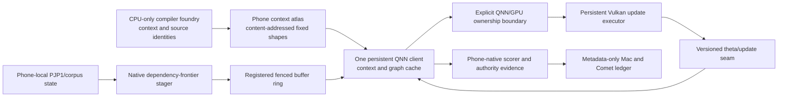

# Apex Hardware-Native QNN/Gemma-4 SoC Engineering Ideas And Implementation Options

Operational alias: **FIR — Frontier Innovation Register**. For connection,
provider, raw-boundary, GitHub, Comet, and current authorization custody, use
Section 23 of the living Phase34 PRD. This register contains engineering
hypotheses and implementation contracts; it is not an execution authority.

Date: 2026-07-10  
Status: living build-engineering companion; no promotion authority  
Binding PRD: `docs/PRD-PHASE34-TASK-ALIGNED-PROJECTION-PHONE-NATIVE-GEMMA4-E4B-POLAR-TRAINING-2026-07-08.md`

## 1. Purpose

This document extracts the useful engineering mechanisms from the supplied
QNN/Hexagon/Adreno briefs, reconciles them against the repository and the
actual QAIRT 2.44 installation on the RedMagic phone, and turns the remaining
opportunities into buildable, falsifiable implementation options.

It is deliberately not a performance forecast. There is no tokens-per-second
target in this document. The objective is to remove measured complexity and
bottlenecks from the phone-native training path while preserving exact model,
training, custody, and authority semantics. A mechanism earns promotion only
when it preserves the relevant output/update evidence and structurally removes
the operation it claims to remove: a context load, copy, registration,
dispatch, process launch, synchronization point, spill, or rebuild.

This document accompanies, but does not supersede, the living PRD. Every live
experiment still requires a frozen source identity, a fresh phone root, an
exact predecessor, a falsifiable pass/fail bar, metadata-only Mac/Comet egress,
and the first exact missing green field on failure.

## 2. Sovereign State And Current Position

- Gate E remains falsified. The sovereign full-27 decoder-token NLL delta is
  positive: `+0.01624497490593768`. Promotion is not allowed.
- Phase34C remains historically `blocked_fail_closed` on
  `layer24_plus_two_alternatives_not_fully_measured`.
- The gradient source remains root-blocked on
  `phase34c_gradient_rank_probe_instrument_absent`. QNN supplies no autograd,
  backward graph, optimizer, or `dL_NLL/dh` service.
- No rank-matched projection candidate exists.
- Q0B proved the CPU-only QAIRT compiler-foundry path. A pod GPU is not
  required for the QNN build plane.
- Q0C proved a bounded phone HTP execution path with positive accelerator
  evidence and no CPU fallback.
- Q1 proved one direct native process holding one backend, device, profile,
  context, and graph across 16 calls, with output poisoning, exact parity,
  current-call HTP profiles, and balanced teardown. Its input/control were all
  zero, so it proves persistent plumbing and writeback only.
- Q1N attempt 1 built two nonzero, distinct, phone-local HTP controls. It
  failed closed before the direct arm because an external 50 ms sampler could
  not observe either 3 ms `qnn-profile-viewer` process. That was observer
  aliasing, not a QNN numerical failure.
- Q1N attempt 2 replaced sampled presence authority with a kernel pidfd child
  lifecycle ledger while retaining exact zero-survivor and at-most-one
  concurrency sentinels. It passed two nonzero discriminatory wrapper controls
  and 32 alternating direct calls through one persistent context/graph. The
  authority report SHA-256 is
  `803d8a952ee9b4db970772626e82ea64ad5b94ae26fb17f3979cda6ae0ff003f`;
  the final disposition SHA-256 is
  `e701ce1a06b561021f2d6fffb67e0e0a40d6da68338ce048b3e08a2928d69830`;
  the metadata-only Comet experiment is
  `https://www.comet.com/zer0pa-imc/mobile-polymath-ai-training/989edd7f986949b796a2709dc3a1b519`.
- The next C5F0 explicit-system-linker plus payload-maps preflight is locally
  green, staged under a fresh phone namespace, and intentionally not executed.
  Its readiness report SHA-256 is
  `1e51122a1fed4fab0e89a9b0136e132fa146e59fd38bf9429489379182859dad`;
  fresh user authorization is the only remaining launch boundary.

Attempt-1 evidence is frozen at:

- host report SHA-256:
  `647adaecdb6bf3d1e77330ea5d6e90e280e04020b2656c702dca4fc7514c2e3f`;
- disposition SHA-256:
  `8f5785d1a78b12fc159a266b284c12fb0378d6b43163393b288378e668d29997`;
- phone worker metadata SHA-256:
  `67a2344f4560e96046db8c4fdeb6d50ce7fa120f06d911bd51d7ab05628a88e1`;
- metadata-only Comet experiment:
  `https://www.comet.com/zer0pa-imc/mobile-polymath-ai-training/0608e6a2cd934962875755e05e612e7e`.

## 3. Source Register And Correction Ledger

### 3.1 Supplied source identities

| Source | SHA-256 | Useful contribution |
|---|---|---|
| `120ae2ba.../pasted-text.txt` | `964c7315b38e70994221cd6d6f85b29ab37f99031095ba1e85fbacaaeccad356` | Persistent native runtime, performance policy, caller-owned buffers, runtime-overhead framing |
| `61e084a6.../pasted-text.txt` | `50db0fba491af50613b29911ff15277b691cce8259dba8c221172ad9cec1cb00` | Public QNN boundary, direct native client, native Phase-3 staging, custom GPU ownership |
| `5bb13263.../pasted-text.txt` | `9352da7795b89b174c46469d72927baef4092c50df35981e238f9f95080d4d28` | Unavoidable QNN mechanisms versus amortizable generality |
| `be8c874a.../pasted-text.txt` | `240ba2fb363bfb3abc14c7cccac783504f698317d9ff01031cc136453f691aa1` | Offline graph preparation, VTCM-aware scheduling, fusion, single-client operation |
| `31eda461.../pasted-text.txt` | `32a8d79220c368bc4385fe684ff6747214214c78063d16b3871bf13a1496c0b6` | Phase-2/Phase-3 batching-mismatch hypothesis |

The third and fifth sources duplicate briefs already integrated into PRD
Section 22.15 except for refreshed signed URLs. The fourth is byte-identical to
its earlier registered source. The genuinely new source material is therefore
the first and second files, while all five remain useful as a consolidated
idea set.

### 3.2 Corrections that are binding

The following attractive statements are hypotheses, not facts, and must not
be copied into reports as conclusions:

1. Equality between historical QNN step count and evaluated packet count does
   not prove one `QnnGraph_execute` per packet. The dispatch count must be
   instrumented at the direct API boundary.
2. A raw PJP1 shard shaped around `[packet_count, 128, ...]` cannot be submitted
   as a drop-in replacement to the accepted fixed `[1, 16, 2560]` float graph.
   True tensor batching requires a different graph/context contract.
3. Requesting `burst` or `sustained_high_performance` does not prove pinned
   clocks. Android/OEM thermal and DVFS control retains final authority.
4. `QNN_TENSORMEMTYPE_RAW`, a caller-owned `clientBuf`, `QnnMem`, DMA-BUF, or
   AHardwareBuffer naming does not itself prove zero-copy.
5. Loading an offline-prepared context does not eliminate compatibility
   checks, memory availability decisions, runtime dispatch, signaling, cache
   coherence, or synchronization.
6. Matching tensor shapes do not make layers share one context identity.
   Weights, operators, encodings, graph options, SoC/HTP target, and generator
   identity remain part of the cache key.
7. No current evidence shows that a full Gemma layer cycle, activations, KV,
   adapter state, and scratch can remain resident in VTCM.
8. Multi-graph-in-one-context is not graph fusion, and graph fusion is not
   zero-copy. Each claim requires its own structural evidence.
9. A small-model inference benchmark cannot classify this Gemma training path
   as compute-bound or memory-bound.
10. None of the QNN runtime levers closes the dimensional sweep, creates a
    hidden-state gradient surface, constructs a candidate, or changes Gate E.

## 4. What Is Already Built And Must Be Preserved

| Mechanism | Current evidence | Retained limitation |
|---|---|---|
| Native Phase-2 packetizer | `native/polar_phase2_packetizer/phase2b_native_packetizer.cpp` | Does not prove native QNN batch consumption |
| Native PJP1 parsing/staging components | Phase34 native consumer preflight and i8 staging benchmark | Not yet the live persistent Phase-3 input path |
| Offline QNN preparation | Q0B context generation and Q0C HTP restore/execute | Bounded contexts only; no production context atlas |
| Persistent direct QNN | Q1 zero-case pass and Q1N nonzero discriminatory pass | One layer-1 island only; not full decoder/training evidence |
| Caller-owned RAW QNN tensors | Q1/Q1N `clientBuf` with `QNN_TENSORMEMTYPE_RAW` | No registered/shared memory or zero-copy proof |
| Detailed HTP profiling | Q0C/Q1 positive HTP evidence and no fallback | No unified cross-QNN/Vulkan critical-path ledger |
| Vulkan theta update | `apex_vulkan_theta_update.comp`, runner, adapter | Vulkan resources and file/CPU transfers are not persistent |
| Corrected C5F0 work | Architecture manifests, local component/oracle work, production wrapper work | Common phone terminal gate remains incomplete |
| Metadata-only evidence plane | JSON reports, hashes, Comet metadata assets | Operator visibility is not authority evidence |

Existing correctness code is not discarded. It remains the oracle, fallback,
and parity reference for every native replacement.

## 5. Installed Phone Control Surface Versus Current Use

The live phone has QAIRT/QNN SDK `v2.44.0.260225143659`, core provider 2.33,
system provider 1.8, HTP V79 binaries/libraries/headers, `qnn-net-run`, profile
and context tools, and Termux C/C++ build tools. The phone is sufficient for
native runtime engineering and validation. It does not contain the complete
model converter, model-library generator, op-package generator, or Hexagon
compiler foundry; those remain CPU-only RunPod responsibilities.

| Installed surface | Actual current path | Engineering gap |
|---|---|---|
| Persistent context/graph APIs | Q1/Q1N reuse one context/graph | Not full decoder or heterogeneous training cell |
| `--perf_profile` including sustained/burst | Unused in direct-QNN source | No scoped HTP session controller or observed-state ledger |
| `QnnMem_register/deRegister`, DMA-BUF descriptors | Unused; RAW tensors only | No registered I/O ring or copy/cache/fence proof |
| `QnnGraph_prepareExecutionEnvironment` | Unused | No bound MEMHANDLE/client-buffer execution environment |
| `QnnGraph_executeAsync`, `QnnSignal_*` | Unused; synchronous execute only | No bounded in-flight ring or unique signal/profile ownership |
| `--use_mmap`, context callbacks/list APIs | Q1/Q1N eagerly read a roughly 158 MB binary | No mmap/lazy/content-addressed loader |
| Batch multiplier and TensorV2 dynamic dimensions | Fixed TensorV1 `[1,16,2560]` | No fixed shape-bucket atlas or true batch parity ladder |
| Multiple graphs/context lists | One generated graph and one restored graph | No multi-graph context amortization or static-span composer |
| HTP power/DCVS/RPC polling controls | Default device creation | No RAII performance-policy controller |
| HTP VTCM/parallel/finalize/SLC/DLBC/sparse options | Basic prepared context only | No measured option capability matrix or spill ledger |
| Updateable tensors and binary updates | Current context has zero updateable tensors | No deliberate mutable-theta graph seam |
| Direct-mode V79 runtime/stub | Installed but unprobed | No feasibility classification; never a bare-metal claim |
| Vulkan external memory/semaphore extensions | Current path uses CPU-visible buffers and fence waits | No documented dual-import allocation or cache-coherence proof |

## 6. Target Architecture

The target is not to bypass QNN. Public third-party code cannot replace
Hexagon scheduling, DMA, memory placement, FastRPC, operator enforcement, or
thermal safety. The target is to remove our own accidental generality around
that irreducible substrate.



The phone owns raw state and practical compute. RunPod creates immutable QNN
build artifacts and metadata; it needs no GPU for this role. The Mac remains a
control plane and metadata ledger.

Every batch or overlap unit carries an epoch ticket binding model, tokenizer,
corpus, context, graph shape, candidate/theta identity, update frontier, and
scorer identity. Two units may share a queue entry only if those tickets prove
that no intervening update must become visible.

## 7. Build Engineering Innovation Registry

### HN-00 — Kernel-owned process lifecycle evidence

Current implementation: Q1N attempt-2 worker and host.

Modification:

- spawn each wrapper tool by direct `Popen(list)`, never a shell;
- isolate the child session/process group;
- open a pidfd immediately after spawn, preferring `os.pidfd_open` and using a
  guarded Android+aarch64 syscall only when the Python binding is absent;
- bind `/proc/self/fd` and fdinfo to the child, observe PGID/SID, wait/reap,
  poll exit, close exactly once, and bind the executable identity before/after;
- require the exact `qnn_A, viewer_A, qnn_B, viewer_B` sequence with worker
  active-child count `0 -> 1 -> 0` and maximum one;
- retain external `/proc` observation only as a pre/post-zero and
  maximum-at-most-one sentinel.

Pass bar: all four lifecycle receipts, nested/ledger equality, QNN/profile
evidence, raw boundary, and direct Q1N parity are green. A sampled short-event
presence claim is forbidden.

Goal relation: this closes mechanical custody for Q1N only. It is also the
process-ownership primitive for the future heterogeneous daemon.

### HN-01 — Capability-negotiated QAIRT adapter

Build a startup inventory that resolves the deployed provider function tables
and records support for memory registration, execution-environment prepare,
async execution, signals, context callbacks/lists, tensor versions, HTP
infrastructure/power calls, binary updates, and direct mode.

Implementation packet:

1. Bind provider/core/system versions and every requested function pointer.
2. Emit booleans and version identities only; never dump headers, environment,
   raw binaries, or provider payloads.
3. Route each feature to `available_unmeasured`, `unsupported`, or a completed
   parity result. A symbol is not a runtime pass.
4. Make every later component depend on this manifest rather than compile-time
   assumptions.

Pass bar: the manifest exactly matches independent tool/header/runtime probes,
and deliberately missing functions select a safe fallback without silently
changing graph or tensor semantics.

### HN-02 — mmap/lazy content-addressed context loader

Current Q1/Q1N reads the complete context into a C++ byte vector before
`createFromBinary`. Replace that eager duplication in tiers:

1. controlled `qnn-net-run --use_mmap` reference arm;
2. native mmap-backed retained context storage if the API consumes the buffer
   synchronously;
3. context binary callback/list APIs only when provider support and lifetime
   ownership are proven.

The cache key must include QAIRT build, backend/system identities, SoC/HTP,
graph/operator identity, weights, quantization/encodings, tensor shapes,
graph/HTP options, generator source, and generator command identity.

Pass bar: exact graph metadata and output parity, one context creation, stable
retained source identity, no extra full-size heap copy, and balanced lifetime.
No context-load-time prediction is admitted.

### HN-03 — HTP session controller with homeostatic evidence

Create an RAII controller around `deviceGetInfrastructure`, power configuration
ID creation/destruction, DCVS/performance mode, sleep/latency/polling controls,
and supported HTP-specific options.

Run matched default, sustained, and burst arms only where the deployed V79
provider accepts the configuration. Record the requested mode separately from
observed thermal/frequency/power evidence. Restore the default configuration
on every exit path.

Pass bar: configuration creation/application/destruction is balanced; outputs,
profiles, and no-fallback evidence remain identical; thermal safety remains in
force. A request is never reported as a pinned-clock fact. V81-only DDR modes
must not be claimed on V79.

### HN-04 — Registered DMA-BUF I/O ring

Replace transient RAW buffers in a parity ladder rather than by assertion:

1. existing RAW client-buffer control;
2. `QnnMem_register`/MEMHANDLE ring with one slot;
3. two-slot fenced ring;
4. graph execution-environment binding through
   `QnnGraph_prepareExecutionEnvironment` when supported.

The ring ledger must count allocation, registration, deregistration, map,
unmap, CPU copy, cache maintenance, ownership transition, fence wait/signal,
and maximum live slot count. Registration occurs once per retained slot, not
per call.

Pass bar: bit-exact or predeclared numerical parity, exact registration
lifecycle, no stale read/write, no CPU fallback, no unproven copy, and a
structural reduction in repeated registrations or copies. A buffer name alone
never establishes zero-copy.

### HN-05 — One persistent heterogeneous phone cell

Build one native process that owns:

- QNN backend/device/profile/context/graph handles;
- native input staging and registered buffer ring;
- versioned model/candidate/theta epochs;
- a persistent Vulkan instance/device/pipeline/descriptor/command-buffer set;
- explicit ownership fences and a metadata event ledger;
- phone-local scoring and controlled teardown.

Python, SSH, and tmux remain launch/monitor/recovery surfaces, never the tensor
hot path. The corrected C5F0 implementation remains the oracle and fallback.

Pass bar: repeated full step ceremonies occur without process, QNN context,
Vulkan device, or pipeline reconstruction; outputs and updates match the
existing correctness path; every owned resource balances under success,
blocked result, timeout, signal, and injected failure.

### HN-06 — Persistent Vulkan executor

The current Vulkan update path creates resources, maps/copies CPU-visible
buffers, submits, fence-waits, and tears down per invocation. Retain the
instance, physical/logical device, queue, pipeline, descriptors, buffers,
command buffers, and synchronization objects across the cell lifetime.

First build: replay the accepted theta update repeatedly in one process with
poison-before-use and exact update parity. Then replace per-call host waits with
timeline/fence ownership that the cell can compose with QNN dependencies.

Pass bar: one creation/free pair per retained resource, exact theta/update
parity, no stale descriptor or buffer reuse, and fewer resource reconstructions
or host synchronizations. No expansion of theta or training semantics is
implied.

### HN-07 — Explicit QNN/Adreno shared-allocation broker

The phone advertises Vulkan external-memory FD/AHardwareBuffer and external
semaphore support, while QNN exposes DMA-BUF/shared-memory descriptors. That
makes a shared allocation a real hypothesis, not a proven path.

Build a broker that owns one allocation, exports/imports it through documented
interfaces on both sides, and applies explicit producer/consumer ownership,
cache maintenance, and semaphore/fence transitions. Begin with a synthetic
known tensor and poison each side before handoff.

Pass bar: both APIs prove they reference the same allocation identity; writes
become visible only after the declared fence; poison is overwritten; parity
matches a copied control; allocation/import/export/fence lifetimes balance.
If dual import or coherence is unsupported, retain the registered QNN ring and
persistent copied Vulkan boundary without a zero-copy label.

### HN-08 — Async QNN depth-two ring

Use `QnnGraph_executeAsync` and `QnnSignal_*` only after synchronous parity and
registered-buffer ownership are green.

Rules:

- start at depth two;
- allocate a unique signal, profile handle/snapshot, input slot, output slot,
  and epoch ticket per in-flight call;
- forbid profile or buffer reuse while owned by an unfinished submission;
- callbacks may publish metadata/state transitions only, never raw rows;
- abort/timeout drains or cancels every submission before teardown.

Pass bar: exact ordered outputs and profiles, maximum in-flight count two,
balanced signals, no stale slot, and a structural reduction in forced
CPU-side serialization. Queue depth is never increased merely because it is
supported.

### HN-09 — Fixed-shape context atlas

Build immutable context variants for dependency-valid fixed shapes instead of
assuming dynamic batching. Candidate dimensions include active row count,
sequence bucket, batch count, graph span, and tap/output set.

Each atlas entry carries the full content-addressed identity tuple from HN-02
and an admission report proving exact metadata, output parity, HTP execution,
and no fallback. Context invalidation is mandatory when any identity component
changes.

Pass bar: selecting an entry is deterministic from the epoch/shape ticket;
missing entries fail closed or route to the accepted scalar context; no shape
padding may change active-token semantics without parity proof.

### HN-10 — Dependency-frontier batching

Separate three mechanisms that earlier discussion conflated:

1. multiple ordinary submissions through one process/context;
2. multiple graphs retained in one context;
3. a true tensor batch represented in the graph shape.

A batch may combine only units sharing model, context, graph shape,
candidate/theta epoch, corpus/scorer state, and update frontier. File adjacency
is not a batching criterion. The initial ladder is batch one replay, then a
small fixed bucket generated by the compiler foundry.

Pass bar: per-unit outputs and the complete update trajectory match sequential
batch-one execution; dispatch/context/copy counts reflect the claimed
structural change; any update-visible dependency closes the batch boundary.

### HN-11 — Multi-graph context then static-span fusion

Use multiple graphs in one context first as a context-amortization experiment.
Label it honestly: graph count and context count may change while dispatch
count and intermediate traffic remain.

Only then compose a short, dependency-valid static span into one graph. Cuts
must remain at mutable theta/update boundaries, required activation/gradient
taps, incompatible layer semantics, or scorer checkpoints. Gemma PLE, local
versus global attention, RoPE type, KV sharing, and final normalization are
part of the composition identity.

Pass bar: corrected C5F0 parity for every exposed/tapped output, fewer actual
graph dispatches or intermediate bytes, unchanged candidate/update visibility,
and no CPU fallback. A renamed group of sequential calls is not fusion.

### HN-12 — Mutable-theta QNN seam

The SDK exposes updateable tensor types, graph/context tensor updates, binary
sections, binary-update tooling, and a phone LoRA adapter updater. The current
context has zero updateable tensors; therefore this is a graph redesign.

Build a bounded graph with one deliberately updateable adapter/theta tensor.
Have the persistent Vulkan executor produce the next version, then admit it to
QNN through the documented update path with an epoch/hash receipt. Compare
against a context-rebuilt control.

Pass bar: theta version `n+1` is invisible before its fence and visible after
admission; forward outputs match the rebuilt control; base weights/context
identity remain unchanged where promised; update and rollback are balanced.
This supplies a forward mutation seam, not autograd or a backward graph.

### HN-13 — Native PJP1-to-QNN stager

Connect the existing native packet parsing/staging work directly to the
persistent cell. Eliminate Python tensor materialization and file-per-call
handoff from the operational Phase-3 hot path while retaining phone-local raw
custody.

First pass reuses the accepted `[1,16,2560]` graph repeatedly through one
retained context and ring. Only HN-10 may introduce true batch-shaped
contexts. PJP1 packet count, row geometry, token/activity masks, candidate
epoch, and output order remain hash-bound.

Pass bar: exact staged tensor identities/statistics and downstream output
parity, no Python or SSH process in the tensor path, and a structural reduction
in per-unit process/file staging operations.

### HN-14 — VTCM/spill working-set ledger

Do not optimize a theoretical capacity. Measure or derive a byte ledger for
constants, inputs, outputs, activations, KV, theta, scratch, registered rings,
and graph-span temporaries for every admitted context.

Use available HTP metadata/profiling/prepare options to classify VTCM request,
grant, spill/fill evidence, context size, and graph-option identity. Change one
dimension at a time: batch, active rows, graph span, tap set, or buffer depth.

Pass bar: identities and outputs remain fixed while the ledger locates a real
allocation/spill transition or establishes that the necessary counter is
unavailable. TCM residency is never inferred from carrier shape or requested
VTCM alone.

### HN-15 — Direct-mode V79 reference arm

The installed runtime advertises direct mode and a V79 stub. Build only a
bounded tool/reference feasibility arm after capability sealing.

Pass bar: exact same context/input/output and positive HTP evidence as the
ordinary runtime arm, with complete provider/stub/process identities and no
fallback. The result may classify a supported runtime route; it may not be
called bare metal, a FastRPC bypass, or a scheduler bypass.

### HN-16 — Unified critical-path and structural-complexity ledger

Create a metadata-only event model spanning CPU staging, QNN context/graph
lifecycle, registrations/copies, graph submissions, FastRPC/profile events,
QNN/GPU ownership transitions, Vulkan submissions/waits, spills, scorer work,
and teardown.

Every optimization states which event/count/byte edge it intends to remove.
The ledger compares semantic parity first and structural deltas second. It does
not impose a forecast or universal throughput threshold.

Pass bar: event identities reconcile with independent subsystem counters and
every claimed removed edge is actually absent. Uninstrumented time is reported
as unknown, not assigned to a favored theory.

### HN-17 — Hardware-assisted scientific instruments

The hardware-native cell can make Phase34C instruments practical, but cannot
replace their scientific requirements.

Activation instrument route:

- one corrected C5F0 forward session;
- dependency-valid multi-layer taps in one decoder traversal where possible;
- phone-local streamed rank accumulator or raw phone-only rows;
- complete layer 24 plus two alternatives before candidate construction.

Gradient instrument route:

- real selected-layer hidden-state perturbations executed through the same
  corrected persistent forward;
- or a real offline autograd `dL_NLL/dh` artifact kept outside Mac raw storage
  and admitted only after phone fidelity;
- or a limited selected-layer backward implementation;
- never synthesize a gradient surface from H3/H4 or historical finite
  differences.

Pass bar remains the Phase34C dimensional and gradient surface bar. Faster or
more native execution alone is not a scientific pass.

## 8. New Cross-System Design Ideas

These ideas are derived from the combined installed surface and project
constraints rather than copied from one attachment.

### 8.1 Epoch-ticketed morphogenetic field

Treat model/candidate/theta/corpus/scorer identity as a field that determines
which work items may interact. The scheduler does not ask merely whether two
tensors have the same shape; it admits them to the same batch, buffer slot, or
graph span only when their complete epoch tickets are compatible. This turns
training causality into an executable type system.

### 8.2 Membrane-owned heterogeneous memory

One broker acts like a cell membrane: allocations cross CPU/QNN/GPU boundaries
only through explicit import, ownership, cache, and fence transitions. No
component may retain an untracked alias. Poison-before-handoff makes membrane
failure observable.

### 8.3 Myelinated execution paths

Repeated, fixed computation is routed through content-addressed offline
contexts and retained graph handles—the computational analogue of myelination.
The fast path is earned by identity and parity; novel or mutated shapes return
to the slower verified path until compiled and admitted.

### 8.4 Homeostatic performance control

Performance policy is a reversible session state, not a global promise.
Requested HTP mode, observed device state, thermal response, parity, and
teardown form one receipt. The controller restores the baseline on any
failure, mirroring biological homeostasis rather than treating maximum clocks
as an unconditional success state.

### 8.5 Clonal capability selection

At startup the adapter selects only provider surfaces that pass identity and
capability probes. Unsupported branches die before they touch authority data.
Alternative implementations—RAW, registered, sync, async, copied, shared—can
coexist behind one semantic contract and compete on measured structural
complexity without altering the governing objective.

### 8.6 Reversible graph cuts

Graph composition follows the training dependency DAG. A cut is placed where
state mutates, evidence must be tapped, or semantics differ. Each cut can later
be removed only after a fused alternative proves parity and real dispatch or
traffic reduction. This makes fusion an incremental, reversible scientific
operation rather than an all-or-nothing rewrite.

## 9. Ordered Implementation Program From Current State

The following order preserves existing work and moves from current custody to
the mission goal:

1. Retain the completed Q1N pidfd lifecycle and nonzero persistent-QNN pass as
   the native runtime predecessor.
2. Close the corrected C5F0 phone authority ladder and freeze its terminal
   runtime/source identity.
3. Add HN-01 capability sealing and HN-02 mmap/lazy context loading.
4. Build HN-04 registered one-slot I/O, then the two-slot fenced ring.
5. Add HN-03 HTP session control as matched parity arms.
6. Merge HN-05 and HN-06 into one persistent QNN/Vulkan cell, initially with
   an explicit copied boundary.
7. Attempt HN-07 shared allocation only after documented dual import and fence
   capability passes.
8. Add HN-08 async depth two and HN-16 unified structural ledger.
9. Build HN-13 native staging and HN-09 fixed-shape context buckets.
10. Run HN-10 batch-one/process amortization before true tensor batching.
11. Explore HN-11 multi-graph context and then short static-span fusion.
12. Build HN-12 mutable-theta seam if it preserves the accepted update
    contract and materially simplifies QNN/Vulkan integration.
13. Use the resulting cell for HN-17 activation dimensionality and real
    gradient-source instrument repair.
14. Only after both predecessor surfaces pass, build rank-matched candidates
    and run D1 -> D2 -> D3 -> matched controls -> Gate D2A -> Gate E full27.
15. After a sovereign Gate E pass, continue the same structural program into
    C3/C4 production-scale operation without changing the authority rule.

Items 3 through 12 may run as bounded parallel engineering lanes only when
they do not bypass the C5F0 correctness predecessor or consume authority data
under an unvalidated path. A mechanical optimization never promotes a
scientific stage.

## 10. Standard Draconian Packet For Every Option

Every option above must instantiate this packet before live execution:

```yaml
engineering_option:
  hypothesis: exact causal mechanism, no performance prediction
  predecessor:
    report_path: required
    report_sha256: required
  immutable_inputs:
    source_sha256: required
    binary_or_context_sha256: required
    provider_and_phone_identity: required
    model_tokenizer_corpus_candidate_theta_identity: required_when_relevant
  one_causal_change: required
  control_path: accepted current implementation
  experimental_path: exact new mechanism
  semantic_pass_bar:
    parity_or_predeclared_tolerance: required
    no_CPU_fallback: required_for_QNN
    update_trajectory_equivalence: required_when_training_state_changes
    raw_boundary: exact
  structural_pass_bar:
    targeted_context_copy_registration_dispatch_sync_or_spill_is_measured
    claimed_removed_operation_is_absent_or_count_reduced
  custody_pass_bar:
    resource_create_free_balance: exact
    timeout_signal_and_injected_failure_cleanup: exact
    phone_raw_assets_unchanged: true
    Mac_and_Comet_egress: metadata_only
  fail_bar:
    first_missing_green_field: exact
    no_successor_authority: true
  nonclaims:
    no_gradient_surface_unless_measured
    no_candidate_or_Gate_promotion_from_engineering_only
```

There is no arbitrary attempt ceiling in this template. The stopping rule is
causal exhaustion, a genuine custody/resource boundary, or the sovereign gate.
The falsifiable bar exists to prevent reward hacking, not to limit engineering
effort.

## 11. Explicit Non-Options

- Raw third-party Hexagon/HMX/HVX instruction replacement is not an available
  public engineering route.
- FastRPC signaling, context compatibility, supported-operator enforcement,
  internal memory placement/scheduling, DMA/cache coherence, arbitration, and
  thermal safety cannot simply be disabled.
- Multiple coordinated clients are not an arbitration bypass.
- Direct QNN-to-Vulkan aliasing is forbidden without documented dual import,
  ownership, cache, and fence semantics.
- Fusion or batching may not cross an update dependency that must become
  visible to later work.
- H3 and H4 remain falsified and frozen. Their matrices or evidence may not be
  relabeled as new candidates.
- A hardware-native forward path is not a hidden-state gradient surface.
- No mechanism in this document changes the Gate E requirement: full matched
  phone-native decoder-token NLL after-minus-before must be negative.

## 12. Final Engineering Thesis

The useful frontier move is not to fight Qualcomm's irreducible HTP machinery
or to imitate a general framework. It is to construct a dedicated living cell
around it: fixed identities, retained contexts, registered membranes,
dependency-aware work packets, reversible graph cuts, a persistent GPU update
organ, and a causal evidence ledger.

Qualcomm remains responsible for the proprietary scheduler, HTP memory
machinery, and accelerator dispatch. We become responsible for eliminating
every repeated interpretation, allocation, copy, process boundary, dispatch,
and synchronization that our fixed Gemma-4 training organism does not need.
The result is accepted only when the sovereign model-training evidence accepts
it.
