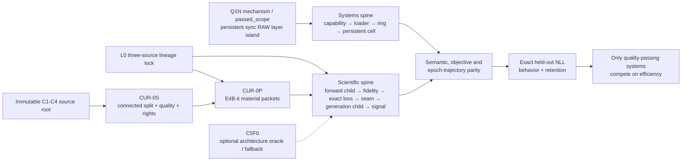

# PRD: Gemma 4 E4B Phone-Native QNN Learning Cell

Document class: CANONICAL_LIVING_ENGINEERING_PRD  
Version: 2.0  
Date: 2026-07-11  
Status: FINAL_EXECUTION_CONSTITUTION__PHASE12_AND_CURRICULUM_COLLISION_INTEGRATED__EVIDENCE_STATE_UNCHANGED  
Sovereign model: Gemma 4 E4B only  
Primary device: REDMAGIC NX789J / SM8750 / Android 15  
Primary runtime: QAIRT/QNN 2.44 / HTP V79  
Primary learning lane: direct-NLL coefficient control over E4B-native PLE  
Execution authorized by this document: false  
Promotion allowed at adoption: false  

Canonical companions:

- Living engineering concept: workspace-root/Polymath AI - Mobile-Native Gemma 4 E4B Heterogeneous Learning - Living Engineering Concept.md
- Typed current-reality capsule: docs/APEX-CURRENT-REALITY-CAPSULE-GEMMA4-E4B-QNN-CELL-2026-07-10.yaml
- C1–C4 readiness audit: docs/APEX-C1-C4-CORPUS-READINESS-AND-INTEGRATION-AUDIT-2026-07-10.md
- C1–C4 evidence receipt: docs/APEX-C1-C4-CORPUS-READINESS-EVIDENCE-RECEIPT-2026-07-10.json
- Frontier Innovation Register: docs/APEX-HARDWARE-NATIVE-QNN-GEMMA4-SOC-ENGINEERING-IDEAS-AND-IMPLEMENTATION-OPTIONS-2026-07-10.md

Historical evidence source:

- Phase34 PRD archive: docs/PRD-PHASE34-TASK-ALIGNED-PROJECTION-PHONE-NATIVE-GEMMA4-E4B-POLAR-TRAINING-2026-07-08.md
- Phase 1–4 science/engineering update: docs/GEMMA-4-TRAINING-PIPELINE-SCIENCE-ENGINEERING-UPDATE-2026-07-06.md

The historical Phase34 PRD is retained as evidence history. Its measured
falsifiers remain binding. Its stored authorizations, automatic successor
order, projection-first strategy, volatile connection state and accumulated
attempt narratives do not govern this PRD.

The July 6 Phase 1–4 update is also evidence history. Its measured Phase 1
and Phase 2 engines are incumbents which a replacement must beat, but its
PQA1/PJP1/JL model boundary, universal 128-slot shape, Phase 3 graph plan and
Phase 4 polar optimizer are not governing architecture. Phase 3 and Phase 4
in that report are archival. Gate E's adverse exact-decoder-NLL result remains
binding on the candidate it measured.

---

## 0. Constitutional contract

### 0.1 What this PRD is

This document is the canonical engineering contract for discovering and
building a phone-native Gemma 4 E4B learning system around the actual
Qualcomm runtime surface.

It is simultaneously:

- a product requirements document;
- a scientific falsification contract;
- a systems architecture;
- an evidence taxonomy;
- a memory against drift;
- and a decision map for what must be built, measured, retained, rejected or
  revisited.

It is not:

- a stored execution permission;
- a claim that a proposed API works;
- a claim that a staged action ran;
- a replacement for measured evidence;
- a performance forecast;
- or a narrative device for converting partial progress into success.

### 0.2 Authority order

The authority order is:

1. The current user objective and current scoped direction.
2. The non-reopenable Gemma 4 E4B model lock.
3. The declared science authority metric and no-regression constraints.
4. Immutable measured event reports bound to their exact scope.
5. This PRD’s design and gate contracts.
6. The current-reality capsule as a last-verified pointer.
7. Runbooks as procedures.
8. Historical PRDs, handovers and attempt narratives as evidence history.

A repository document can make an action eligible to propose. It cannot make
that action authorized. No old phrase such as authorized, next required,
continue automatically or run until done is an inheritable capability.

### 0.3 Objective hierarchy

The hierarchy is noncompensable:

1. Improve the exact Gemma 4 E4B authority objective.
2. Preserve the intervention on the adapted autoregressive generation route.
3. Improve held-out target behavior.
4. Remain inside the retention no-regression bound.
5. Preserve exact model, evaluator, custody and rollback integrity.
6. Only then minimize energy, thermal-steady time, memory and ceremony.

An improvement at level 6 cannot repair a failure at levels 1 through 5.
Throughput, HTP occupancy, low memory, fewer processes, lower polar loss,
correlation, rank, code volume, test volume, a Comet dashboard or a visually
complete architecture can never compensate for adverse decoder NLL or failed
held-out behavior.

### 0.4 Evidence classes

Every claim must name its class and scope.

| Class | Meaning |
|---|---|
| design_hypothesis | A falsifiable engineering idea not yet exercised |
| installed_capability | A tool, symbol or runtime surface exists |
| local_verification | Source-level or host-only checks passed |
| custody_readiness | Inputs, identities and boundaries are staged |
| mechanism_execution | A bounded physical mechanism ran |
| semantic_fidelity | Target computation matched a declared oracle |
| science_diagnostic | A non-promotional measurement about signal or geometry |
| science_authority | The declared model-quality gate ran |
| performance | Time, energy, memory, thermal or structural measurement |
| custody | Ownership, egress, lifecycle or provenance evidence |

Allowed claim states are:

- proposed;
- available_unmeasured;
- staged_unexecuted;
- running;
- passed_scope;
- falsified_scope;
- blocked_fail_closed;
- invalidated;
- superseded.

A bare status of pass is invalid because it hides the axis and scope.

### 0.5 Success terminal

The project succeeds only when one E4B candidate satisfies all of:

    success_terminal:
      quality_authority_requires:
        - CUR-0_curriculum_readiness
        - exact_phone_native_decoder_NLL_gate
        - adapted_autoregressive_generation_fidelity
        - held_out_target_behavior_lower_confidence_bound
        - retention_no_regression_bound
        - no_update_and_matched_random_separation
      project_success_additionally_requires:
        - repeated_seed_and_session_evidence
        - rollback_and_reproduction
        - raw_and_secret_custody_passed_scope
        - measured_energy_memory_thermal_and_time_characterization
      ranking_only_after_quality:
        measures: [energy, thermal_steady_time, memory, latency]
        compensation_for_quality_failure: forbidden
      required_contracts:
        curriculum_readiness:
          "CUR-0": passed_scope
          global_split_group_leakage: zero
          current_504dd91c_artifact_role: physically_valid_evidence_only
          real_authority_root: immutable_and_optimizer_inaccessible
        exact_phone_native_decoder_NLL:
          within_stage_aggregation: token_weighted
          cross_stage_aggregation: frozen_stage_vector_weights_and_constraints
          authority_stage_weights: nonnegative_normalized_no_silent_zero
          global_all_token_pool: forbidden
          B23_stage_weight: 0
          paired_upper_confidence_bound_of_frozen_curriculum_score: at_or_below_negative_delta_NLL
          all_prior_stage_constraints: passed_scope
          confidence_cluster: split_group_id
          delta_NLL: predeclared_positive_materiality_floor
          full_answer_mask: true
          reference_parity: passed_scope
        adapted_autoregressive_generation_fidelity: passed_scope
        held_out_target_behavior:
          lower_confidence_bound: at_or_above_predeclared_minimum_gain
        retention:
          lower_confidence_bound: at_or_above_negative_tolerance
        controls:
          no_update: stable
          matched_random_interventions: candidate_separates
        reproduction:
          seeds: multiple
          independent_sessions: multiple
          cold_start: reproduced
        integrity:
          rollback_to_frozen_baseline: exact
          checkpoint_restore: reproduced
        custody:
          raw_and_secret_boundary: passed_scope
        systems_characterization:
          energy_memory_thermal_and_time: measured_not_inferred

Within-stage token-weighted NLL, a frozen cross-stage score/vector, all
prior-stage constraints and a predeclared paired materiality bound are
necessary but not sufficient. Behavioral and retention authority strengthens
them; neither may repair an NLL result that misses that bar.

### 0.6 Long-horizon pursuit contract

The program is logically unbounded in hypothesis cycles and operationally
bounded by finite, renewable user authority, cost, custody, disk, thermal,
time and safety envelopes. It continues until a declared Section 16.8.6
terminal.

    long_horizon_contract:
      sovereign_terminal: section_0_5
      logical_hypothesis_cycle_limit: none
      operational_authority: finite_current_action_or_campaign_lease
      progress_unit:
        - evidence_backed_claim_transition
        - architecture_branch_elimination
        - newly_evidenced_decision_changing_blocker
        - clean_rollback_or_rebuild
        - project_terminal
      local_mechanism_wave_commit_test_or_demo_as_success: forbidden
      objective_model_or_evaluator_drift: forbidden
      sunk_cost_in_experiment_selection: forbidden

A completed wave, benchmark, report or defensible result is never a terminal.
An active campaign may proceed autonomously inside its finite envelope; the
document itself grants no authority.

---

## 1. Executive decision

The governing architecture is no longer a task-aligned projection campaign
whose universal path is activation rank, hidden gradient, polar correlation,
Gate D2A and then Gate E.

The new decision is:

> Freeze the exact E4B IT mobile-QAT core in one persistent direct-QNN phone
> cell, expose the smallest reversible coefficient control that preserves
> official E4B PLE semantics, return exact masked decoder NLL, and learn from
> direct forward experiments. Admit batching, async execution, Vulkan, shared
> memory and graph fusion only when semantic parity and a measured bottleneck
> justify them.

The shortest credible success path is:

    immutable C1-C4 source root -> CUR-0S source/split/quality/rights
      in parallel with exact E4B artifact lock L0
      -> CUR-0P E4B material packets -> composite CUR-0
      -> F5 forward-child and F6 generation-child foundry candidates
      -> one complete fixed-shape QNN forward route
         as a monolith or admitted static graph family
      -> high-precision-to-QAT and QAT-to-QNN parity
      -> one persistent QNN cell
      -> exact compact per-candidate NLL
      -> one-to-eight coefficient mutation seam
      -> L5G adapted-generation fidelity and finalized authority root
      -> direct-NLL finite-difference signal
      -> no-update and matched-random separation
      -> development-heldout learning and comparator freeze
      -> first blinded hidden-C5 target and retention authority
      -> systems optimization from measured bottlenecks

This is inference-shaped learning. QNN is not being mistaken for an autograd
framework. The runtime repeatedly evaluates a static, quantized E4B organism
under small, versioned interventions. The CPU can update the initial tiny
coefficient state. The NPU evaluates candidates. The GPU is optional and must
earn a role.

The program has two compute spines and one independent material plane:

- a scientific spine that establishes useful E4B learning;
- a systems spine that makes the experiment persistent, owned and affordable.
- a curriculum plane that admits real material without leaking authority.

The material plane joins the scientific spine only through CUR-0P; systems
and science join only through parity and the sovereign quality gate.



---

## 2. Adoption evidence snapshot — noncurrent

This section quotes immutable scoped events at the evidence cutoff
2026-07-10T19:27:04Z. It is not a mutable state pointer or a live assertion
about the phone or RunPod after that instant. The typed current-reality capsule
is the sole current-state pointer.

### 2.1 Historical science authority

The historical E4B JL C2 candidate remains falsified:

| Field | Value |
|---|---:|
| Before NLL/token | 14.538868526231177 |
| After NLL/token | 14.555113501137114 |
| After-minus-before | +0.01624497490593768 |
| Records | 27 |
| Scored tokens | 27 |
| Promotion | forbidden |

This is permanent negative evidence for that exact candidate, graph, control,
objective and evaluator. It is not the baseline of a future E4B-it mobile-QAT
runtime.

### 2.2 Q0B and Q0C

Q0B is `mechanism_execution/passed_scope` only for a synthetic standard-op
foundry claim:

- CPU-only QAIRT 2.44 foundry;
- one float32 ReLU graph shaped [1,16,2560];
- target socModel 69 and dspArch 79;
- no model weights;
- no phone execution in Q0B;
- a 49,152-byte context with SHA-256
  9060753282c8b0bf232b7db8abc1637b6d9f857560c2d151ae8cd3f197e6aa03.

Q0C is `mechanism_execution/passed_scope` only for a synthetic phone HTP
claim:

- two deterministic ReLU cases;
- exact CPU-reference outputs;
- positive HVX, RPC, QNN-accelerator and cycle evidence;
- no observed QNN graph CPU fallback.

Together they prove a compiler/deploy substrate. They do not prove E4B
conversion, E4B operators, full-model memory, mutable state or learning.

### 2.3 Q1 to Q1N: the real persistent-QNN predecessor

Q1N is the strongest runtime evidence at the cutoff.

Q1 first established `mechanism_execution/passed_scope` for 16 zero-input,
zero-control direct calls through one retained context/graph, with 16 poison
overwrites, 16 current-call HTP profiles, no observed CPU fallback and balanced
teardown. That is plumbing/writeback evidence only. Q1N names Q1's immutable
report as its direct predecessor and adds the required nonzero discrimination.

It used:

- graph
  gemma4_e4b_ffn_residual_layer1_forward_island_seq16_hidden2560;
- tensor shape [1,16,2560] float32;
- a 157,982,720-byte context;
- one direct native runner process in the persistent arm; Q1N's separate
  control-worker wrapper/tool children remain separately pidfd-accounted;
- one backend, device, system context, QNN context, graph and profile lifetime;
- caller-owned RAW buffers;
- synchronous direct graph execution.

Measured closure:

| Quantity | Result |
|---|---:|
| Distinct nonzero inputs | 2 |
| Distinct nonzero wrapper controls | 2 |
| Context loads | 1 |
| Context creates | 1 |
| Graph retrieves | 1 |
| Direct graphExecute calls | 32 |
| A parity / wrong-control rejections | 16 / 16 |
| B parity / wrong-control rejections | 16 / 16 |
| A/B transitions | 31 |
| Poison overwrites | 32 |
| Current-call HTP profile snapshots | 32 |
| CPU fallback snapshots | 0 |
| Initialization | 1.031607916 seconds |
| Steady median | 11.618334 milliseconds |
| Steady p95 | 14.017968 milliseconds |
| Balanced owned-resource teardown | yes |

The initialization-to-steady ratio directly reinforces persistent execution:
loading or rebuilding this context per candidate would be structurally wrong.

The timing domains do not yet form one reconciled critical path. Profile
aggregates and host call durations must not be subtracted or assigned to a
favored explanation. Unaccounted intervals remain unknown until the unified
timeline exists.

Q1N proves:

- an E4B-width `[1,16,2560]` layer-shaped mechanical island whose exact
  E4B-it mobile-QAT artifact identity is unbound;
- nonzero numerical discrimination;
- direct persistent synchronous QNN execution;
- RAW-buffer correctness;
- per-call HTP evidence;
- and bounded lifecycle custody.

Q1N does not prove:

- the exact E4B authority artifact;
- a full decoder;
- PLE;
- exact loss;
- mutable coefficients;
- updateable tensors;
- registered memory;
- async execution;
- Vulkan persistence;
- a heterogeneous cell;
- training;
- or energy advantage.

### 2.4 C5F0 attempt 12

C5F0 attempt 12 is:

- source-matched;
- staged under a fresh phone namespace;
- output-absent;
- process-clean at its final observation;
- locally verified;
- unexecuted.

Its scope is only a synthetic system-linker, process and payload-maps custody
preflight. Its next unmeasured field is:

    explicit_system_linker_plus_payload_maps_identity_not_revalidated

The hash-bound readiness report records one focused suite with 56 passes and
one host-only skip. No broader aggregate is admitted without a suite-resolved
manifest and immutable receipt.

C5F0 attempt 12 does not run Gemma, QNN, a corpus, activations, gradients, a
candidate or a gate. It is not the scientific next action by inheritance.

### 2.5 Current unresolved surfaces

The primary lane is blocked by:

1. exact E4B-it and mobile-QAT source lineage not frozen;
2. executable mobile-QAT framework reference not frozen;
3. high-precision-to-QAT quality drift not admitted under a frozen policy;
4. complete fixed-shape E4B QNN token-to-loss route, as a monolith or admitted
   static graph family, not built or parity-admitted;
5. QAT-to-QNN conversion fidelity not admitted;
6. exact compact per-candidate `nll_sum` and `scored_token_count` not proven;
7. causal, normalized PLE coefficient ABI not proven;
8. dynamic or updateable coefficient seam not proven;
9. F6/L5G adapted-generation route not built or admitted;
10. direct coefficient-to-NLL signal not measured;
11. no trained candidate separating from matched random interventions.

The legacy fields:

- layer24_plus_two_alternatives_not_fully_measured;
- phase34c_gradient_rank_probe_instrument_absent;
- no_rank_matched_projection_candidate;

remain true for their historical lanes. They do not block direct coefficient
Lane A.

---

## 3. Collision disposition

### 3.1 What dies as governing architecture

| Retired governing idea | Reason |
|---|---|
| Task-aligned projection is the universal primary program | Direct coefficient-to-NLL learning does not require a projection matrix |
| Activation effective rank chooses control width | Activation variance is not authority sensitivity |
| Hidden dL_NLL/dh is a prerequisite for every candidate | Lane A estimates coefficient derivatives from exact forward losses |
| Polar correlation is the primary candidate screen | The historical proxy improved while decoder NLL worsened |
| Gate D2A polar improvement is a universal predecessor | It is a historical diagnostic, not E4B language authority |
| Historical full27 is the final evaluator | It scored only 27 tokens and is a bounded falsifier |
| C5F0 attempt 12 is the automatic next action | It is only a synthetic custody preflight |
| The entire C5F0 ceremony chain blocks all new QNN work | Capability, loader and memory work can use Q1N independently |
| Adreno is a mandatory update organ | CPU is the default for one to 32 coefficients |
| Q1N is a heterogeneous cell | It contains no Vulkan or learning state |
| One document can authorize future execution | Execution authority is current, scoped and non-inheritable |
| More hash fields imply more causal evidence | Hashes establish identity, not execution |
| Comet completion is promotion authority | Comet is eventual metadata visibility |
| Append-only PRD amendments are safe memory | They created contradictory live states and cognitive debt |

Retired ideas remain in historical evidence where they explain a falsifier.
They are removed only from current decision authority.

### 3.2 What evolves

| Existing work | Evolved role |
|---|---|
| Base E4B C5F0 | Architecture-equation oracle and optional native reference lane |
| Q1N | Mechanical predecessor for loader, registered-memory, policy and async experiments |
| C5F0 supervisor/custody code | Reusable operational components only if a selected runtime needs them |
| Historical native-polar/Vulkan loop | P0 negative-quality and mechanism comparator |
| Activation capture | Optional basis-diagnostics lane |
| Hidden gradient and exact adjoint | Optional gradient or exact-backward lane |
| Gate E | Necessary negative-NLL gate embedded in a stronger behavior/retention authority suite |
| RunPod | CPU-only compiler foundry with a new full-model envelope |
| Vulkan | Optional workload-admitted organ |
| PJP1 staging | Legacy exposed diagnostic/import fixture only; reusable native machinery must emit a separately versioned E4B-native ABI |
| FIR HN options | Independent atomic systems gates rather than one bundled tier |

### 3.3 What comes alive

1. A four-role E4B artifact manifest.
2. A direct-NLL one-to-eight coefficient PLE experiment.
3. Dynamic input, updateable tensor and rebuilt-context mutation routes.
4. A persistent QNN cell that exists before any GPU joins.
5. Exact compact per-candidate NLL as the physical learning oracle.
6. Epoch-ticketed antithetic siblings.
7. A small graph-morphology competition rather than a presumed monolith.
8. A typed claim ledger separating mechanism, fidelity, science and systems.
9. A generated current-reality capsule rather than prose current-state drift.
10. A proof-budget rule: evidence fields survive only when they prevent a
    named failure or affect a decision.

### 3.4 July 6 Phase 1–4 collision

The report's phase names describe a historical implementation, not the
current gate order. Their sovereign disposition is:

| Historical phase | What is preserved | What must be re-admitted or retired |
|---|---|---|
| Phase 1 — native tokenization | Zig streaming tokenizer, bounded parallelism, mmap/madvise, preallocation, deterministic binary output, source hashes and measured phone throughput are the incumbent material-ingest kernel | Exact Gemma 4 E4B-it tokenizer/template/termination parity, current corpus lineage and in-process versus child/file boundary must be re-measured; the old corpus/tokenizer binding is not inherited |
| Phase 2 — native packetization | C++/AArch64 SIMD parsing, explicit fixed layouts, preallocated writers, binary readback/oracles and the measured 32.3× native-over-Python packetization result are the incumbent packet compiler | PJP1's polar/JL payload, universal 128 slots, one-row-per-packet padding and authority role are retired; source/build/binary identity must be reconciled before reuse |
| Phase 3 — QNN forward | The bounded QNN/HTP layer-island work is retained as mechanism evidence | The report's graph plan and implied PJP1-to-QNN route are archival; no direct PJP1 ingestion or full E4B forward was established there |
| Phase 4 — update | The native Vulkan execution and lifecycle work remains an optional workload comparator | Polar/JL theta optimization is a falsified candidate after exact decoder NLL worsened; it is not the current learning boundary |

This creates a **semantic-kernel lock, embodiment competition** rule:

- deterministic exact tokenization, explicit roles/masks, immutable lineage,
  bounded memory, native binary layouts and readback are locked invariants;
- Zig and C++ are measured incumbents, not sacred implementations;
- PQA1 and PJP1 remain import-only historical formats;
- the canonical successor is a versioned E4B-native material/sequence/batch
  ABI;
- a challenger replaces an incumbent only after bit/semantic parity and at
  least one authority-relevant performance win with no regression.

The historical PJP1 result is simultaneously impressive and non-governing.
It reduced a raw hidden/JL materialization comparison dramatically, but the
full C1 artifact used 6,527,232 fixed slots for 2,130,785 source tokens
(32.64% slot utilization), occupied 461,805,760 bytes (approximately 216.73
bytes per source token), and did not feed the accepted QNN graph directly.
Those values make PJP1 a serious benchmark arm, not the presumed optimum for
the complete E4B cell.

---

## 4. Sovereign model and artifact identity

### 4.1 Non-reopenable target

Gemma 4 E4B is the sole authority model. A compilation, memory, operator,
quality or performance failure is an E4B blocker. It is not permission to use
a smaller target.

A smaller model may be used only as a quarantined systems fixture. It cannot:

- close an E4B graph gate;
- close an E4B fidelity gate;
- close a learning gate;
- define an E4B performance forecast;
- or become a fallback objective.

### 4.2 Four artifact roles

The old PRD and living concept were both partly right and jointly incomplete.
They refer to different members of the E4B lineage.

| Role | Artifact | Authority |
|---|---|---|
| Architecture oracle | google/gemma-4-E4B at revision 7aa32e6889efd6300124851b164f8b364314c3d8 | Equations and structural invariants only |
| High-precision task oracle | exact frozen google/gemma-4-E4B-it | Tokenizer, chat template and targets; Edge-A high-precision logits/NLL/behavior quality reference, never the phone learning surface |
| Mobile-QAT source and executable framework reference | exact frozen E4B-it mobile-QAT Transformers or compressed-tensors artifact plus pinned reference stack | Quantized source, encodings and pre-QNN numerical oracle |
| Phone authority artifact | finalized root over immutable forward and generation context-family children | Actual phone runtime authority only after L2/L4/L5G parity |

Official repository metadata establishes the family chain:

    google/gemma-4-E4B
      -> google/gemma-4-E4B-it
      -> google/gemma-4-E4B-it-qat-mobile-transformers
      -> google/gemma-4-E4B-it-qat-mobile-ct

Primary lineage anchors:

- [E4B base](https://huggingface.co/google/gemma-4-E4B)
- [E4B instruction-tuned](https://huggingface.co/google/gemma-4-E4B-it)
- [E4B IT mobile-QAT Transformers](https://huggingface.co/google/gemma-4-E4B-it-qat-mobile-transformers)
- [E4B IT mobile-QAT compressed tensors](https://huggingface.co/google/gemma-4-E4B-it-qat-mobile-ct)
- [Google metadata correction for the mobile-Transformers base lineage](https://huggingface.co/google/gemma-4-E4B-it-qat-mobile-transformers/commit/6637cffd8d4cd55fb1461d280f7299c4998daf63)
- [Google metadata correction for the compressed-tensors base lineage](https://huggingface.co/google/gemma-4-E4B-it-qat-mobile-ct/commit/89612aa338a3182781b6840b407ca9813231acbd)

The currently published [high-precision E4B-it config](https://huggingface.co/google/gemma-4-E4B-it/blob/main/config.json)
declares tied word embeddings, while the [mobile-QAT Transformers config](https://huggingface.co/google/gemma-4-E4B-it-qat-mobile-transformers/blob/main/config.json)
declares an untied, separately quantized LM head. LM-head tying is therefore
artifact-bound, not a structural invariant transferable from the base or
high-precision role.

L0 freezes both mobile-QAT candidates, the selection protocol and at most one
provisional build source using static converter compatibility and encoding
evidence. It does not claim numerical parity. L2 admits the source only after
the high-precision-to-QAT and QAT-to-QNN edges both pass. The selected source's
tokenizer and chat-template bytes must either equal the frozen E4B-it task
oracle or have an explicit, tested mapping. Its executable framework
reference, library revision, dtype policy and quantization encodings are
frozen before QNN conversion. Choosing between the two official mobile-QAT
representations is not a model downshift. Silently using main or mixing
revisions is forbidden.

### 4.3 Transfer boundary

The base architecture oracle may transfer only after exact config and semantic
equality checks:

- 42-layer order;
- five-local then one-global pattern;
- local and global head geometry;
- type-specific RoPE;
- attention-type-keyed KV sharing;
- PLE source and injection order;
- final RMSNorm;
- LM-head tying state and softcap order, bound to the selected artifact rather
  than inherited from the base architecture oracle.

It may not transfer:

- weights or PLE values;
- tokenizer or chat template;
- end-token convention;
- logits, NLL or perplexity;
- activation ranks;
- gradients;
- control sensitivity;
- candidate behavior;
- target masks or positions;
- quantization encodings;
- QNN operator support;
- updateable-tensor support;
- or context parity.

Therefore a base-model C5F0 pass cannot numerically authorize an E4B-it
mobile-QAT graph.

### 4.4 Fixed architecture contract

Every model-dependent graph and context binds:

| Property | E4B contract |
|---|---:|
| Decoder layers | 42 |
| Local layers | 35 |
| Global layers | 7 |
| Pattern | five local, one global |
| Hidden width | 2,560 |
| Feed-forward width | 10,240 |
| Query heads | 8 |
| Key/value heads | 2 |
| Local head dimension | 256 |
| Global head dimension | 512 |
| Sliding window | 512 |
| PLE width | 256 |
| Full per-layer PLE field | 10,752 values |

The E4B graph identity includes:

- full layer ordering;
- PLE precomputation from initial scaled embeddings;
- per-layer PLE slice identity;
- local/global attention type;
- RoPE type and parameters;
- KV compute/store/reuse schedule;
- final normalization and LM head;
- exact answer-mask objective;
- weights and quantization encodings;
- tensor shapes and tap set;
- graph options;
- QAIRT, provider, SoC and HTP identities;
- exporter, converter, generator source and commands.

Equal tensor shape is never sufficient context identity.

### 4.5 L0 source-lineage and authority-contract manifest

L0 produces one immutable parent manifest. It contains no pending future
artifact hashes and is never edited after admission:

    e4b_artifact_manifest:
      architecture_oracle:
        repository: required
        revision: immutable
        config_sha256: required
      high_precision_task_oracle:
        repository: required
        revision: immutable
        config_and_weight_shards_sha256: required
        tokenizer_files_sha256: required
        chat_template_sha256: required
        termination_token_contract: required
        LM_head_tying_state: required
        edge_A_decode_template_stop_length_seed_and_evaluator_protocol_sha256: required
      mobile_qat_candidates:
        candidate_id:
          repository: required
          revision: immutable
          config_and_weight_shards_sha256: required
          quantization_and_encoding_manifest_sha256: required
          LM_head_tying_and_quantization_identity: required
          tokenizer_and_template_equality_or_mapping_sha256: required
          executable_reference_stack_and_revision: required
          reference_dtype_and_runtime_policy: required
      mobile_qat_selection:
        frozen_candidate_set_sha256: required
        selection_protocol_sha256: required
        provisional_build_source_candidate_id: nullable
      converter_lineage:
        exporter_revision: required
        converter_and_QAIRT_build: required
        target_socModel: 69
        target_dspArch: 79

No model-dependent execution enters science authority before this manifest
passes.

The generated phone-authority role is one rooted family with two immutable
children:

    e4b_forward_phone_child_manifest:
      parent_L0_manifest_sha256: required
      exporter_converter_and_generator_identity: required
      graph_family_and_tensor_contract_sha256: required
      operator_partition_and_no_fallback_sha256: required
      context_family_sha256_and_sizes: required
      exact_loss_ABI_sha256: required
      quantization_identity: required
      target_socModel: 69
      target_dspArch: 79
      generated_at_utc: required

    e4b_generation_phone_child_manifest:
      parent_L0_manifest_sha256: required
      forward_child_sha256: required
      prefill_decode_or_recompute_context_family_sha256: required
      tokenizer_template_stop_and_decode_protocol_sha256: required
      KV_position_mask_and_shared_KV_contract_sha256: required
      coefficient_ABI_sha256: required
      selected_QAT_framework_reference_sha256: required
      generated_at_utc: required

    e4b_phone_authority_root_manifest:
      parent_L0_manifest_sha256: required
      forward_child_sha256: required
      generation_child_sha256: unresolved_until_L5G
      coefficient_ABI_sha256: required
      exact_loss_ABI_sha256: required
      tokenizer_template_and_QAT_reference_sha256: required
      device_runtime_identity_sha256: required
      state: provisional_forward_only_or_finalized

F5 emits a forward-child candidate; F6 emits a generation-child candidate.
L1 admits the forward child and creates an immutable provisional root. L5G
admits the generation child and creates a new immutable finalized root that
references both children. No manifest is edited in place. Replacing any
context creates a new child and root; it never mutates L0.

### 4.6 C1–C4 curriculum identity and material root

Model/graph identity and curriculum identity are independent roots. A corpus
repair must not falsely invalidate an unchanged graph, and a graph rebuild
must not silently change the learning material. They join only in packets,
epoch tickets, checkpoints and scientific evidence.

The physically verified source artifact is:

```text
hf://datasets/Zer0pa/polymat-gemmalit-c1-c4-commercial-corpus
@504dd91c5a7c8365882d690d52f3de20697c4f7b
```

It contains 77,023 rows: C1 5,180; C2 3,198; bridge B23/C2.5 20;
C3 56,138; and C4 12,487. Its five manifest and full-QA hashes are frozen in
the C1–C4 readiness audit. That revision has `passed_scope` physical
integrity and the immutable role `physically_valid_evidence_only`. It is not
the learning or authority root because connected split-group leakage, C1/C2 semantic
admission, provider/source rights and E4B packet compilation remain blocked.

Target roles and current physical roles are distinct:

| ID | Sovereign target role | Current `504dd91c...` role |
|---|---|---|
| `corpus_stage_C1` | lexical self-expansion with admitted closure | lexical source pool; closure unproved |
| `corpus_stage_C2` | new vocabulary defined only by admitted known vocabulary | technical vocabulary pool; certificates absent |
| `corpus_bridge_B23` | familiar-language-to-science bridge | congruent 20-row sentinel, not an authority phase |
| `corpus_stage_C3` | science dictionary resolving through prior closure | long science QA/reasoning, not target dictionary |
| `corpus_stage_C4` | prerequisite-ordered science syllabus passing MegaScience comparability | paired refinement over mostly C3 sources, not target syllabus |
| `evaluation_C5` | globally heldout evaluation only | current cumulative/test surface exposed and non-authoritative |

The label `C2` is never used alone in typed interfaces because it collides
with historical candidate labels.

The current artifact's fractal interpretation is
`implicit_progression_hypothesis`: lexical components recur at larger
semantic scales, but no admitted row-level dependency graph exists. Promotion
to `explicit_graph` requires a content-addressed, resolvable relation manifest
and graph-integrity report.

An admitted curriculum manifest has this minimum schema:

```yaml
curriculum_manifest:
  corpus_family_id: required
  source_repository: required
  immutable_source_revision: required
  physical_source_root_sha256: required
  source_instance_overlay_sha256: required
  semantic_cluster_overlay_sha256: required
  global_split_overlay_sha256: required
  quality_admission_overlay_sha256: required
  source_license_and_provider_terms_manifest_sha256: required
  vocabulary_seed_and_base_policy_sha256: required
  lexeme_concept_dependency_and_prerequisite_DAG_sha256: required
  closure_cycle_SCC_unresolved_reference_report_sha256: required
  C3_dictionary_root_sha256: required
  C4_syllabus_and_MegaScience_comparability_root_sha256: required
  C4_COM_or_isolated_C4_RX_lineage: required
  material_compiler_sha256: required
  tokenizer_template_and_termination_sha256: required
  curriculum_relationship:
    state: explicit_graph_required_for_successor_target
    relation_manifest_sha256: required
  semantic_order: [corpus_stage_C1, corpus_stage_C2,
                   corpus_bridge_B23, corpus_stage_C3, corpus_stage_C4]
  stages:
    corpus_stage_id:
      semantic_role: required
      source_and_view_manifest_sha256: required
      row_counts_by_split: required
      split_group_root_by_split: required
      packet_manifests_by_bucket: required
      packet_length_coverage: required
      license_and_quality_disposition: required
  evaluation_C5:
    globally_heldout_source_group_root: required
    optimizer_access: forbidden
```

The current source revision is never edited to manufacture this manifest. A
successor root binds content-addressed global split, quality-admission and
target-E4B material overlays while preserving the source revision as evidence.

---

## 5. Sovereign objective and evaluator

### 5.1 Immediate learning oracle

For one example x, targets y and answer mask m:

    L(a; x, y, m) =
      sum_t m_t times negative_log_probability(y_t | x, a)
      divided_by sum_t m_t

The exact masked decoder cross-entropy is the learning oracle. Every candidate
return carries both:

- nll_sum: the sum of negative log probabilities over scored tokens;
- scored_token_count: the exact denominator.

Corpus NLL/token is computed independently for each candidate c:

    sum_of_nll_over_examples_and_tokens_assigned_to_candidate_c
      divided_by
    scored_token_count_assigned_to_candidate_c

It is never an unweighted mean of per-example means. Per-example and
split-group statistics are retained for paired confidence analysis, but
they do not replace token-weighted aggregation. The normalization denominator,
target shift, chat template and termination tokens are part of objective
identity. Candidate identities are compared only in the estimator or
statistical layer; their sums and denominators are never pooled.

The C1–C4 curriculum adds a second aggregation boundary. Exact NLL is
token-weighted within each stage/view, while cross-stage aggregation preserves
the vector and uses frozen weights or explicit retention constraints:

```text
L_s(c) = sum(nll_sum for candidate c and corpus stage s)
         / sum(scored_token_count for candidate c and corpus stage s)

J(c) = sum_s frozen_stage_weight[s] * L_s(c)
```

For admitted authority stages, weights are nonnegative and sum to one.
`w_B23 = 0` because B23 is a diagnostic canary. No admitted authority stage
may silently receive zero weight. The complete stage vector and every
per-stage constraint remain sovereign over scalar J; J cannot compensate a
failed stage constraint.

A single global target-token pool is forbidden: current observed E4B
answer-mask counts make it 95.4925% C3 and would erase the curriculum. Every report
retains C1, C2, B23, C3 and C4 values separately. B23 has `stage_weight: 0`
and `authority_role: diagnostic_canary`. Earlier-stage validation-sentinel
regression is noncompensable. C3/C4 variants joined by source-instance or
semantic-cluster equivalence are one `split_group_id` and one statistical
cluster even when their material views and record IDs differ.

The graph should return exact per-candidate nll_sum and scored_token_count, or
equivalent exact sufficient statistics. Full hidden states and full logits are
diagnostic fallbacks, not the scale path.

### 5.2 Gate E

Gate E remains necessary and noncompensable:

    gate_e:
      exact_phone_native_decoder_NLL:
        within_stage_aggregation: token_weighted_nll_sum_divided_by_scored_token_count
        cross_stage_aggregation: frozen_stage_vector_weights_and_constraints
        authority_stage_weights: nonnegative_normalized_no_silent_zero
        global_all_token_pool: forbidden
        B23_stage_weight: 0
        paired_upper_confidence_bound_of_frozen_curriculum_score: at_or_below_negative_delta_NLL
        all_prior_stage_constraints: passed_scope
        confidence_cluster: split_group_id
        delta_NLL: predeclared_positive_materiality_floor
        all_intended_answer_tokens: true
        reference_native_parity: required
      no_update:
        delta: zero_within_predeclared_tolerance
      matched_random:
        norm_site_calls_examples_and_device_state: matched
        seed_floor_and_missing_partial_run_rule: predeclared
        confidence_separation_not_minmax_containment: required
        candidate_must_separate: true
      identity:
        artifact_graph_control_objective_and_scorer: complete

The new evaluator is larger than historical full27 and scores every intended
answer token. Exact record count, token count, positive materiality floor
delta_NLL, paired confidence method, clustering unit and seed count are frozen
before adaptation.

### 5.3 Final authority

Gate E success is not final project success. Final authority also requires:

- a frozen target-behavior suite independent of training data;
- a frozen general retention suite;
- a predeclared lower confidence bound for target gain;
- a predeclared maximum retention regression;
- multiple seeds;
- multiple independent device sessions;
- and cold-start reproduction.

Training loss is never final authority.

### 5.4 Metric hierarchy

| Level | Metric | Role |
|---|---|---|
| AUTH-0 | Exact reference/native objective parity | Numerical prerequisite |
| AUTH-1 | Direct coefficient-to-exact-NLL response | Learning-signal diagnostic |
| AUTH-2 | Adapted-generation numerical/KV/control fidelity | Deployment-semantic prerequisite |
| AUTH-3 | Exact held-out decoder NLL with controls | Necessary science authority |
| AUTH-4 | Target behavior and retention | Final quality authority |
| AUTH-5 | Energy, time, thermal, memory, state size | Ranking after quality |
| D | Rank, correlation, polar loss, occupancy, code/test counts | Diagnostics only |

No D metric can promote AUTH-0 through AUTH-5.

### 5.5 Proxy rule

If exact compact loss cannot compile, a proxy is a different algorithm until
it proves, on the same examples and perturbations:

- predeclared rank or linear association with exact NLL;
- predeclared direction agreement;
- stable calibration across seeds and control states;
- and no target-position or denominator mismatch.

A proxy that passes only one statistic remains diagnostic.
Even a dual-calibrated proxy is eligible only for a separately named
proxy-research algorithm. It cannot close L4, Gate E, Lane A science authority
or project success.

---

## 6. Learning boundary

### 6.1 Primary control

Let P0(x) be ordinary E4B PLE and let fixed reversible fields Bj(x) preserve
the official PLE source and injection semantics.

    DeltaP(a, x) = sum_j a_j times Bj(x)

    controlled_PLE(a, x) = P0(x) + DeltaP(a, x)

The initial coefficient dimension is one to eight. It may grow to at most 32
only after direct-NLL sensitivity, estimator SNR, matched-random separation
and held-out value justify it.

The complete 42 by 256 field contains 10,752 values:

- 42 KiB in FP32;
- 21 KiB in FP16.

Those sizes make CPU coefficient updates the default. They do not prove that
expanding the field inside QNN is cheap.

Every basis contract fixes:

- the exact PLE injection node relative to lookup, context projection,
  normalization, combination scale, GELU/gate and residual addition;
- coefficient sign and units;
- active token, layer and channel support;
- field RMS or other explicit normalization over that support;
- broadcast, segment and position semantics;
- master dtype;
- runtime cast and quantization encoding;
- expected physical post-cast norm;
- clipping and saturation policy;
- zero-state identity.

The basis is causal. Bj for position t may depend only on the causal input
prefix and public position/segment state available at deployment. Target IDs,
answer masks and future answer tokens may enter only the terminal gather/loss
path. They may not influence coefficient expansion, PLE, hidden states, logits
or generation state.

### 6.2 Fixed-field families

Initial field families are tested independently:

1. one global coefficient across all layers;
2. one coefficient for the seven global-attention layers;
3. seven six-layer-cycle coefficients;
4. local-versus-global coefficients;
5. question-versus-answer segment coefficients;
6. a small smooth position basis;
7. a predeclared orthogonal field bank.

No layer family is privileged by the historical layers 24 through 38
schedule. Activation effective rank may suggest a compact prior, but direct
NLL chooses the dimension.

### 6.3 Mutation-seam competition

The same declared control semantics must be implemented through:

| Route | Physical mechanism | Role |
|---|---|---|
| S1 | Fixed-shape dynamic coefficient input | Preferred simple runtime route |
| S2 | Deliberately updateable coefficient or theta tensor | Optional documented update route |
| S3 | Equivalent rebuilt or reloaded context | Slow correctness oracle |

S1 must prove:

- compiler acceptance;
- zero-state parity;
- at least two discriminatory nonzero states;
- no per-update graph finalization;
- context and constant growth;
- coefficient upload cost;
- exact objective effect.

S2 must prove:

- a newly designed updateable graph;
- version n+1 invisibility before its fence;
- visibility after admission;
- rollback;
- base-context integrity;
- S3 parity.

The FIR reports zero updateable tensors for the Q0B synthetic 49,152-byte
context, but the supplied Q1N authority and disposition JSON do not bind that
field to the 157,982,720-byte layer-shaped context. Therefore Q1N does not
admit S2 and no
existing context may be treated as updateable. L5 must obtain exact
graph-specific context metadata before concluding whether that binary can
implement S2. A newly designed updateable graph remains the expected S2
route.

S3 is never a performance target. It prevents S1 or S2 from silently changing
the mathematical intervention.

### 6.4 Direct forward estimator

For a Rademacher direction u:

    L_plus  = L(a + epsilon times u)
    L_minus = L(a - epsilon times u)

    gradient_estimate =
      ((L_plus - L_minus) / (2 times epsilon)) times u

The direction is regenerated from a seed. Binary structure belongs in the
perturbation, not in replacement token embeddings.

The first estimator study measures:

- epsilon ladder;
- coefficient bin collisions;
- clipping;
- plus/minus order reversal;
- direction sign reversal;
- repeated no-update noise;
- loss-difference distribution;
- estimator SNR;
- and agreement with a trusted small analytical reference when available.

No authentic hidden-state gradient is required for this coefficient-space
instrument.

### 6.5 Antithetic causality

The plus and minus candidates are siblings of one parent optimizer epoch.
They have distinct candidate digests.

No optimizer commit occurs until:

- every required sibling completes;
- every loss is attributable to its candidate;
- no call is invalidated;
- and the pair passes consistency checks.

If candidates share a true tensor batch, the graph returns a separately
attributable nll_sum and scored_token_count for every child candidate.
Reduction across candidate identities is forbidden.

Changing PLE changes downstream hidden states. KV or hidden-state reuse across
different candidate controls is forbidden unless a cut-specific dependency
proof establishes that the reused state lies strictly before the control’s
influence.

### 6.6 Competing learning lanes

| Lane | Mutable state | Gradient contract | Status |
|---|---|---|---|
| A | One to 32 E4B PLE coefficients | Direct forward losses | Primary |
| B | Dynamic or updateable LoRA | Forward-only or exact visible gradient | Strong comparator |
| C | CPU/GPU exact-gradient sparse or suffix state | Explicit backward | Comparator and fallback |
| D | Side network or head that changes generation | Explicit local gradient | Experimental |
| P0 | Historical native-polar/JL state | Historical only | Frozen negative baseline |
| G | ASVD, GaLore, true P-GAP or exact hidden gradients | Lane-specific source gate | Optional research |

No optional lane is allowed to become an implicit prerequisite for Lane A.

### 6.7 Lane A falsifiers

Lane A is redesigned or stopped if:

- no exact E4B graph can expose S1 or S2 without per-step rebuild;
- zero control fails baseline parity;
- nonzero control does not change exact NLL reproducibly;
- quantization erases useful perturbations;
- paired loss is dominated by unavoidable export or ceremony;
- estimator signal cannot separate from runtime noise;
- trained state cannot separate from matched random interventions;
- held-out gain fails;
- retention regresses beyond tolerance;
- or native CPU/GPU LoRA dominates at matched quality, energy and state.

---

## 7. Target runtime architecture

### 7.1 Processor roles

| Substrate | Initial responsibility |
|---|---|
| Oryon CPU | Tokenization, packetization, epoch tickets, tiny coefficient optimizer, checkpointing, supervision |
| Hexagon HTP through QNN | Frozen E4B forward and exact objective where supported |
| Adreno | No mandatory initial role; optional visible differentiable or sufficiently large update workload |
| RunPod CPU foundry | Immutable export, conversion, graph composition and context generation |
| Mac | Source, orchestration and metadata ledger |

The product is called a persistent QNN cell until a Vulkan organ is actually
admitted. Heterogeneous is a measured composition state, not a branding
assumption.

### 7.2 One persistent phone cell

The cell is one native process that owns:

- provider and capability manifest;
- QNN backend and device;
- system context;
- one admitted context entry initially;
- graph handles;
- input and output pools;
- mutation seam;
- exact loss attribution;
- epoch scheduler;
- resource, copy and ownership ledgers;
- checkpoint and rollback state;
- thermal and liveness supervision;
- and controlled teardown.

Python, SSH and tmux may launch, observe and recover it. They never carry
hot-path tensors.

### 7.3 Graph morphology competition

No graph topology is assumed to win. The foundry tests three morphologies.

#### Morphology A: full monolith

- one full E4B token-to-loss graph;
- simplest intermediate ownership;
- highest single-context compilation and memory risk.

#### Morphology B: seven natural decoder cycles

- one PLE/stem graph;
- seven spans following five-local plus one-global cycles;
- an explicit cut at zero-based layer index 24—the 25th decoder layer and the
  start of the final 18 KV-sharing layers—when required;
- one terminal norm, LM-head and loss graph.

This reflects E4B structure but remains a hypothesis. It is admitted only if
span boundaries preserve PLE, KV, RoPE, masks and quantization parity.

#### Morphology C: bounded prefix/suffix family

- one or more immutable prefixes;
- one selected suffix or terminal graph;
- intended for diagnostics or a visible differentiable cut;
- highest atlas and transfer risk.

The selection rule is:

1. semantic fidelity;
2. exact loss;
3. memory feasibility;
4. persistent execution;
5. measured copies and dispatches.

The system never creates one context per layer by default. Q1N’s 158 MB
single-layer context makes unbounded context multiplication a concrete risk.

### 7.4 PLE placement

Official E4B semantics require:

- initial scaled embeddings computed once;
- PLE context projection computed from those initial embeddings;
- all 42 per-layer PLE slices precomputed or semantically equivalent;
- each layer consuming only its slice;
- no recomputation from evolving hidden state.

Coefficient expansion may occur:

- inside a stem/PLE graph;
- inside each static span from a shared coefficient input;
- or on CPU as a bounded fallback field.

Each route must match the same control semantics. A compiler shortcut that
changes PLE source is a fidelity failure.

### 7.5 State machine

The typed runtime state is:

    COLD
      -> CAPABILITIES_SEALED
      -> CONTEXT_ADMITTED
      -> FROZEN_BASELINE_VERIFIED
      -> EPOCH_OPEN
      -> SIBLINGS_SUBMITTED
      -> LOSSES_COLLECTED
      -> UPDATE_COMMITTED
      -> CHECKPOINTED
      -> ACTIVE_STATE_VERIFIED
      -> EPOCH_OPEN

    ACTIVE_STATE_VERIFIED
      -> ROLLBACK_REQUESTED
      -> FROZEN_BASELINE_VERIFIED

Terminal states are:

- BLOCKED_DRAINED;
- ABORTED_DRAINED;
- FAILED_INTEGRITY;
- CLOSED_BALANCED.

The API must make these transitions impossible:

- execute before context admission;
- compare losses from different artifact or scorer identities;
- reuse a slot before completion;
- commit one sibling before the pair completes;
- cross an update frontier in a batch;
- mutate frozen base state;
- checkpoint without optimizer and RNG identity;
- tear down with an in-flight call;
- or promote a systems result to science.

### 7.6 Initial memory policy

The initial correctness path uses:

- caller-owned RAW QNN buffers;
- one graph/context entry;
- synchronous execution;
- explicit application-side CPU staging and copies;
- backend-internal copies classified as unknown unless directly measured;
- CPU coefficient updates;
- no shared QNN/Vulkan allocation.

Optimizations are admitted independently:

1. retained mmap context source;
2. registered QNN one-slot memory;
3. registered two-slot synchronous ring;
4. async depth two;
5. bounded atlas;
6. persistent Vulkan for a real workload;
7. shared allocation only if a copied boundary is material.

Physical LPDDR sharing is not an ownership or coherence contract.

### 7.7 Capacity accounting

Before a full graph executes, the phone budget records:

- Android and Termux reserve;
- QNN context bytes;
- retained source mapping and duplicate heap bytes;
- backend and graph allocations;
- token, mask and target buffers;
- PLE and coefficient state;
- KV state;
- ring slots;
- terminal loss workspace;
- optional Vulkan resources;
- checkpoint and rollback reserve;
- thermal-monitoring overhead;
- emergency free-space reserve.

Q1N’s 157,982,720-byte context is a measured data point, not a linear
whole-model forecast. Any extrapolation must be explicitly labeled a planning
bound and replaced by foundry and phone measurements.

### 7.8 Physical-roof contract

The approximately 80 GB/s total SoC RAM bandwidth supplied for this device is
theoretical shared-memory bandwidth. It is a hardware ceiling, not:

- a current measurement;
- a promised sustainable application bandwidth;
- a target that can be passed;
- proof that the current cell is memory-bound;
- or permission to neglect correctness, thermals, dispatch, compute or
  dependency limits.

The aspiration is to remove avoidable software and transport bottlenecks until
the residual limiter is a measured physical roof. The roof may be DRAM
bandwidth, HTP compute/operator throughput, VTCM/on-chip capacity, dispatch or
dependency latency, thermal/power sustainment, or an unavoidable model
dependency. A bottleneck is not eliminated from physics; it is displaced
toward the best residual physical limit.

Every performance candidate therefore carries a byte/event roofline:

    physical_roof_record:
      device_and_firmware_identity: required
      sequence_bucket_batch_candidate_axes: required
      theoretical_shared_RAM_ceiling_Bps: approximately_80e9_user_supplied
      measured_sustainable_Bps_for_exact_access_pattern: required_for_bandwidth_claim
      useful_minimum_bytes: derived_and_reviewed
      accounted_bytes_by_owner_and_edge: required
      byte_amplification: accounted_bytes_divided_by_useful_minimum_bytes
      graph_dispatches_and_signals: required
      allocation_registration_map_copy_cache_and_fence_events: required
      QNN_operator_and_fallback_profile: required
      compute_and_dependency_work: required
      p50_p95_p99_wall_and_steady_state: required
      energy_temperature_clocks_and_fan_state: required
      current_limiting_roof: measured_not_assumed

`useful_minimum_bytes` is the lower-bound information movement for the exact
accepted algorithm, not the bytes a convenient implementation happens to
move. `accounted_bytes` includes token/target/mask staging, weights and
encodings to the extent observable, activations/KV, loss statistics, context
load, copies, checkpoints and update state. Unknown backend traffic stays
unknown; it is not silently counted as zero.

Bandwidth-bound status requires intervention evidence. At minimum, change
bytes, compute or memory frequency while holding the objective and graph
identity fixed, and show the predicted response with profiler support. A fast
microbenchmark or arithmetic division by 80 GB/s cannot classify the full
cell.

### 7.9 Target native hot path

The target steady-state path is one Android native service/process:

    immutable admitted MaterialView
      -> exact E4BSequencePacket
      -> preallocated BatchPlan slot
      -> persistent QNN E4B candidate evaluation
      -> compact exact nll_sum + scored_token_count
      -> CPU coefficient update by default
      -> atomic checkpoint and next epoch

There is no Python, JSON, shell, per-packet file creation, tokenizer rebuild,
graph finalization or wrapper executable in that hot path. Python remains
appropriate for foundry control, experiment design, aggregate analysis and
sanitized reporting. Kotlin owns Android UI and lifecycle only. External
foundry compilation is compatible with runtime-local phone learning because
raw examples, objective evaluation, mutable state and checkpoints remain on
the phone.

Historical Phase 1/2 child-exec and file boundaries are retained until a
same-input tournament proves that an in-process library or persistent material
service is superior. Their removal is not assumed; their ceremony is measured.

### 7.10 Batch, packing and continuation semantics

Batching, sequence packing and curriculum composition are different
operations.

- **Independent batching** adds a batch axis and preserves one causal example
  per row. It is the preferred first utilization mechanism.
- **Sequence packing** places multiple examples in one sequence and is
  forbidden by default. It is admitted only if the exact QNN graph supports
  block-diagonal attention, position/RoPE reset, segmented KV, per-row loss
  attribution and generation parity with no cross-talk.
- **Curriculum composition** intentionally combines concepts into a new
  lesson. It creates a new named `MaterialView`; it is never disguised as a
  transport optimization.
- **Long-sequence continuation** carries exact position, local/global
  attention, shared-KV continuity, masks and per-row NLL attribution. It may
  not turn independent 128-token chunks into false complete examples.

Gemma 4 E4B contains global-attention layers, so local-window intuition does
not make naive concatenation safe. Concatenating C1, C2, C3 or C4 examples can
place answers from one row in another row's context and manufacture the very
fractal effect the science is meant to test.

The initial authority baseline is one row per sequence. The first performance
tournament compares that baseline with independent batches B=2/4/8. A packed
candidate must reproduce independent-row per-token logits, exact per-row
`nll_sum` and count, generation/KV behavior and update trajectory before its
throughput can be considered.

---

## 8. Scientific gate DAG

The scientific gates are ordered by dependency. A later gate cannot repair an
earlier failure.

### L0 — Artifact and objective identity

Question:

    Are the exact E4B architecture, task, QAT, tokenizer, template, target and
    converter lineages frozen without a cross-lineage substitution?

Pass requires:

- the immutable three-source-role lineage plus converter/authority contract
  from Section 4.5;
- the declared forward-child, generation-child and common-root schemas, still
  uninstantiated;
- immutable revisions, never main;
- exact weight, tokenizer, template and encoding hashes;
- target-token and answer-mask contract;
- frozen mobile-QAT candidates, selection protocol and optional provisional
  build source; numerical admission remains L2;
- declared reference/QAT tolerance policy;
- license and use constraints;
- no base-E4B numerical substitution for E4B-it.

Fail examples:

- missing IT revision;
- ambiguous chat template;
- model shard mismatch;
- QAT encoding identity absent;
- target position inferred from a historical scorer;
- converter lineage not reproducible.

Output:

- one immutable L0 parent manifest;
- no phone execution or learning claim.

L1 can admit only the forward child and provisional root. The fourth
phone-authority role becomes complete only when L5G admits the generation
child and emits the finalized common root before L6.

### CUR-PROBE — Bounded real train-only diagnostic

Question:

    Can a real target-shaped packet be used before full curriculum admission
    without leaking evaluation material or inheriting learning authority?

CUR-PROBE is a partial diagnostic gate, not a partial CUR-0 pass. For every
included row it requires:

- immutable source revision, row and packet hashes;
- admitted source/license/provider disposition for the diagnostic use;
- row-level semantic-quality and missing-context disposition;
- `source_instance_id`, `semantic_cluster_id` and connected
  `split_group_id` computed against the full current source corpus;
- train assignment with no validation/test member exposed;
- an immutable target-E4B diagnostic tokenizer/template/termination revision,
  answer mask and natural-fit bucket; a pre-L0 diagnostic packet has no
  authority transfer and is regenerated under L0 for CUR-0P;
- categorical fixture label `real_probe_non_authority`;
- an append-only exposure-ledger receipt that permanently burns every
  source-instance and semantic-cluster member into train/diagnostic status;
  any future connected split group containing an exposed member remains
  train-only even if membership or component hash changes;
- no optimizer commit, early stopping, authority reuse or hidden-C5 access.

It can support packetization, numerical parity, persistence, compact-loss,
mutation-discrimination and bounded coefficient-signal diagnostics. It cannot
close target-data learning, heldout or promotion claims and never implies
CUR-0.

### CUR-0 — Curriculum identity and E4B material readiness

Question:

    Does a successor instantiate lexical closure, known-vocabulary expansion,
    science dictionary and science syllabus semantics; remain globally
    decontaminated and rights/quality admitted; and compile into immutable
    target-E4B packets without collapsing its structure?

CUR-0 has two joined subgates:

- `CUR-0S` semantic/source admission runs in parallel with L0 and closes the
  dependency/syllabus root, immutable source, connected split, semantic
  quality, rights/provenance and quarantine;
- `CUR-0P` packet admission depends on CUR-0S and the L0-frozen
  tokenizer/template/termination contract, and closes material views, exact
  packets, bucket coverage and fixture roots.

Composite CUR-0 passes only when both pass. It must pass before any target-data
learning, heldout claim or authority result. Pure synthetic compiler,
lifecycle, ownership and poison fixtures may proceed without it, but remain
mechanical only. Before full CUR-0, only a CUR-PROBE packet may support bounded
non-authority real-data diagnostics.

Pass requires:

- the immutable `504dd91c...` source root and all five phase manifests
  physically verified;
- successor source-instance, semantic-cluster and connected split-group
  overlays with zero cross-stage and within-stage train/validation/test
  leakage;
- exact and near-duplicate policies frozen by source, question, answer and
  semantic-content units rather than phase-specific record IDs;
- semantic edges use a predeclared high-precision joint question/material
  predicate, never answer-only similarity; component-size distribution,
  maximum component and giant-component share are reported against frozen
  anti-percolation thresholds, with chaining collapse a hard failure;
- complete source, transformation, provider/model and license disposition;
- C1/C2 reject rows excluded, repair rows repaired/rejudged and no structural
  score promoted as semantic correctness;
- frozen normalized lexeme/concept IDs and seed/function-word/base-vocabulary
  policy;
- C1 self-expansion closure and per-definition C2 known-vocabulary
  certificates, topological rank, cycle/SCC report and zero unresolved
  references;
- C3 successor admitted as a science dictionary resolving through prior
  closure;
- C4 successor admitted as a prerequisite-ordered science syllabus passing
  every hard dimension of the frozen MegaScience-comparability vector;
- C4-COM and any research-only C4-RX kept in separate source, packet,
  checkpoint and claim roots;
- missing figure/table context and unverified numeric/unit views quarantined;
- exact L0-frozen E4B tokenizer, template, termination, target shift and
  answer mask compiled into byte-stable packet manifests;
- per-stage/view token-length and no-truncation coverage reports;
- one deterministic real target diagnostic manifest for each admitted
  stage/view/bucket;
- B23 explicitly classified with `stage_weight: 0` and
  `authority_role: diagnostic_canary`; its one validation row cannot support
  standalone retention or generalization;
- an explicit dependency/prerequisite graph root passing integrity checks;
- a globally heldout C5 root plus independent target and retention suites,
  all unavailable to optimizer and mechanical design;
- an append-only exposure root whose taint follows source-instance and
  semantic-cluster members through all future component merges;
- raw location, egress and custody policy passed.

Output:

- one immutable curriculum root, separate from the graph root;
- frozen stage objective weights/constraints and earlier-stage sentinels;
- typed real-diagnostic and real-authority packet manifests.

The current corpus closes only physical integrity. Its learning and authority
states remain `blocked_fail_closed`; its present heldout boundary is
`invalidated` by global source leakage.

### L1 — Full fixed E4B graph feasibility

Question:

    Can one fixed-shape token-native E4B graph or admitted static graph family
    be built for SM8750/V79 without changing target semantics?

Initial bucket:

- batch one;
- sequence length 16;
- `synthetic_mechanical` fixture class because no complete real C1–C4 packet
  fits 16 tokens;
- exact E4B IT template;
- full answer mask;
- one context morphology;
- synchronous RAW I/O.

Pass requires:

- exporter and converter return success;
- all required operators classified;
- partition manifest complete;
- no required E4B operator executes through a CPU fallback in the admitted HTP
  route;
- exact 42-layer architecture counters;
- PLE, local/global attention, RoPE, KV and final norm identities;
- context and graph tensors introspected;
- context, model-library and scratch sizes inside a predeclared envelope;
- exact per-event device, Android build, kernel, QAIRT/core/system provider,
  HTP architecture/firmware and relevant driver identity; an unavailable
  required field is explicit and blocks rather than being inherited;
- phone restore and direct execution;
- no model downshift or semantic stub.
- immutable admitted forward-child manifest and provisional phone-authority
  root, both bound to L0; generation child remains unresolved until L5G.

Failure classification:

- blocked_fail_closed for tooling, operator, size or runtime absence;
- falsified_scope for completed semantic mismatch.
- diagnostic_hybrid_partition_observed for a fully disclosed CPU partition;
  this is nonpassing for L1 but may inform a fallback architecture.

Nonclaims:

- L1 is not numerical fidelity;
- L1 is not learning;
- one sequence bucket is not an atlas.

### L2 — Reference/native numerical fidelity

Question:

    Are high-precision-to-QAT drift and QAT-to-QNN conversion error measured
    as two separate edges with separate verdicts?

Edge A — model/quantization admission:

- high-precision E4B-it task oracle;
- selected executable mobile-QAT framework reference;
- quantified teacher-forced logits/NLL drift and framework-level deterministic
  decode behavior drift under the L0-frozen template, stop, maximum-length,
  decoding-parameter, seed and evaluator protocol;
- a frozen quality/admission policy.

Edge B — conversion fidelity:

- selected executable mobile-QAT framework reference;
- generated QNN phone artifact;
- tight graph, logits, exact-sufficient-statistic and NLL parity.

Matching high precision while differing from the selected QAT source does not
pass Edge B. Matching the QAT source does not excuse unacceptable Edge-A
quality drift. The frozen adaptation baseline is the same QAT/QNN artifact
admitted by both edges.

Required comparisons:

- tokenization and target positions;
- zero-control logits or exact sufficient statistics;
- masked NLL;
- at least one local and one global layer diagnostic;
- PLE source invariance;
- local/global RoPE;
- shared-KV transitions;
- final RMSNorm and the selected artifact's LM head, including its tying state;
- multiple deterministic examples and lengths inside the bucket;
- synthetic adversarial fixtures plus CUR-PROBE
  `real_probe_non_authority` packets before CUR-0, replaced by frozen
  `real_target_diagnostic` packets after CUR-0 wherever a complete row
  naturally fits; current heldout rows are forbidden.

Pass requires:

- separate Edge-A and Edge-B thresholds frozen before first target
  observation;
- every required comparison inside its own tolerance;
- exact answer-mask denominator;
- no fallback;
- stable repeated baseline;
- zero-control native result attributable to the exact context.

Failure at L2 invalidates every downstream learning result from that context.

### L3 — Persistent full-E4B QNN cell

Question:

    Can the admitted full E4B graph execute repeatedly through one owned
    direct-QNN cell?

Pass requires:

- one process;
- one provider/backend/device/context family;
- one graph retrieval per admitted graph;
- two distinct token packets under the same zero-control state; mutation
  discrimination begins only at L5;
- at least one synthetic mechanical packet pair and, for buckets of 128 or
  greater, one CUR-PROBE pair before CUR-0 or frozen real-target-diagnostic
  pair after CUR-0;
- alternating schedule;
- poison-before-use;
- direct API call counters;
- per-call result attribution;
- current-call HTP evidence under a diagnostic mode;
- no fallback;
- balanced success, timeout, signal and injected-failure teardown;
- wrapper tools absent from the hot path.

The Q1N pattern is the predecessor, not the result.

### L4 — Exact compact objective

Question:

    Can exact masked decoder NLL return without exporting the full hidden or
    vocabulary surface?

Preferred return:

- one exact nll_sum per candidate;
- one exact scored_token_count per candidate;
- optionally the derived normalized loss;
- bounded checksum and diagnostic fields.

Permitted exact alternative:

- target logit plus exact log-sum-exp per scored token;
- phone-local reduction to the same exact objective.

Pass requires:

- equality or predeclared tolerance against full-logit reference;
- frozen accumulation and output dtypes, stable log-sum-exp algorithm,
  reduction axes/order, final-softcap/gather order and overflow/underflow/NaN
  policy;
- multiple packet lengths and target masks;
- synthetic edge cases plus CUR-PROBE packets for bounded pre-CUR-0 scope;
  final target-data scope requires real target-diagnostic packets from every
  admitted stage/view that naturally fits the tested bucket after CUR-0;
- distinct candidate nll_sum and token-count pairs remain attributable;
- no reduction across candidate identities;
- aggregation is token-weighted within each stage/view; cross-stage reporting
  preserves the frozen vector/weights/constraints and forbids a global pool;
- objective bytes, reduction time and transfer bytes measured;
- repeated-evaluation reduction error/noise measured and below a predeclared
  absolute L4 numerical floor; L6 must later prove its coefficient-loss signal
  clears that independently frozen floor by its required margin;
- no fallback or denominator drift.

If exact compact loss is unsupported, the primary QNN lane is blocked at L4.
A proxy may enter a separately named diagnostic lane but cannot be called
exact loss.

### L5 — Mutation seam

Question:

    Can one declared E4B PLE control be changed without hidden base mutation
    or per-step graph reconstruction?

The initial experiment uses one to eight coefficients.

Pass requires:

- S1 or S2 plus S3 oracle;
- exact zero-state parity;
- two or more discriminatory nonzero coefficient states;
- CUR-PROBE discrimination may support bounded pre-CUR-0 scope; final
  target-data scope requires real-target-diagnostic discrimination in every
  admitted non-16 bucket after CUR-0;
- coefficient sign and scale sensitivity;
- no graph finalization for S1;
- explicit pre/post-fence visibility for S2;
- rollback to baseline;
- S1/S2 objective parity with S3;
- for a multi-context forward morphology, one coefficient digest/epoch across
  all members with all-or-none S2/S3 admission and family rollback;
- base weights and context identity unchanged where promised;
- coefficient input/update cost measured;
- holding input IDs and control fixed while poisoning target IDs leaves all
  pre-loss coefficient, PLE, hidden and logit tensors unchanged.

Failure examples:

- control optimized away;
- quantization collapses plus and minus;
- update reaches only a diagnostic output;
- PLE source changes;
- rollback differs;
- S1, S2 or the promoted live route rebuilds the graph per evaluation; S3 is
  explicitly permitted to rebuild because it is the slow oracle only.

### L5G — Autoregressive mutation deployment fidelity

Question:

    Can the admitted coefficient state drive a real E4B-it autoregressive
    generation route with reference parity and no training-only information?

The route is:

- exact IT template and tokenizer;
- prefill graph or declared full-prefix recompute;
- single-token decode or declared recompute step;
- explicit KV-cache allocation, position, mask, update and teardown;
- correct local/global and shared-KV semantics;
- the same coefficient basis applied causally to prompt and every generated
  token;
- exact stop-token and maximum-length policy;
- frozen decoding parameters and RNG seeds.

Teacher-forced loss, prefill and decode contexts form one phone-authority
context family. Every call carries the same `child_candidate_digest`,
`coefficient_or_theta_digest` and `parent_epoch`. S2 updates and S3 rebuilds
are admitted all-or-none across that family, with rollback of the whole family
on partial failure. S1 binds the same coefficient digest at every context
submission. KV state is owned by and keyed on:

    (phone_authority_root_sha256,
     child_candidate_digest,
     coefficient_or_theta_digest,
     parent_epoch,
     sequence_and_bucket_identity)

Any key change invalidates the cache before reuse.

Pass requires:

- frozen numerical thresholds before target observation;
- zero-control full-vocabulary per-step pre-softmax-logit parity against the
  selected QAT framework on a bounded diagnostic sequence for every admitted
  length bucket;
- the same full-distribution parity for at least two nonzero coefficient
  states;
- synthetic causal/KV adversaries plus representative CUR-0-admitted real
  target prompts for every target-data length bucket; CUR-PROBE prompts may
  support only bounded pre-CUR-0 diagnostics;
- frozen max-absolute, RMS/L2, distribution-divergence, top-k set/order and
  decision-margin thresholds, computed phone-locally against hash-bound
  reference vectors when raw full logits may not egress;
- selected-logit plus exact log-sum-exp parity may support loss sufficiency but
  cannot by itself close generation parity;
- KV tensor values, dtype, layout, local/global cache partition, shared-KV
  reuse, position, eviction and update order match for every admitted length
  bucket;
- generated token IDs and stopping behavior match under deterministic decode
  as supplemental, not sufficient, evidence;
- coefficient epoch/digest is identical across loss, prefill and decode
  contexts, with all-or-none admission and rollback;
- stale-key KV reuse is rejected and poison-tested;
- no target IDs, answer masks or future tokens enter pre-loss/pre-decode state;
- changing teacher-forced targets while holding inputs and control fixed
  leaves every pre-loss logit, hidden/control tensor and generation state
  unchanged;
- only the terminal gathered loss changes with targets;
- context, memory, fallback and teardown evidence passes;
- the immutable generation child and finalized phone-authority root are emitted
  and bind L0, the forward child, coefficient ABI, tokenizer/template/decode
  protocol, QAT reference and device/runtime identity.

L5G is a fail-fast predecessor to L6 and optimizer work. Teacher-forced NLL
cannot authorize a learning experiment whose control is unavailable during
generation.

### L6 — Direct-NLL learning signal

Question:

    Does the exposed coefficient coordinate contain a stable local signal in
    the exact authority objective?

Required design:

- predeclared coefficient basis;
- predeclared epsilon ladder;
- matched examples and targets, including a frozen stage-balanced real
  diagnostic set after CUR-0;
- plus/minus order counterbalancing;
- repeated zero perturbation;
- matched random direction envelope;
- identical direction set, epsilon policy, coefficient epoch and objective-call
  budget across stage fingerprints, with frozen per-stage packet/token
  manifests and explicit normalization;
- exact NLL;
- runtime-noise characterization;
- bin-collision and clipping measurements.

Pass requires:

- finite central differences;
- at least one stable epsilon region;
- repeatable direction reversal;
- estimator SNR above a predeclared threshold;
- signal not contained by the matched no-update distribution;
- no objective or artifact drift;
- where a tiny trusted analytical reference is available, acceptable
  agreement;
- separately reported finite-difference fingerprints for C1, C2, B23, C3 and
  C4 views, plus a coefficient-space alignment/conflict matrix; B23 is a
  sentinel rather than an independently weighted phase.

A zero-norm stage fingerprint is reported as `no_detected_signal` and has no
cosine; it cannot be imputed as alignment. In one coefficient dimension the
cosine degenerates to signed agreement, so the report retains sign, magnitude
and uncertainty and makes no multi-dimensional geometry claim.

L6 establishes signal only. It does not establish training convergence or
held-out value.

### L7 — Controlled learning

Question:

    Can an optimizer use the L6 signal to improve development-heldout exact
    stage-vector NLL and separate from random intervention without seeing
    hidden C5/real authority?

Required arms:

- frozen baseline;
- exact no-update replay;
- trained candidate;
- matched random coefficients or perturbations;
- at least one alternative optimizer or update rule;
- prompt-only and retrieval controls where appropriate.

Matching includes:

- mutable-state size;
- norm;
- active layers and injection site;
- examples;
- objective calls;
- wall-time or energy budget;
- phone thermal state;
- scorer identity.

Pass requires:

- training trajectory is reproducible;
- CUR-0 is `passed_scope` and the optimizer consumes only admitted train
  split groups;
- every stage transition emits an immutable checkpoint and preserves all
  earlier-stage sentinel losses inside predeclared non-regression bounds;
- the frozen cross-stage development score meets its predeclared negative
  materiality/UCB rule, every prior-stage validation constraint passes and
  B23 remains a zero-weight diagnostic canary;
- candidate separates from the predeclared random envelope;
- no-update remains stable;
- no control leakage or evaluator adaptation;
- checkpoint and rollback integrity.

L7 never consumes hidden C5 or a `real_authority` packet. It is candidate
selection evidence, not final generalization authority.

### L8 — Final target and retention authority

Question:

    Does the E4B candidate improve useful behavior without unacceptable
    regression?

Pass requires:

- CUR-0 passed and a globally split-grouped C5/heldout root never exposed to
  graph/material design or admission, basis, epsilon, optimizer or early-stop
  decisions; only the blinded frozen evaluator may feed it through the
  already-admitted graph after the candidate/protocol freeze;
- frozen hidden target suite;
- frozen retention suite;
- all intended answer tokens scored;
- predeclared minimum target gain;
- predeclared maximum retention regression;
- confidence method fixed before unblinding;
- multiple seeds and independent sessions;
- Gate E token-weighted NLL materiality and paired upper-confidence-bound bar;
- L5G adapted generation-path fidelity;
- paired frozen-versus-adapted generation under the frozen decoding protocol;
- no threshold changes after observation.

No performance metric participates in the L8 verdict.

### L9 — Reproduction and sustained operation

Question:

    Does the quality-passing system remain valid after cold start and under
    thermal steady state?

Pass requires:

- cold context reload;
- independent session reproduction;
- checkpoint restoration;
- adaptation disablement reproduces baseline;
- long-run resource balance;
- sustained thermal and energy measurement;
- interruption and resume;
- no stale buffer, candidate or context identity;
- full result reproducibility from immutable inputs.

Only after L8 passes may L9 efficiency decide between quality-passing
implementations.

---

## 9. Systems gate DAG

The systems spine advances independently on bounded fixtures. Its results do
not promote L0 through L9.

### SYS-0 — Preserve Q1N

Q1N remains the immutable synchronous RAW-buffer correctness predecessor.

No rerun is required merely to begin source design. Any modification of its
fixture requires a new claim identity.

### SYS-1 — Capability sealing

Build a capability manifest that records:

- QNN core and system provider versions;
- every requested function pointer;
- graph-specific tensor versions;
- context callbacks and mmap surfaces;
- memory registration;
- execution-environment preparation;
- async execution and signals;
- HTP infrastructure and performance controls;
- binary or tensor update surfaces;
- direct mode;
- explicit HTP MAX_EVENTS unsupported state on the exercised path.

Capability progression is:

    installed_symbol
      -> available_unmeasured
      -> provider_probe_passed
      -> graph_specific_parity_admitted

Only graph-specific admission selects an optimized path.

### SYS-2 — Content-addressed context loader

Use the Q1N context first.

Ladder:

1. current eager byte-vector control;
2. qnn-net-run mmap reference;
3. retained native mmap source after provider lifetime proof;
4. callback/list APIs only if ownership is documented and measured.

Pass requires:

- graph metadata and output parity;
- one context creation;
- source mapping retained for the required lifetime;
- no extra full-size heap copy when claimed;
- exact map/unmap and close balance;
- injected early-release failure caught;
- no load-time forecast presented as fact.

### SYS-3 — Registered QNN memory

Ladder:

1. RAW client-buffer control;
2. registered one-slot synchronous path;
3. registered two-slot synchronous path;
4. optional execution-environment binding.

Pass requires:

- numerical parity;
- exact allocation and registration identity;
- register once per retained slot;
- deregister exactly once;
- no stale read or write;
- explicit map, copy, cache and ownership records;
- no fallback;
- a structural reduction in the exact targeted operation.

QNN registration is independent of QNN-to-Vulkan sharing.

### SYS-4 — HTP session control

Matched arms:

- default;
- sustained where accepted;
- burst where accepted.

Pass requires:

- config creation, application and destruction balance;
- baseline restoration;
- output parity;
- no fallback;
- requested policy recorded separately from observed clocks, power and
  thermals;
- no V81-only claim on V79.

Performance policy is a reversible session state, not a pinned-clock claim.

### SYS-5 — Persistent cell hardening

Compose the capability-sealed loader, graph, RAW buffers, ticket scheduler and
ledgers in one QNN process. Registered memory is an independent optimization;
SYS-5 does not require SYS-3.

Pass requires:

- repeat execution without process, context or graph reconstruction;
- exact state ownership;
- bounded queues;
- success, block, timeout, signal and injected-failure cleanup;
- no Python/file tensor hot path;
- no generic status pass;
- every resource balance in the resource ledger.

### SYS-6 — Async depth two

Starts only after SYS-3 synchronous two-slot parity.

Each in-flight call exclusively leases, but does not allocate, register,
deregister, create, free or destroy:

- one input slot;
- one output slot;
- one signal;
- one profile snapshot or attribution record;
- one epoch ticket;
- one completion ordinal.

Pass requires:

- maximum depth exactly two;
- ordered and attributable outputs;
- no slot or profile reuse;
- drain or cancel on every terminal path;
- identical candidate losses and update trajectory to sequential execution.

This does not claim two HTP kernels run physically in parallel.
AsyncSubmissionRing owns QNN drain/cancel and QNN signal-handle teardown;
RunSupervisor may request those operations but does not duplicate ownership.

### SYS-7 — Native staging and bounded atlas

Native staging must distinguish:

- hidden-island [1,16,2560] packets;
- token-native full-model packets;
- coefficient/control inputs;
- target and answer-mask inputs.

No packet crosses graph types by shape coincidence.

The context atlas begins with one entry. An additional entry is admitted only
for a measured need such as a second sequence bucket or candidate batch.

Every entry binds:

- complete E4B artifact identity;
- graph morphology;
- exact shape;
- tap and loss outputs;
- quantization;
- provider and target;
- generator identity;
- context hash and size;
- parity and no-fallback report.

Missing entries fail closed or route to an admitted scalar path.

### SYS-7P — E4B token-native packet/storage boundary tournament

SYS-7P replaces the legacy raw-hidden-versus-JL materialization microbenchmark
with an end-to-end, quality-identical packet-to-exact-NLL tournament.

Governing arms:

- T0: persistent synchronous RAW token-native baseline;
- T1: mmap plus registered one-slot token-native input;
- T2: registered two-slot synchronous input;
- T2A: async depth two, only after T2 trajectory parity;
- T3: candidate-batched plus/minus controls, only after exact per-candidate and
  per-row loss attribution;
- T4: independent example batch B=2/4/8, only after neighbor-poison,
  permutation, duplicate-row and cross-bucket invariance.

Separate diagnostic arms:

- H0: raw-hidden input at one proven morphology-C graph cut;
- J0: historical binary-JL/PJP1 negative control. J0 cannot join performance
  ranking unless a real QNN invocation first proves exact logits/NLL,
  generation where applicable and update-trajectory equivalence.

The experiment crosses only scientifically admissible cells of:

    sequence S = rebuilt natural-fit 64/128/256/512/1024/2048/4096
    example batch B = 1/2/4/8
    candidate batch K = 1 then antithetic 2
    async depth D = 1 then 2
    mode = row | independent_batch | admitted_blockdiag | exact_KV_continuation

Sequence 16 remains synthetic mechanics. Real work uses CUR-PROBE mechanics
and, after CUR-0, admitted natural-fit stage/view packets. A compact arm reports
`[candidate,row]` loss statistics before it can batch. Every arm reports cold
and warm storage time, faults, logical/application/registered/provider bytes,
copies, QNN execute and loss time, fallback, RSS/peak memory, p50/p95/p99,
scored target tokens/s, objective calls/s, energy and thermals.

Selection order is semantic/logit fidelity, exact rowwise NLL, generation/KV
and update-trajectory parity, then sustained physical performance. The
approximately 80 GB/s theoretical SoC roof is recorded but never participates
in the verdict. SYS-7P is systems evidence only and cannot promote L6–L8.

### SYS-8 — Multi-graph, fusion and VTCM

Test separately:

1. multiple graphs retained in one context;
2. a true static fused span;
3. VTCM request and spill behavior.

Multi-graph is not fusion. Fusion is not zero-copy. VTCM request is not VTCM
residency.

A graph cut remains where:

- mutable state must become visible;
- loss attribution occurs;
- a tap is required;
- layer semantics cannot be preserved;
- or ownership is unproven.

Fusion passes only with:

- output and objective parity;
- update-trajectory parity;
- fewer measured graph dispatches or intermediate bytes;
- no hidden fallback;
- complete working-set ledger.

### SYS-9 — Optional Vulkan organ

Vulkan enters only for a declared workload.

Stage A:

- retain instance, device, queue, pipeline, descriptors, buffers and command
  objects;
- poison and replay;
- prove exact update parity;
- compare against CPU.

Stage B:

- compose timeline or fence ownership;
- reduce admitted waits;
- retain exact parity and cleanup.

For one to 32 coefficients, CPU remains the incumbent.

### SYS-10 — Optional shared QNN/Vulkan allocation

Starts only if:

- a Vulkan workload passed SYS-9;
- the copied boundary is a measured material bottleneck;
- both APIs expose documented import/export paths.

Pass requires:

- one allocation identity observed by both engines;
- explicit producer and consumer ownership;
- cache-maintenance contract;
- fence or semaphore visibility;
- poison overwrite;
- copied-control parity;
- balanced export, import and release.

Failure keeps the copied boundary. It does not block learning.

### 9.1 Dependency matrix

| Gate | Requires | May proceed without C5F0 | Science effect |
|---|---|---:|---|
| SYS-1 capability | Q1N identity | yes | none |
| SYS-2 loader | Q1N | yes | none |
| SYS-3 registered memory | Q1N and SYS-1 | yes | none |
| SYS-4 HTP policy | Q1N and SYS-1 | yes | none |
| SYS-5 cell hardening | SYS-1 and SYS-2; RAW remains valid | yes | none |
| SYS-6 async | SYS-3 synchronous parity | yes | none |
| SYS-7 atlas | L1/L2 for target entries | yes for fixture, no for authority entry | none |
| SYS-8 fusion | L2 plus graph-specific parity | yes | none |
| SYS-9 Vulkan | declared GPU workload | yes | none |
| SYS-10 sharing | SYS-9 and measured copied bottleneck | yes | none |

Candidate batching waits for L5. Compact-loss fusion waits for L2 and L4.
Efficiency credit waits for semantic and update-trajectory parity.

---

## 10. Full-model compiler-foundry program

### 10.1 New foundry envelope

The old Q0 envelope deliberately prohibited model downloads and capped a
compiled artifact at 256 MiB. It was a synthetic admission envelope and does
not govern a full E4B build.

A full-model foundry packet must separately declare:

- official E4B artifact acquisition on the provider;
- artifact revision and hashes;
- license acceptance;
- maximum provider-local storage;
- maximum context and model-library sizes;
- CPU and RAM requirements;
- wall-time checkpoints;
- converter and compiler logs retained provider-local;
- no phone-private corpus, theta, activation, gradient or checkpoint upload;
- no Mac landing of model weights, contexts, SDK binaries or raw logs;
- metadata-only egress;
- GPU absent unless a separately justified foundry workload actually needs
  one.

Official model weights may be acquired directly inside the provider-local
foundry under their exact public identity. Phone-private mutable state may not
be uploaded there.

### 10.2 Foundry ladder

#### F0 — Export and operator feasibility

- freeze source artifact and exporter;
- enumerate required operators;
- classify quantization and unsupported boundaries;
- estimate context and working-set sizes from generated metadata;
- do not execute the phone graph.

Pass means a complete feasibility report, not full conversion success.

#### F1 — Coefficient-expansion micrograph

Inputs:

- coefficient vector of size one to eight;
- fixed field constants or a small representative field;
- token/segment selectors if required.

Outputs:

- expanded control field for the bounded fixture, or a full
  collision-resistant digest plus reference-recomputable sampled indices when
  output size is intentionally bounded;
- zero and two nonzero discrimination cases.

Measure:

- compiler acceptance;
- constant size;
- context size;
- runtime input bytes;
- coefficient effect;
- whether expansion is folded away.

Pass requires:

- zero-state identity;
- elementwise parity against the CPU/reference expansion on the bounded
  micrograph, or exact sampled-index parity plus full-field digest equality;
- expected linearity under coefficient addition and sign reversal;
- basis normalization and physical post-cast norm match;
- target-poison independence;
- nonzero discrimination.

This is a semantic ABI probe, not an E4B learning graph.

#### F2 — One E4B control-bearing layer or span

Build the smallest real E4B graph that:

- consumes an admitted PLE slice;
- applies the declared coefficient control;
- preserves local or global layer semantics;
- exposes a bounded output for reference parity.

It must bind real target-QAT weights for that span.

#### F3 — Terminal exact-loss graph

Build:

- final RMSNorm;
- the selected artifact's LM head and tying state;
- softcap;
- exact masked cross-entropy or exact sufficient statistics.

Test vocabulary reduction memory, chunking, numerical parity and result size.

F3 is valuable even if the full monolith is not yet compiled.

#### F4 — One natural six-layer cycle

Build one five-local plus one-global span with:

- correct PLE slices;
- type-specific RoPE;
- KV inputs and outputs;
- no hidden CPU fallback;
- exact reference parity.

The span must report context bytes, runtime allocations and intermediate
traffic.

#### F5 — Full fixed target build candidate

Select Morphology A, B or C from Section 7.3.

Foundry pass requires:

- the immutable L0 parent manifest;
- a complete forward-child manifest candidate;
- every graph/context generated successfully;
- tensor, operator, partition, context-size and graph-family metadata
  introspected provider-locally;
- required-op CPU partitions classified as nonpassing candidates;
- exact loss or exact sufficient-statistic outputs declared;
- provider-local size and resource estimates recorded;
- no phone-execution, fidelity or learning claim.

F5 may emit `mechanism_execution/passed_scope` only for provider-local artifact
generation; the forward child remains `proposed` for phone admission. L1, L2,
L3 and L4 then decide phone execution, numerical fidelity, persistence and
exact objective. There is no F5 dependency on those downstream gates.

#### F6 — Autoregressive generation build candidate

Build a fixed, adapted generation route as either:

- prefill plus single-token decode graph contexts with explicit KV cache;
- or a declared full-prefix recompute route for the initial correctness
  baseline.

The candidate binds:

- exact IT template and stop-token policy;
- position and mask lifecycle;
- local/global attention and shared-KV semantics;
- coefficient application for the prompt and every generated token;
- tokenizer and detokenizer identities;
- decoding parameters and RNG policy;
- graph/context family and memory envelope.

F6 may emit `mechanism_execution/passed_scope` only for provider-local artifact
generation; the generation child remains `proposed` for phone admission. L5G
admits its phone behavior and parity.
It emits a generation-child manifest candidate bound to the L0 parent, the F5
forward child, coefficient ABI, exact tokenizer/template/decode protocol and
selected QAT framework reference. It cannot finalize the phone-authority root
until L5G passes.

### 10.3 Foundry non-options

- Do not use the synthetic ReLU graph as an E4B operator proxy.
- Do not use Q1N hidden input as a token-native full-model input.
- Do not interpret converter success as phone execution.
- Do not silently partition required ops to CPU.
- Do not call a context updateable because the SDK supports an update symbol.
- Do not multiply context variants before one entry passes.
- Do not build a custom HTP op package until standard operators and legal
  public interfaces are genuinely exhausted.

---

## 11. Software component architecture

### 11.1 Required interfaces

| Component | Single responsibility |
|---|---|
| E4bArtifactSet | Bind the four artifact roles and transfer constraints |
| E4bArchitectureSpec | Encode all 42 layer semantics |
| CapabilityManifest | Classify installed, provider-probed and graph-admitted features |
| ContextIdentity | Hash complete graph, target, quantization and generator identity |
| ContextLoader | Own content verification and source-mapping lifetime; create or restore a context, then move its unique handle to QnnExecutor and never tear it down |
| ContextAtlas | Admit, select, invalidate and bound context entries |
| CurriculumRegistry | Resolve the immutable source root, global split, quality/license overlays, stage/view topology and authority-access class |
| CorpusSource | Stream master records by immutable record, source-instance, semantic-cluster and connected split-group identity without changing admission state |
| CorpusMaterialCompiler | Deterministically emit lineage-preserving definition, relation, bridge, reasoning, evidence and unit views from admitted master records |
| CurriculumScheduler | Select stage/view/split-group packets under frozen weights, replay constraints and update-frontier rules |
| Packetizer | Apply the exact E4B IT template, tokenize, shift targets, build answer masks, select a natural-fit static bucket and emit a content-addressed packet |
| NativeStager | Place token, mask, target and control packets into owned slots |
| EpochTicket | Bind phone-authority and curriculum roots, corpus stage/view/source-instance/semantic-cluster/split-group, fixture class, parent epoch, candidate and coefficient digests, context-family member, objective, bucket and update frontier |
| DependencyScheduler | Prevent illegal batching and update visibility |
| QnnBufferPool | Sole allocation, registration, deregistration and destruction owner for RAW and registered QNN slots |
| QnnProfilePool | Sole create/free owner of persistent synchronous and per-call async QNN profile handles and snapshots; calls borrow leases |
| AsyncSubmissionRing | Own per-call slot leases, QNN signal handles and completions; borrow buffers and profile leases without destroying them |
| QnnExecutor | Sole lifetime owner of backend, device, system context, moved-in QNN contexts, graphs and direct calls |
| HtpSessionController | Own performance-config create, apply, observe, restore and destroy |
| PersistentQnnCell | Compose loader, executor, pools, scheduler, ledgers, loss, supervision and teardown |
| MutationSeam | Implement S1, S2 or S3 with version and rollback |
| LossOracle | Return exact attributable candidate losses |
| CoefficientBasis | Materialize fixed E4B control fields |
| DirectionGenerator | Recreate perturbations from seeds |
| Estimator | Convert paired losses into a coefficient estimate |
| Optimizer | Update only declared mutable state |
| VulkanExecutor | Optional admitted GPU workload |
| SharedAllocationBroker | Optional sole allocation/coherence owner for an admitted dual-import experiment; QNN/GPU rings borrow imported views |
| ThermalGovernor | Admit, delay or stop work from measured state |
| CriticalPathLedger | Reconcile structural events and unknown intervals |
| ExposureLedger | Permanently record every real row/split group exposed to diagnostics, design, optimization or evaluation and enforce authority exclusion |
| CheckpointStore | Persist atomic complete adaptation state plus curriculum position, stage-vector objective and earlier-stage retention receipts |
| RunSupervisor | Own OS/process liveness, timeouts, Unix/Android signal handling and resume; request but never own QNN ring drain or QNN signal handles |
| CustodyPolicy | Enforce raw and secret boundaries |
| Evaluator | Enforce optimizer-inaccessible real-authority roots and run frozen stage NLL, behavior and retention suites |
| CampaignController | Advance the Sovereign Frontier Loop inside a current campaign lease without expanding authority or owning platform resources |
| FrontierRegistry | Preserve hypotheses, alternatives, falsifiers, branch state and selected experiments as immutable events |
| MaximalExperimentSelector | Apply hard eligibility and lexicographic sovereign-gate/falsification selection; emit a selector receipt |
| AccessBroker | Validate nonsecret phone/RunPod/Hugging Face/GitHub/Comet capabilities, freshness, cost and cleanup through injected adapters |
| ExperimentTransaction | Bind preregistration, source state, lease, immutable inputs, execution, adjudication, evidence commit and capsule transition |
| EvidenceAdjudicator | Apply frozen pass/falsification/block/invalidity rules without editing thresholds after observation |
| RollbackManager | Drain, invalidate descendants, restore exact known-good state and start clean rebuilds while preserving failure evidence |
| EscalationRouter | Distinguish an in-scope pivot from access, legal, custody, destructive, public or objective decisions requiring the user |

`resource.owner_id` always names the component that must destroy the resource.
Moves transfer that identity exactly once; borrows and slot leases never do.
The ownership ledger records the current lease holder separately from the
resource ledger's destruction owner.

### 11.2 Language and ABI decision

C or C++ remains the natural owner of Qualcomm, Vulkan, OpenCL and Android NDK
surfaces. The existing C++/NEON Phase 2 engine is a measured incumbent. The
existing Zig Phase 1 engine is likewise the measured tokenizer/material-ingest
incumbent. They are not rewritten for fashion.

The language topology is selected per physical responsibility:

| Domain | Default/incumbent | Deep capability that earns the choice | Non-role |
|---|---|---|---|
| Exact token/material ingest | Zig incumbent | explicit allocation, bounded workers, mmap/syscalls, compact native binary layouts, cross-compilation and inspectable failure handling | proof of E4B tokenizer parity or proof that tokenization is the system bottleneck |
| QNN/QAIRT, Android NDK and Vulkan | C++20 with C ABI seams | first-party headers, RAII ownership, templates/code generation for static tensor layouts, AArch64 intrinsics and mature driver interoperability | permission for ambiguous ownership or monolithic JNI code |
| Ownership-critical orchestration | Rust challenger where measured useful | typestate, lifetimes, exhaustive enums, capability wrappers, allocator control and impossible-to-misuse epoch/resource APIs | automatic performance, accelerator access, bare-metal Android, or reason to rewrite proven hot kernels |
| App lifecycle/UI | Kotlin | Android lifecycle, foreground service and operator surface | tensor loops, packet serialization or objective computation |
| Research/foundry/control | Python | exporter integration, experiment generation, aggregate analysis and reproducible reports | phone steady-state hot path |
| GPU kernels | GLSL/SPIR-V through Vulkan; OpenCL only as an admitted challenger | fused sufficiently large parallel work with explicit queue and memory lifecycle | mandatory tiny coefficient update |

Rust `no_std` or a freestanding binary does not remove Android, the vendor
driver, QAIRT or the operating system from the execution path. Custom
allocators, inline assembly and compile-time checks are real tools, but each is
admitted only for a measured allocation, code-generation or kernel problem.
Compile-time SQL and language novelty have no authority value by themselves.

The highest-leverage language innovation is **one schema, generated edges**:

- define the logical packet, batch, epoch, error and resource-state schemas
  once;
- generate layout constants, enum values, static assertions, serializers,
  readers and test vectors for Zig, C/C++, Rust, Kotlin and Python;
- make canonical logical digests independent of file offset, shard and
  alignment;
- zero physical padding and exclude or normalize it from the logical digest;
- expose borrowing views rather than serializing between native stages;
- prohibit ownership transfer through an untyped pointer or integer handle.

A small declarative graph/packet DSL is eligible only if it eliminates
cross-language drift and generates inspectable ordinary source plus golden
vectors. A new language layer that adds interpretation or hides QNN identity
is rejected.

Hand-written AArch64 assembly is a last-mile kernel challenger. It requires a
profiled hot loop, compiler-output inspection, bit parity, ABI tests, p50/p95/
p99 improvement, and no energy/thermal regression. Intrinsics are preferred
when they produce the same code.

No language choice creates accelerator capability. No rewrite is accepted
without a same-hardware tournament against the incumbent using identical
logical packets.

The tournament receipt records:

- source, compiler, flags, target ABI and binary digests;
- exact semantic/oracle parity;
- allocations, page faults and persistent bytes;
- copies, bytes, dispatches and synchronization events;
- p50/p95/p99 latency and throughput at thermal steady state;
- joules, temperature, clocks and fan policy;
- failure, cancellation and teardown behavior;
- and the exact authority-relevant decision changed.

Replacement requires semantic parity, no regression on every already-passed
gate, and a material win in the currently governing bottleneck. A 10% faster
tokenizer does not matter if full E4B forward dominates wall time.

The ABI must encode:

- artifact and context identity;
- curriculum, split-overlay and quality-overlay roots;
- corpus stage, material view, source-instance, semantic-cluster, split-group,
  split and fixture class;
- tensor shape and dtype;
- slot generation;
- epoch and candidate digest;
- ownership state;
- completion fence;
- objective normalization;
- and explicit error class.

The ABI also distinguishes four layers:

1. `MaterialView`: semantic content, dependency edges and closure proof;
2. `E4BSequencePacket`: one exact chat-templated causal example with separate
   input, target and loss-mask buffers;
3. `BatchPlan`: ordered packet digests, bucket, independent/packed/continuation
   strategy and pack-contract hash;
4. `EpochTicket`: phone root, batch, candidate/coefficient digest, antithetic
   sibling, objective weights and update frontier.

Candidate state never enters packet identity. Physical container identity does
not replace logical packet identity. Batch B, candidate K and async depth D
remain separate axes and cannot be flattened unless every output preserves
`(candidate_id, row_id, stage, view)` attribution exactly.

Names that obscure meaning or collapse multiple responsibilities are
forbidden.

### 11.3 Dependency injection boundary

Interfaces may inject:

- a QNN executor;
- a loss oracle;
- a mutation route;
- a telemetry sink;
- a checkpoint store;
- a thermal policy.

Production authority constructors may not accept arbitrary fake process
receipts, arbitrary paths or test-generated authority reports. Synthetic
implementations use categorically distinct schemas and cannot reach promotion
surfaces.

---

## 12. Mandatory ledgers

### 12.1 Capability ledger

Per feature:

    capability:
      name: required
      provider_version: required
      symbol_present: boolean
      provider_probe: unmeasured_or_result
      graph_specific_parity: unmeasured_or_result
      selected_for_execution: boolean
      fallback: explicit

An installed symbol is never selected automatically.

### 12.2 Resource ledger

Per owner and resource type:

    resource:
      owner_id: required
      type: required
      created: count
      admitted: count
      live_max: count
      reused: count
      released: count
      leaked: count
      terminal_reason: success_block_timeout_signal_or_injected_failure

Resource types include:

- process child;
- mmap source;
- QNN backend;
- QNN device;
- system context;
- QNN context;
- graph;
- profile;
- memory handle;
- signal;
- CPU pool;
- performance config;
- Vulkan objects when present;
- fences and semaphores.

### 12.3 Copy ledger

Per transfer:

    copy:
      source_domain: CPU_QNN_GPU_or_provider
      destination_domain: CPU_QNN_GPU_or_provider
      source_allocation_id: known_value_or_unknown
      destination_allocation_id: known_value_or_unknown
      logical_payload_bytes: known_value_or_unknown
      application_copied_bytes: known_value_or_unknown
      registered_extent_bytes: known_value_or_unknown
      provider_or_bus_bytes: measured_value_or_unknown
      byte_evidence_source: counter_profile_derived_or_unknown
      classification:
        application_explicit
        backend_unknown
        same_allocation_no_copy_proven
      reason: required
      cache_operations: recorded
      start_and_end: monotonic

Unknown IDs and bytes remain unknown and are never fabricated. A
same-allocation-no-copy classification requires independent allocation and
coherence proof. QnnMem, DMA-BUF, AHardwareBuffer or clientBuf names are not
zero-copy evidence.

The device record may carry `theoretical_soc_RAM_roof_bytes_per_s` as a
planning ceiling. Utilization percentages require a measured sustainable rate
for the exact named boundary/access pattern. Logical bytes divided by wall
time are payload throughput, not DRAM-bus measurement.

### 12.4 Ownership ledger

Every buffer slot follows:

    FREE
      -> CPU_WRITING
      -> QNN_OWNED
      -> QNN_DONE
      -> CPU_OWNED or GPU_OWNED
      -> FREE

Each transition records:

- slot and generation;
- allocation identity;
- epoch and candidate;
- acquiring and releasing component;
- fence or signal;
- cache state;
- access mode;
- copied-versus-shared transition class;
- poison state;
- monotonic time.

Alias reuse before completion is an integrity failure.

### 12.5 Mutation ledger

Per candidate:

    mutation:
      phone_authority_root_sha256: required
      ordered_context_family_member_sha256s: required
      parent_epoch: required
      child_candidate_digest: required
      route: S1_S2_or_S3
      coefficient_or_theta_digest: required
      family_admission: atomic_all_or_none
      admission_fence: required_when_S2
      first_visible_evaluation: required
      KV_cache_owner_key_and_invalidation_receipt: required_when_generation
      rollback_receipt: required
      base_identity_unchanged: required

No partially admitted mutation may be observed. One context accepting version
`n+1` while another remains on `n` is an integrity failure, even if sampled
token IDs happen to match.

### 12.6 Scientific ledger

Per objective evaluation:

- artifact and context identity;
- curriculum source, split-overlay, quality-overlay and material-compiler
  roots;
- corpus stage, material view, source-instance, semantic-cluster and
  split-group identities, split, schedule position
  and fixture class;
- tokenizer/template;
- example and split identity;
- answer-mask and target identity;
- candidate class: baseline, no-update, random, plus, minus or trained;
- parent epoch and direction;
- objective call count;
- exact nll_sum, scored_token_count and derived token-weighted NLL;
- per-stage loss vector, frozen cross-stage weights and prior-stage constraint
  disposition when applicable;
- behavior or retention suite when applicable;
- seed;
- device session and thermal state;
- disposition.

Every real packet also appends an exposure event keyed by split group,
fixture class, access purpose and first exposure time. Exposure is monotonic:
the ledger also keys every source-instance and semantic-cluster member. No
later overlay may move an exposed member into validation, hidden C5 or any
real-authority root; every successor split group containing one remains
train-only even when its component membership or hash changes.

Systems fields cannot modify the scientific disposition.

### 12.7 Unified timeline

One phone-local monotonic event model includes:

- cold storage read or mmap and page-fault phase;
- source verification and decode;
- packetization start and end;
- CPU staging;
- coefficient materialization;
- context map, load and create;
- graph retrieve;
- allocation and registration;
- explicit host/provider copy boundaries;
- submit and completion;
- profile snapshot;
- explicit copies;
- cache operations;
- ownership transitions;
- compact exact-loss reduction and readback;
- CPU or Vulkan update;
- optimizer commit;
- checkpoint;
- thermal samples;
- teardown.

Every event is keyed by:

- run;
- context;
- graph;
- curriculum root, packet and split group;
- slot;
- parent epoch;
- child candidate;
- and submission ordinal.

Detailed HTP profiling may be sampled after correctness. Direct API counters,
not backend profile event counts, remain the call-count authority.

Performance reports use unambiguous denominators: complete packets/s, full
input tokens/s, scored target tokens/s, objective calls/s and epochs/hour.
They report p50/p95/p99 plus warm/cold and thermal state. A legacy
"window-token/s" value cannot be relabeled as full-sequence or scored-token
throughput.

### 12.8 Frontier ledger

Every architecture branch transition appends:

    frontier_event:
      event_id: required
      parent_frontier_root_sha256: required
      active_sovereign_gate: required
      hypothesis_and_architecture_lane: required
      target_claim_ids: required
      disconfirming_evidence_and_falsifiers: required
      state: viable_falsified_blocked_superseded_or_selected
      first_missing_green_field: nullable
      serious_alternatives_and_eligible_maximal_experiments: required
      selected_experiment_and_runner_up: required_when_selected
      evidence_refs: list

No branch is kept viable because it is familiar or expensive. No branch is
declared falsified by a tool/access failure that never exercised its mechanism.

### 12.9 Access, budget and cleanup ledger

For every platform used by a campaign, record:

- nonsecret identity and locator;
- read/write/delete/publication permission classes;
- credential capability reference, never value;
- freshness/expiry;
- allowed and forbidden data classes;
- monetary, time, storage, thermal and concurrency envelope;
- exclusive owner/lock where required;
- consumption to date;
- cleanup, shutdown and residual-artifact state.

An access success is capability evidence only. An expired credential is not a
scientific falsifier. RunPod compute cannot remain alive merely because an
experiment blocked before execution.

### 12.10 Experiment transaction ledger

A state-changing event binds:

- parent capsule, frontier and source-commit roots;
- preregistration and maximal-selector receipt digests;
- campaign/action lease and exact resource slice;
- input, model, corpus, graph, binary and configuration digests;
- immutable raw-report locator within custody;
- sanitized report digest;
- adjudicated claim and branch transitions;
- rollback/invalidation disposition;
- evidence commit and optional scoped push receipt;
- child capsule hash from compare-and-swap.

An event with a missing link can remain diagnostic evidence but cannot change
governing state.

---

## 13. Initial experiment specification

### 13.0 Experiment EXP-M0: native material-boundary re-admission

Purpose:

- decide whether the proven Phase 1/2 native engines implement the successor
  E4B material contract and whether any challenger materially improves the
  real governing bottleneck.

Arms:

- frozen official E4B tokenizer/template reference serializer;
- adapted historical Zig tokenizer/material engine;
- adapted historical C++/SIMD packet engine;
- any serious in-process C++ or Rust challenger selected by the frontier
  receipt.

Pass requirements:

- exact tokenizer, chat-template, special-token, termination, target-shift and
  full-answer-mask parity;
- Unicode, invalid-input and streaming chunk-boundary invariance;
- exact logical MaterialView and E4BSequencePacket digest equality;
- master/source/semantic/split/dependency/rights lineage preservation;
- binary independent-reader round trip, endianness, alignment, overflow,
  corruption, zeroed-padding and poison tests;
- separately addressable targets/masks and positive scored-token count;
- natural-fit buckets; no universal fixed 128 and no transport truncation;
- no PJP1/JL/polar field in canonical source truth;
- exact source/build/compiler/binary identity;
- thermal-steady phone allocations, faults, bytes, p50/p95/p99, scored-token
  throughput, energy and cleanup.

The historical 32.3× native-PJP1-over-Python number is a bounded incumbent
benchmark only. EXP-M0 passes on the successor workload or it does not.

### 13.1 Experiment EXP-A0: zero-control identity

Purpose:

- prove that the control ABI is behaviorally inert at zero.

Inputs:

- exact L0 artifact set;
- one admitted L2 graph;
- one fixed sequence bucket;
- coefficient vector of zeros;
- S3 baseline.

Pass:

- logits or exact sufficient statistics within L2 tolerance;
- exact masked NLL within tolerance;
- repeated outputs stable;
- no changed context or base weights;
- rollback exact.

### 13.2 Experiment EXP-A1: coefficient discrimination

Use:

- one coefficient;
- positive and negative values;
- at least two magnitudes;
- two or more examples;
- both S1 and S3;
- S2 only if available.

Pass:

- control changes the intended PLE path;
- objective changes above no-update noise;
- sign or scale response is reproducible;
- S1/S2 matches S3;
- no saturation or bin collapse at every tested magnitude.

### 13.3 Experiment EXP-A2: epsilon and noise ladder

For each basis:

- select epsilon values before execution;
- repeat plus/minus pairs;
- swap order;
- reverse direction;
- interleave zero calls;
- record thermal and time state;
- compare exact NLL differences.

Pass:

- at least one stable central-difference region;
- coefficient perturbations survive runtime representation;
- noise floor is materially below signal;
- no systematic order artifact.

### 13.4 Experiment EXP-A3: matched-random envelope

Match:

- coefficient dimension;
- norm;
- site;
- examples;
- target tokens;
- objective calls;
- device session;
- runtime and graph;
- thermal policy.

Freeze:

- a minimum completed seed/session count;
- a fail-closed missing, partial, timeout and interrupted-run rule;
- comparison statistic;
- confidence procedure.

Every arm matches coefficient dimension, norm, injection site, ordered
examples, target tokens, objective-call count, graph/runtime and session or a
predeclared blocked design states why not. A partial scan never contributes a
zero or successful result. The trained or selected direction must separate by
the frozen confidence rule; falling outside the observed random minimum and
maximum is neither necessary nor sufficient by itself.

### 13.5 Experiment EXP-A4: optimizer micro-run

Starts only after an immutable evaluation_protocol_freeze_manifest binds:

- train, development and hidden-test split roots;
- blinded hidden-test IDs and access policy;
- target and retention suites;
- NLL materiality and confidence rules;
- matched-random comparison checkpoints and budgets;
- missing-run and unblinding rules.

EXP-A4 may consume train and development identities only. Hidden-test content
and per-example identities remain blinded.

Start with:

- one to eight coefficients;
- short fixed packets;
- one optimizer;
- one alternative update rule;
- atomic checkpoint after every committed epoch;
- fixed maximum objective calls.

Stop immediately for:

- NLL divergence;
- unstable no-update;
- quantization collapse;
- resource leak;
- thermal stop;
- identity drift.

Candidate-versus-random separation is evaluated only at the frozen matched
checkpoints and budgets. Failure there blocks promotion; it is not an
arbitrary early-stop trigger for every intermediate optimizer state.

### 13.6 Experiment EXP-A5: development-heldout learning

Only after EXP-A0 through EXP-A4, using splits and evaluation protocols already
frozen before EXP-A4:

- revalidate frozen train/development identities and the still-blinded hidden
  root digest/access policy;
- use full answer masks;
- compare frozen, trained, no-update and random arms on development only;
- run multiple seeds;
- preserve all failed candidates;
- keep hidden C5/authority content and per-example outcomes blinded;
- report exact NLL and confidence.

### 13.7 Experiment EXP-A6: comparator tournament

At matched state size and objective budget compare:

1. PLE coefficients;
2. dynamic LoRA;
3. updateable LoRA if supported;
4. MeZO or PocketLLM-class forward-only state;
5. MobiZO-class perturbed LoRA;
6. native CPU/GPU exact-gradient LoRA;
7. prompt-only;
8. local retrieval.

Only quality-passing candidates enter the energy/time ranking.

EXP-A6 also uses train/development and independent non-authority diagnostics
only. It freezes the final candidate/comparator set, ranking rule, seeds and
protocol before L8. L8 is the first blinded hidden-C5/real-authority
evaluation; its result cannot send the candidate back into tuning.

---

## 14. Corpus and evaluation contract

### 14.1 Governing source state

The target curriculum is C1→C2→B23→C3→C4. The private Hugging Face revision
`504dd91c5a7c8365882d690d52f3de20697c4f7b` is the immutable current physical
source/evidence root, not the completed target-curriculum root. Its physical
integrity passes; its target semantics, learning admission and authority
admission do not.

Target stage meanings are sovereign and non-substitutable:

| Stage | Required target identity | Admission proof |
|---|---|---|
| C1 | lexical self-expansion: known vocabulary explains and expands its own lexical neighborhood | normalized lexeme/concept dependency graph, stage-start known set, no-forward-reference certificate and semantic quality pass |
| C2 | lexical frontier: every newly admitted word is defined using only admitted known vocabulary plus a frozen function-word/base-vocabulary policy | machine-checkable per-definition closure certificate; tokenizer subword coverage is irrelevant |
| B23 / C2.5 | explicit bridge from closed general vocabulary into foundational science terms | dependency-resolving bridge coverage; diagnostic canary only, stage weight zero |
| C3 | science dictionary: scientific terms and concepts defined through the admitted lexical/bridge closure | concept IDs, prerequisite edges, definitions, relations, examples, evidence/source and unresolved-reference count zero |
| C4 | science syllabus: ordered, prerequisite-aware lessons, worked examples, exercises, assessments and recurrence/retention structure | content-addressed syllabus DAG plus a predeclared MegaScience-quality comparability gate |
| C5 | globally heldout evaluation | evaluation-only; never training, replay, early stop or architecture design |

Vocabulary closure is a semantic lexeme/concept graph, not a Gemma-token graph.
Every string can be decomposed into subword IDs; that proves nothing about
whether a learner knows the words used in a definition.

Binding observations:

- 12,387/12,487 C4 rows share a source identity with C3;
- all 112 current C4 test rows were semantically exposed in C3: 111 share
  exact source identity and one QASC row has a near-equivalent C3-train
  question/answer concept under a different source ID;
- C1/C2 semantic judges marked substantial samples repair/reject but the
  material remained promoted;
- C1/C2 provider/model-output training rights are unresolved;
- C3 source provenance is multi-source, not SciInstruct-only;
- C4 numeric and unit evidence is structurally present but not programmatically
  recomputed;
- current QA runtime rows discard much of the intended relational structure;
- no target-E4B packet root exists.

These observations falsify relabeling the current stages as the target:

- current C1 has useful lexical material but no admitted ordered closure DAG;
- current C2 has no proof that definitions use only previously known
  vocabulary;
- current B23 is congruent but only a 20-row transition sentinel;
- current C3 is long science reasoning/application material, not a science
  dictionary;
- current C4 is mostly a shorter paired refinement of C3 sources, not a
  prerequisite-ordered science syllabus and not shown comparable to
  MegaScience;
- the already exposed C4 test cannot become C5 authority.

The required outcome is a new content-addressed successor root. Current rows
may be repaired, transformed, decomposed or rejected, but their stage labels
do not transfer automatically.

The full evidence and repair contract is in the canonical C1–C4 readiness
audit. MegaScience/TextbookReasoning is a research/reference comparator under
its repository's CC-BY-NC-SA-4.0 label, never an ingredient of the commercial
root. A separately discovered commercial-eligible source is only a candidate
until row-level upstream rights, quality and curriculum fitness pass.

### 14.2 Global split and connected-group contract

Before any optimizer adaptation, including EXP-A4:

- compute `source_instance_id` from immutable dataset/revision/source-local
  identity;
- compute `semantic_cluster_id` from exact and near content independent of
  provider ID;
- admit semantic edges only from a frozen high-precision joint
  question/material predicate, never answer-only similarity; report component
  sizes, maximum and giant-component share and fail on predeclared chaining
  or percolation bounds;
- compute `split_group_id` as the connected component across both equivalence
  relations and assign it once across every stage/material view;
- require zero split-group leakage among train, validation and hidden test;
- audit exact and near duplication separately for source, question and answer;
- cluster statistics by `split_group_id`;
- classify the already-inspected current validation/test split as permanently
  non-authoritative and audit-only; after deterministic connected assignment,
  seal successor validation/hidden groups from graph/material design, basis,
  epsilon, optimizer and early-stop access;
- freeze a globally heldout C5 root and independent science, general-language
  and instruction-retention suites;
- document every benchmark excluded for contamination.

Phase-specific `record_id` non-overlap and a single concatenated provenance
hash are insufficient: the former misses transformed views, while the latter
misses semantic duplicates under different provider IDs. C4 is a paired
refinement view of C3 and shares its connected split group and statistical
cluster.

### 14.3 Quality, provenance and rights contract

The curriculum root binds row-level source revision, transformation lineage,
provider/model identity, source license and quality disposition.

- Structural completeness never promotes semantic correctness.
- C1/C2 reject rows are excluded; repair rows are repaired and independently
  rejudged; unjudged generated enrichment cannot inherit blanket approval.
- C1/C2 learning stays quarantined until provider/model-output rights are
  explicitly admitted or the material is rebuilt from an acceptable source.
- SciInstruct requires upstream provenance; OpenStax requires book/edition and
  snapshot-license lineage; QASC CC-BY material remains the strongest
  provisional real source.
- Figure/table-dependent rows cannot enter text-only views without the
  required context.
- Quantitative/unit views require actual recomputation, not a structural
  verifier label.

This PRD is not a legal opinion. Unresolved rights fail closed at CUR-0.

### 14.4 CorpusMaterialCompiler and packet ABI

The immutable source/master row is not itself the training packet. A
deterministic, revision-bound `CorpusMaterialCompiler` emits named semantic
views while preserving master-record, source-instance, semantic-cluster and
split-group lineage. A transport packet never decides curriculum meaning.

The corrected compiler emits:

- C1 lexical atom, definition, relation, family, usage and closure-expansion
  views;
- C2 new-term definitions, contrasts, domains and collocations with an exact
  known-vocabulary dependency set and closure certificate;
- B23 forward/reverse familiar-anchor-to-science-term bridge views;
- C3 science-dictionary definition, relation, example, counterexample,
  evidence and prerequisite views;
- C4 syllabus unit, lesson, worked example, exercise, assessment, remediation,
  recurrence and admitted unit/numeric views.

Every target semantic root includes:

- canonical normalized lexeme and concept IDs;
- the frozen function-word/base-vocabulary policy;
- dependency and prerequisite edges;
- topological rank;
- strongly connected component and cycle reports;
- no-forward-reference certificates where required;
- unresolved references, which must be zero for admitted closure;
- coverage, connectivity and recurrence metrics;
- and content, provenance, rights and quality dispositions.

An intentional shortening, decomposition or abstraction is a new named
`MaterialView` with parent lineage and its own semantic validation. Transport
truncation is always `none`. A packetizer cannot remove an answer, lesson
prefix or prerequisite merely to fit a graph.

For E4B-it:

- question/material instruction is the user turn;
- answer is the supervised assistant turn;
- prompt and control tokens are ignored by the primary loss;
- every intended answer and exact IT termination token is scored;
- target shifting and answer-mask denominator are explicit;
- reference answers are not silently substituted;
- literal Q/A delimiter scanning is forbidden.

The four-layer ABI is:

1. `MaterialView`: immutable semantic content plus dependency/closure proof;
2. `E4BSequencePacket`: one exact E4B-it sequence with natural-fit bucket and
   separately addressable numeric inputs, targets and masks;
3. `BatchPlan`: ordered packet digests plus independent-row,
   explicitly-admitted block-diagonal or exact-continuation strategy;
4. `EpochTicket`: batch identity joined to phone artifact root, candidate,
   coefficient/theta digest, antithetic sibling, stage objective and update
   frontier.

Each sequence packet binds source/curriculum/closure roots, stage, view,
master record, source-instance, semantic-cluster and split-group IDs, split,
license/quality disposition, fixture/access class, tokenizer/template,
termination and target-shift identity, logical `input_ids`, derived-or-explicit
`position_ids`, attention validity, separately addressable `target_ids`,
shifted answer mask, scored-token count, natural-fit bucket,
`truncation=none`, and final logical packet digest.

The canonical digest covers logical content and is independent of physical
shard, offset and alignment. A physical SoA container may expose:

    input_ids[N,S]
    position_ids[N,S] or frozen derivation
    attention_validity_or_exact_mask[N,...]
    target_ids[N,S]
    shifted_answer_mask[N,S]
    lengths[N]
    scored_target_counts[N]
    packet_directory[N]

Physical padding is initialized and poison-tested; canonical hashing excludes
or normalizes it. Target and answer-mask buffers remain separately
addressable so L4/L5G can prove they do not enter pre-loss forward state.
Authority packets require `scored_token_count > 0`; an empty-mask packet is a
categorically synthetic failure fixture.

For B>1 or K>1, compact loss returns attributable
`[candidate,row] nll_sum` and `[candidate,row] scored_token_count`, or another
predeclared statistically valid cluster unit. If the graph cannot preserve
rowwise attribution, one invocation contains one logical row. Throughput
cannot erase stage vectors, paired clusters or cross-talk diagnostics.

Raw embeddings, hidden tensors, PJP1 JL bits and polar sketches are optional
derived sidecars only. Each sidecar binds the source packet digest, exact graph
cut, shape/dtype/strides, active/padded lengths, projection seed/matrix,
packing/endianness and semantic-parity disposition. It never becomes source
truth. Old `source_kind=0`, FNV-1a64 record identity or PQA1/PJP1 files cannot
be upgraded automatically. The historical Phase 1/2 full-C1 artifact has
50,994 source records, whereas the current immutable C1 has 5,180; no row,
split or packet readiness transfers across that identity gap.

Every manifest reports distinct denominators:

- master rows;
- named material views;
- complete sequence packets;
- packet windows or continuations;
- full input tokens;
- scored target tokens;
- logical bytes;
- physical/on-disk bytes;
- admitted train/validation/hidden split groups.

The CPU compiles/tokenizes once. The QNN hot path consumes immutable numeric
packets and never parses JSON or retokenizes.

### 14.5 Static buckets and observed legacy-root capacity priors

Current exact observed E4B-it packetization—not yet the future L0 or corrected
curriculum freeze—gives:

| Stage | p50 / p99 / max tokens | Coverage relevant to initial atlas |
|---|---:|---|
| C1 | 52 / 60 / 66 | 100% ≤128 |
| C2 | 57 / 66 / 77 | 100% ≤128 |
| B23 | 80 / 103 / 103 | 100% ≤128 |
| C3 | 510 / 1,341 / 2,193 | 20.583% ≤128; 50.390% ≤512; 92.930% ≤1,024; 99.995% ≤2,048 |
| C4 | 109 / 424 / 1,420 | 77.993% ≤128; 95.932% ≤256; 99.487% ≤512 |

These quantiles describe the drifted `504dd91c...` rows. They are useful
capacity priors only. They cannot freeze the successor atlas because target C3
changes from long reasoning material to a science dictionary and target C4
changes from paired refinement material to a science syllabus. CUR-0P
recomputes every distribution after semantic rebuild.

No full current real row fits 16 tokens. The provisional atlas order is
therefore:

1. 16 synthetic mechanical only;
2. candidate 64-token real diagnostics after CUR-0P computes exact coverage;
   existing quantiles prove at least 99% of C1 and at least 50% of C2 fit;
3. 128 as the first measured full-coverage C1/C2/B23 bucket;
4. 256 and 512 after prior graph/parity gates;
5. 1,024, 2,048 and, if required, 4,096 for meaningful C3 coverage after
   memory and causal/KV feasibility.

Hardware-bucket order is independent of semantic stage order. Long examples
are selected into a natural-fit bucket. An answer is never truncated merely
to accommodate a built graph. Padding cannot alter active attention, target
masks or objective normalization.

The same logical packet must be equivalent in every larger bucket that can
hold it. Cross-bucket tests compare active-token logits, rowwise NLL and
generation/KV behavior under frozen tolerances. Padding poison, batch-neighbor
poison, row permutation, duplicate-row and antithetic-sibling permutation must
leave the focal row invariant. Any failure blocks the larger bucket and every
packing/async claim depending on it.

### 14.6 Fixture classes

| Class | Use | Maximum claim |
|---|---|---|
| `synthetic_mechanical` | poison, mask, overflow, shape, fallback, copy, fence, teardown | mechanism only |
| `real_probe_non_authority` | CUR-PROBE-passed train-only rows before full CUR-0 | bounded mechanism, semantic-fidelity and science-diagnostic scope only |
| `real_target_diagnostic` | frozen CUR-0-admitted train/development rows for packet, parity, persistence, loss, seam and signal tests | semantic fidelity and science diagnostic, never heldout authority alone |
| `real_authority` | globally grouped heldout C5 plus independent behavior/retention suites | gate authority under frozen access |

Where shape permits, a gate uses both synthetic adversarial fixtures and real
target diagnostics. Real data replaces synthetic convenience, not synthetic
edge cases. The four values above are the complete `fixture_class`
vocabulary. A `real_probe_non_authority` packet cannot be silently relabeled
or reused as heldout authority after CUR-0.

### 14.7 Curriculum schedule and conflict contract

Exact NLL is token-weighted within stages; cross-stage aggregation preserves
the vector and frozen weights. B23 has `stage_weight: 0` and
`authority_role: diagnostic_canary`, rather than becoming a 65% sampling
phase. Every transition emits an immutable checkpoint. Optimizer replay uses
only admitted prior-stage train groups under a frozen schedule. Separate
validation sentinels measure non-regression without feeding updates. Hidden
C5 is never replayed, used for early stopping or exposed before final freeze.

Before basis growth or optimizer scaling, L6 estimates a small exact-NLL
coefficient fingerprint for every stage/view. The CPU computes its
alignment/conflict matrix. Shared coefficients, stage-segmented coefficients,
rehearsal or basis growth are selected only from that direct-objective
evidence. C3/C4 same-source pairs are valuable multi-view diagnostics but can
never be counted as independent heldout observations.

### 14.8 Historical evaluator transfer

Historical full27 remains a valid candidate falsifier. It does not transfer:

- its before-NLL baseline;
- its one-token-per-record surface;
- its scorer identity;
- its target positions;
- or its confidence strength

to the new E4B-it mobile-QAT authority protocol.

### 14.9 Commercial and research corpus lanes

Two roots are permanently separated:

#### C4-COM — sovereign commercial candidate

- commercial-eligible source chain at row level;
- target C1/C2/C3/C4 semantics and closure proofs;
- no MegaScience/TextbookReasoning content or derived text;
- private immutable Hugging Face storage by revision;
- the only lane eligible for a commercial/product learning artifact.

[nvidia/OpenScienceReasoning-2](https://huggingface.co/datasets/nvidia/OpenScienceReasoning-2)
at revision `174b02c9cdf231f220765b2a1d5ece4550921894`
is a discovery candidate because its current repository card labels the data
CC-BY-4.0 and commercial-ready. It is not admitted. It is synthetic reasoning
material, not a science dictionary/syllabus, its Viewer result is partial at
the observed endpoint, and card-level licensing does not replace upstream,
quality, contamination or curriculum-fitness review.

#### C4-RX — isolated research comparator

- [MegaScience/TextbookReasoning](https://huggingface.co/datasets/MegaScience/TextbookReasoning)
  at `ca7ecbec76d01bff2e99f3dc17735b02f87d4e96` and/or
  [MegaScience/MegaScience](https://huggingface.co/datasets/MegaScience/MegaScience)
  at `8df5586005374acba25aecc4f5469ce30fec605c`;
- repository card label CC-BY-NC-SA-4.0;
- private research storage and independent corpus, packet, checkpoint,
  evaluator and report roots;
- no merge, distillation, replay, checkpoint reuse or text leakage into
  C4-COM;
- no commercial/product promotion.

Observed Dataset Viewer metadata is planning evidence only: TextbookReasoning
exposes 651,840 rows in one train split and MegaScience exposes 1,253,230 rows
in one train split. Neither supplies an authority split. A research experiment
must build connected grouping, quality admission and heldout evaluation rather
than treating `train` as clean curriculum authority.

The selection order is:

1. discover and audit commercial-eligible source candidates;
2. build C4-COM and test the frozen comparability rubric;
3. if C4-COM cannot reach the bar, use C4-RX for research-only feasibility
   under a separately instantiated execution lease;
4. never convert research success into commercial-root success by prose.

Mac disk is not a corpus cache. Large source shards, token packets, contexts
and checkpoints live in revision-pinned private Hugging Face repositories or
phone-owned storage according to custody. The Mac retains only source, small
schemas, hashes, counts and aggregate receipts. A read-only bounded audit may
use temporary storage only with free-space preflight and verified deletion.

### 14.10 C4 syllabus quality and MegaScience-comparability gate

"As good as MegaScience" is not a row-count or stylistic claim. Before any
target observation, CUR-0S freezes a reference revision, sample protocol,
rubric, judges, human-review fraction, thresholds and confidence method over:

- science-domain and prerequisite coverage;
- concept-graph connectivity without giant-component contamination;
- factual and reference-answer correctness;
- evidence sufficiency and source traceability;
- pedagogical order and prerequisite satisfaction;
- explanation/reasoning depth without verbosity reward;
- worked-example and exercise diversity;
- assessment validity and answer recomputation;
- unit/numeric correctness;
- missing figure/table/context rate;
- recurrence, remediation and retention design;
- duplication, contamination and source concentration;
- target E4B packet coverage and no-truncation feasibility;
- and measured development-heldout learning/retention value under equal
  objective-call budgets, only after both roots independently pass admission.

Reference-corpus text never enters a commercial judge prompt that can cause it
to be reproduced into C4-COM. Structural criteria may be learned from public
documentation; content transfer is forbidden. The comparability result is a
vector with hard minima, not one compensating average. A giant corpus cannot
buy away wrong science, broken prerequisites or license failure.

---

## 15. C5F0 disposition

### 15.1 What C5F0 remains

The corrected native/OpenCL C5F0 work remains valuable as:

- an architecture-equation oracle;
- a component conformance suite;
- an optional phone-native high-precision or quantized reference;
- an exact-gradient or terminal-adjoint research lane;
- a fallback if full QNN conversion is falsified;
- a source of supervision, timeout and custody components.

### 15.2 What C5F0 no longer is

C5F0 is not:

- the automatic predecessor of every QNN experiment;
- the authority artifact merely because it uses E4B architecture;
- numerical authority for E4B-it mobile-QAT while bound to base E4B;
- a prerequisite for SYS-1 capability, loader, memory or HTP policy work;
- a prerequisite for direct coefficient finite differences;
- or a universal ceremony monopoly.

### 15.3 Attempt 12

Attempt 12 remains an immutable staged-unexecuted event.

It may be selected later only if:

- the chosen native reference or supervisor path still needs its exact
  linker/process identity guarantee;
- its scope is revalidated against the selected target lineage;
- and a current user direction chooses that bounded lane.

Its pass would close only its synthetic custody claim. It would not
automatically authorize W0A, X0, R1, O1, E1, Track 1, Track 2 or any gate.

### 15.4 Minimal semantic core

Instead of inheriting the full historical ceremony, extract a minimal E4B
semantic conformance core for the selected artifact roles:

1. architecture-spec equality;
2. PLE source invariance;
3. local/global attention geometry;
4. type-specific RoPE;
5. KV compute/store/reuse;
6. final RMSNorm;
7. artifact-bound LM-head tying state and exact loss;
8. target/template parity;
9. mobile-QAT numerical tolerance.

Every conformance test must answer a named target-semantic failure. Evidence
fields that do not affect a decision or prevent a named failure are removed.

### 15.5 Optional gradient lane

The existing layer-41 adjoint and hidden-gradient work remains useful for:

- validating terminal derivatives;
- exact-gradient comparator Lane C;
- gradient-informed basis research.

It cannot be synthesized from activation rank, correlation, historical H3/H4
surfaces or coefficient finite differences. It is not a Lane A predecessor.

---

## 16. Evidence, change control and anti-process-theater rules

### 16.1 Claim schema

Every measured or proposed claim uses:

    claim:
      claim_id: globally_unique
      class: typed_evidence_class
      state: allowed_claim_state
      scope:
        model_artifact_sha256: required_when_model_dependent
        graph_context_sha256: required_when_runtime_dependent
        curriculum_root_sha256: required_when_data_or_learning_dependent
        corpus_stage_and_material_view: required_when_data_dependent
        source_instance_semantic_cluster_and_split_group_ids: required_when_real_data
        split_and_fixture_class: required_when_data_dependent
        device_runtime_identity: required_when_executed
        control_objective_evaluator_identity: required_when_learning_related
      evidence:
        report_path_or_content_addressed_locator: required_when_measured
        report_sha256: required_when_measured
        predecessor_claim_ids: list
        observed_at_utc: required_when_measured
        freshness: immutable_event_or_revalidate_before_use
      blocker:
        class: null_or_typed
        first_missing_green_field: null_or_scoped
      effects:
        closes_only: list
        eligible_successors: list
        promotion_allowed: boolean
        execution_authorized: false
      nonclaims: structured_list
      custody:
        raw_location_class: phone_provider_temporary_audit_host_deleted_or_none
        egress_result: required

No bare pass is schema-valid.

Every governing source also carries a stable workspace-relative path or
content-addressed locator beside its digest. A hash without a locator is not a
recoverable provenance record. A locator without a digest is mutable naming,
not identity.

### 16.2 Identity is not execution

A hash proves that observed bytes match named bytes. It does not prove:

- a process executed;
- an accelerator ran;
- a graph used an operator;
- a buffer was consumed;
- a candidate learned;
- or a report was independently authenticated.

Execution evidence comes from the narrowest direct surface:

- direct API counters for QNN calls;
- pidfd receipts for short owned children;
- output poisoning for writeback;
- graph-specific HTP profiles for backend evidence;
- immutable input/output identity;
- and a scoped report.

### 16.3 Proof budget

Every evidence field must name:

- the failure it detects;
- the decision it changes;
- and why a simpler field is insufficient.

Delete or move to diagnostics any field that:

- duplicates another authority;
- cannot distinguish the claimed event;
- is too slow to resolve the event;
- has no decision consequence;
- or exists only to make a report look complete.

Examples:

- a 50 ms sampler cannot prove a 3 ms child existed;
- a self-hash cannot prove its own producer ran;
- a code/test count cannot prove target fidelity;
- a dashboard URL cannot prove science;
- a source manifest cannot prove the staged binary consumed that source.

### 16.4 Change record

Material changes use:

    change_record:
      change_id: unique
      parent_current_reality_sha256: required
      class: concept_policy_state_experiment_procedure_or_annotation
      affected_claim_ids: list
      reason: required
      evidence_refs: list
      semantic_diff: required
      objective_effect: none_or_explicit
      custody_effect: none_or_explicit
      acceptance_and_falsifiers: required_when_experimental
      supersedes: list
      state: proposed_adopted_rejected_or_superseded

Changing the objective, target model, evaluator or promotion rule requires an
explicit current user decision. Systems code cannot change those indirectly.

### 16.5 Execution lease

Execution authority is runtime-only, scoped and non-inheritable.

Two lease classes exist.

    action_lease:
      state: denied_granted_consumed_or_expired
      grant_source: current_user_direction
      exact_action_id: required
      target_identity: required
      command_or_operation_digest: required
      scope: exact
      resource_envelope: required
      egress_policy: required
      one_shot: true
      downstream_auto_authorization: false

    campaign_lease:
      state: denied_granted_suspended_consumed_or_expired
      grant_source: current_user_direction_in_the_active_task
      sovereign_objective_and_success_terminal_sha256: required
      allowed_systems: explicit_list
      allowed_mutation_classes: explicit_list
      forbidden_mutation_classes: explicit_list
      branch_worktree_and_repository_scope: required
      phone_HF_RunPod_GitHub_Comet_scope: explicit
      cost_time_thermal_disk_and_egress_envelopes: required
      secret_capabilities_not_values: required
      delegation: bounded_research_and_engineering_subtasks
      public_publish_release_delete_or_irreversible_actions: explicit_only
      stop_and_escalation_conditions: required
      expires_with_active_task_or_explicit_revocation: true
      downstream_goal_or_promotion_redefinition: forbidden

A currently granted campaign lease permits the agent to choose and execute a
sequence of ordinary in-scope research, implementation, phone, foundry,
private-artifact and source-control operations without obtaining permission for
each command. It never permits objective drift, public release, destructive
data deletion, secret disclosure or unbounded external cost. Subagents receive
bounded tasks, not an inheritable bearer token; the supervising agent remains
responsible for scope and external effects.

An evidence-supported repair makes an attempt eligible. It does not grant a
lease.

This schema is a design requirement for future automation. It is not a claim
that the current toolchain implements leases.

### 16.6 Current-reality capsule

The capsule:

- contains the last verified state;
- carries evidence cutoff time;
- distinguishes last-verified from live;
- points to immutable reports;
- carries no executable command;
- contains no authorization;
- records only non-authoritative campaign ID/status, frontier root, active
  gate/hypothesis, last selected experiment/claim transition, rollback base,
  access-freshness summary, budget consumption and pause/terminal reason;
- is atomically replaced and archived after each measured event;
- and is the only mutable state pointer used by handovers.

PRDs and concepts may quote immutable scoped events only when they label an
evidence cutoff and point back to the capsule and event report. They may not
make live/current assertions. Manual mutable current-state prose in multiple
documents is forbidden.

### 16.7 Memory-document architecture

The program separates:

1. living concept: philosophy, architecture and falsifiers;
2. canonical PRD: requirements, gates and decisions;
3. current-reality capsule: last verified state;
4. immutable event reports: measured evidence;
5. runbooks: procedures;
6. historical archive: superseded strategies and attempts.

This separation prevents an old procedure from becoming policy and prevents
attempt accumulation from appearing as science progress.

### 16.8 Sovereign Frontier Loop for long-horizon execution

The execution agent runs a logically persistent **Sovereign Frontier Loop
(SFL)**. It is a research/falsification/re-engineering cycle, not a static
backlog executor and not permission for unbounded cost.

The loop state is:

    RESTORE_VERIFIED_STATE
      -> IDENTIFY_SOVEREIGN_BLOCKER
      -> RESEARCH_PHYSICS_RUNTIME_MODEL_AND_PRIOR_EVIDENCE
      -> GENERATE_COMPETING_ARCHITECTURES
      -> SELECT_MAXIMAL_DISCRIMINATOR
      -> BUILD_MINIMUM_COMPLETE_VERTICAL_EXPERIMENT
      -> VERIFY_ORACLES_AND_CUSTODY
      -> EXECUTE_ON_REQUIRED_PHYSICAL_SURFACE
      -> ADJUDICATE_KILL_PIVOT_SCALE_OR_REBUILD
      -> COMMIT_EVIDENCE_CHANGING_STATE
      -> RESTORE_VERIFIED_STATE

#### 16.8.1 Sovereign blocker selection

At each cycle the agent names exactly one top blocker to the success terminal
and at most three live competing hypotheses. A work item is inadmissible unless
it states:

- the sovereign gate or authority uncertainty it can change;
- the current evidence and missing observation;
- competing explanations, including a rebuild-from-scratch option;
- the decisive observation and falsifier for each;
- the largest dependency-correct experiment that discriminates them;
- expected information gain, resource/custody envelope and rollback;
- and the decision that follows every possible result.

The selector maximizes expected gate resolution per unit of constrained cost,
not the number of completed tasks. "Maximal" means the most decisive
scientifically admissible experiment at the real boundary. It does not mean
the longest run, largest dataset or broadest mutation.

#### 16.8.2 Anti-incrementalism laws

1. The authority metric and target model never yield to a convenient local
   milestone.
2. A synthetic or reduced fixture may close only the exact mechanical
   predecessor it tests and carries a fixed promotion ceiling.
3. Once that predecessor passes, repeat scaffolding, reports and microfixtures
   are forbidden unless a named identity changed.
4. Prefer one integrated boundary experiment that kills several architectures
   over a sequence of microtasks that leaves the governing uncertainty intact.
5. Build the riskiest complete E4B boundary early: exact artifact, graph,
   packet, loss and control semantics, not a smaller-model success narrative.
6. Batch independent read-only research, source inspection, builds and audits.
7. After every experiment choose exactly one disposition: kill, pivot, scale,
   rebuild, or promote the scoped claim. "Continue polishing" is invalid.
8. A local throughput win with authority, fidelity, custody or already-passed
   gate regression is killed immediately.
9. No work package exists merely to produce a document, dashboard, test count,
   orchestration layer or narratable win.
10. If a thousand-step plan contains ten decisive experiments, execute the ten
    experiments and generate supporting mechanics only when each becomes a
    real dependency.

Dependency gates are not incrementalism. Skipping tokenizer fidelity, exact
loss, generation fidelity, leakage control or rollback makes a larger run
invalid rather than disruptive.

#### 16.8.3 Research escalation and adversarial reasoning

When the blocker is not explained by existing evidence, the agent must:

- inspect the exact source, generated model/context and first-party SDK/API
  documentation;
- search external primary sources for changed runtime/model/dataset facts;
- construct a bounded probe that separates API availability, graph admission,
  physical execution and semantic fidelity;
- ask one research lane to propose the strongest architecture and an
  independent falsification lane to attack it;
- use the highest available reasoning tier when model/runtime/corpus coupling
  remains ambiguous;
- treat all agent conclusions as advisory until integrated with direct
  evidence.

Consensus, code volume and agent count do not increase claim authority.

#### 16.8.4 Rebuild mandate

The agent may replace any implementation, language boundary, packet format,
graph morphology, optimizer, corpus compiler or run harness inside an active
campaign lease. It may also retain an ugly incumbent. The decision is governed
only by semantic parity, the top blocker and measured no-regression value.

Full rebuild is preferred when accumulated compatibility layers make the
critical path less observable or preserve a falsified abstraction. Surgical
repair is preferred when a measured native kernel already satisfies the new
contract and the defect is isolated. Sunk cost never participates.

#### 16.8.5 Transactional evidence and source control

Every material cycle is a transaction:

1. verify capsule and governing hashes plus cleanly identify pre-existing user
   changes;
2. create or select the scoped branch/worktree without destructive cleanup;
3. commit the smallest coherent source/contract change, or record why a
   pre-run source commit would be misleading;
4. execute immutable inputs and record the exact source/binary/config digests;
5. write an immutable success, falsification or blocker report;
6. independently validate the report schema and hashes;
7. atomically compare-and-swap the current-reality capsule;
8. commit the evidence-changing result and push/checkpoint only within the
   campaign lease;
9. never commit raw data, secrets, model artifacts, contexts, tensors or
   generated dependency directories.

A failed experiment that changes architectural knowledge is a valuable
evidence commit. A formatting-only report of unchanged evidence is not.
The canonical PRD and living concept remain frozen during ordinary cycles;
they change only for a real objective/policy/architecture decision. Attempt
history lives in immutable reports, not new PRD amendments.

#### 16.8.6 Loop terminals

The SFL continues while a safe in-scope experiment can materially reduce the
sovereign uncertainty. It terminates only as:

- `SUCCESS`: the complete Section 0.5 terminal passes;
- `PAUSED_SAFETY_OR_RESOURCE`: the active envelope would be violated, with
  resumable state and the next decisive experiment preserved;
- `BLOCKED_EXTERNAL_AUTHORITY`: access, legal rights, destructive choice or
  new resource authority is the first missing fact;
- `FRONTIER_EXHAUSTED`: all materially distinct in-scope architectures have
  direct falsifiers and the remaining requirement contradicts a measured
  physical/runtime limit.

`FRONTIER_EXHAUSTED` requires an alternative matrix, direct evidence for each
eliminated family and an adversarial review. Difficulty, elapsed time, a nearly
working demo, budget pressure or a defensible report is not exhaustion.

### 16.9 Maximal-experiment selection

Eligibility is hard-gated before ranking. A candidate must have required
semantic predecessors, exact target identity, custody, rollback, active lease,
discriminable outcomes and at least one named claim/branch transition.

Eligible experiments are selected lexicographically by:

1. earliest unsatisfied sovereign-gate relevance;
2. falsification power;
3. number of viable architecture families separated or eliminated;
4. end-to-end causal span on the real E4B path;
5. outcome discriminability and resistance to confounding;
6. reuse value of the resulting evidence;
7. reversibility and custody integrity;
8. only then time, cost and implementation effort.

The selector emits every serious candidate, rejection reason, selected
experiment, runner-up, expected outcome-to-decision map and why a broader or
smaller experiment is currently inferior. A blended scalar is forbidden
because low cost must not compensate weak authority relevance.

### 16.10 Stagnation and strategic reset

Every campaign freezes a same-blocker limit and strategic-review interval
appropriate to its resource envelope. Reaching either does not imply failure;
it forbids another cosmetically different repair without a new causal model.
The controller must pivot architecture, perform a clean rebuild, escalate the
missing external fact or show why the blocker identity genuinely changed.

A cycle that produces no claim transition, branch elimination,
decision-changing blocker, rollback/rebuild or project terminal is recorded as
`no_information_process_failure`. It is not counted as progress and cannot be
used to justify more of the same approach.

### 16.11 Rollback, invalidation and clean rebuild

Rollback is mandatory on model/corpus/evaluator/graph identity drift,
semantic/parity failure, hidden-authority exposure, partial mutation admission,
stale KV, custody breach, post-preregistration source drift or invalidated
predecessor evidence.

- Phone drains owned work, invalidates KV/context descendants, disables
  adaptation and restores the exact baseline/checkpoint digest.
- Git uses a forward revert/new commit; it never rewrites or resets shared
  history destructively.
- Hugging Face creates a new repair revision/repository; immutable source
  revisions are never overwritten.
- RunPod persists only allowed digests/receipts, then terminates compute and
  scratch according to the campaign envelope.
- Comet receives an invalidation annotation; historical runs are not deleted.
- Capsule/frontier state invalidates every descendant claim explicitly.

A clean rebuild begins from a named known-good source commit and immutable
inputs. Unverified generated output and compatibility sediment are not copied
forward. Failure evidence remains immutable.

### 16.12 Escalation ladder

| Level | Condition | Required action |
|---|---|---|
| E0 | transient/read-only technical uncertainty | primary-source research, direct inspection or bounded retry inside lease |
| E1 | implementation/graph/material embodiment falsified while objective remains viable | pivot, rebuild or select another architecture family |
| E2 | access, credential, cost, time, storage, thermal or concurrency envelope exhausted | pause cleanly and request renewal/action |
| E3 | model, objective, evaluator, corpus target, legal rights, hidden unblinding, public release or destructive action would change | explicit current-user decision |
| E4 | secret exposure, forbidden raw egress, authority contamination, device safety or unrecoverable identity failure | immediate drain/freeze, preserve evidence and notify user |

All in-scope lanes falsified is E3 scientific escalation and may support
`FRONTIER_EXHAUSTED`; it is never permission to downshift from E4B.

---

## 17. Custody, security and platform boundaries

### 17.1 Phone

The phone owns:

- practical target execution;
- raw corpus and token payloads;
- raw tensors, logits and profiles;
- coefficients, theta and checkpoints;
- phone-native objective evaluation;
- QNN contexts staged for execution;
- optional Vulkan state.

Phone-local raw cleanup is destructive and requires a deliberate retention
decision.

### 17.2 RunPod foundry

The foundry may own:

- exact official model artifacts acquired provider-locally for a declared
  build;
- QAIRT SDK and toolchain;
- exporter, converter and context-generation scratch;
- provider-local model libraries and contexts;
- raw build logs;
- bounded synthetic and reference inputs.

It may not receive:

- phone-private corpus rows;
- phone-private tokens;
- activations or gradients;
- mutable candidate state;
- checkpoints;
- raw phone logs;
- secrets copied from the phone.

The current role is CPU-only. A GPU is provisioned only for a separately
declared workload that actually needs it.

### 17.3 Mac

The Mac owns:

- source;
- tests;
- PRDs, schemas and runbooks;
- hashes, shapes, counts and aggregate metrics;
- sanitized command ledgers;
- small metadata reports and receipts.

The Mac does not store:

- raw corpus or token rows;
- raw logits or tensors;
- activations or gradients;
- theta or checkpoints;
- model weights;
- QNN contexts or model libraries;
- SDK binaries;
- raw stdout, stderr or profiles.

### 17.4 GitHub

GitHub is source custody and review. It is not scientific authority.

It receives scoped source, schemas, tests, sanitized evidence and small
metadata only. Branch, parent commit, remote and push/PR scope are bound to the
campaign. Force-push, history rewrite, raw artifacts, credentials and
unreviewed public release are forbidden.

### 17.5 Hugging Face

Hugging Face is the preferred durable custody plane for revision-pinned
private source corpus, model and other large immutable artifacts when policy
allows; phone storage is the other large-artifact plane.

- Reads are pinned to immutable revisions.
- Writes create a new private revision/repository inside campaign scope and
  require revision-pinned readback/hash verification.
- Mutable `main` naming is never authority identity.
- C4-COM and C4-RX use separate repositories/roots and access classes.
- Phone-private runtime tokens, activations, logits, profiles, coefficients,
  checkpoints and raw logs do not upload merely because storage is available.
- Public creation, visibility change, deletion and organization-wide mutation
  require explicit current user scope.

### 17.6 Comet

Comet is eventual metadata visibility. A schema-valid, hash-bound phone report
can complete its scientific disposition even if Comet is temporarily
unavailable. Logging can be repaired later without rerunning accepted phone
work.

Comet receives no raw payloads or secrets.

### 17.7 Secrets

Never print or embed:

- environment values;
- private endpoints;
- signed terminal URLs;
- keys;
- tokens;
- service credentials;
- unrestricted process output;
- raw log excerpts.

Connection details remain in private operator configuration and dedicated
runbooks, not the canonical PRD.

### 17.8 Egress matrix

| Artifact | Phone | RunPod | Mac | GitHub | Hugging Face private | Comet |
|---|---:|---:|---:|---:|---:|---:|
| Source and small schemas | yes | bounded | yes | scoped | scoped | no |
| Official model artifact | yes | declared foundry only | no | no | revision-pinned private | no |
| Immutable source corpus rows | yes | no | temporary bounded audit only | no | revision-pinned private | no |
| Phone-runtime token rows | yes | no | no | no | no by default | no |
| Activations/gradients/logits | yes | no | no | no | no | no |
| Coefficients/theta/checkpoints | yes | no | no | no | no by default | no |
| QNN contexts/model libraries | yes | yes | no | no | scoped private if explicitly leased | no |
| Raw build/runtime logs | local only | local only | no | no | no | no |
| Hashes/shapes/counts/metrics | yes | yes | yes | scoped | scoped | yes |
| Small metadata reports | yes | yes | yes | scoped | scoped | yes |

### 17.9 ACCESS-0 capability registry

A future execution agent begins by validating capabilities, never by assuming
that a historical endpoint, token or shell remains live. It records no secret
values.

    access_capability:
      system: phone_RunPod_HuggingFace_GitHub_Comet_or_Mac
      purpose: required
      identity_without_secret: required
      access_method: required
      read_write_delete_publication_scope: explicit
      custody_and_egress_class: explicit
      last_probe_time: required
      probe_result: available_unmeasured_passed_scope_or_blocked_fail_closed
      expiry_or_freshness: required
      cleanup_owner: required

Required probes under an active campaign lease are:

- **Phone:** exact NX789J/SM8750 build/runtime identity, direct shell/app path,
  free RAM and persistent storage, thermal/fan state, QAIRT provider presence,
  QNN/HTP direct-run probe and private corpus/artifact locations. The probe
  does not print environment files or unrestricted logs.
- **RunPod:** provider/API/SSH reachability, declared CPU/GPU image and disk
  envelope, QAIRT/toolchain version, official-artifact acquisition route,
  provider-local cleanup and spending ceiling.
- **Hugging Face:** authenticated user/organization identity, private
  model/dataset repository read/write scope, revision-pinned readback,
  large-artifact location and prohibition on accidental public creation.
- **GitHub:** exact remote/repository, branch/worktree, authenticated read and
  allowed push/PR scope, dirty-worktree preservation and non-destructive
  policy.
- **Comet:** workspace/project metadata-write scope and sanitized schema;
  unavailability never blocks scientific disposition.
- **Mac:** free-space floor, repository/runtime/tool versions and confirmation
  that large corpus/model/context/checkpoint material will not persist.

ACCESS-0 closes capability only. A successful login is not model, graph,
corpus, execution or science evidence. A blocked optional visibility system is
not allowed to stall phone science; a blocked required custody or compute
surface names the exact next external authority needed.

---

## 18. Implementation program

These waves are a dependency map, not a queue of tasks to complete in order.
The Sovereign Frontier Loop selects the current maximal discriminator and may
collapse, parallelize, replace or delete work packages while preserving hard
predecessors. Wave completion has no authority apart from the claims its
experiments actually close.

### 18.1 Wave 0 — Rebase and freeze

Deliverables:

- this canonical PRD;
- typed current-reality capsule;
- historical PRD classified as archive;
- living concept aligned to the new dependency DAG;
- exact source manifest for adopted design inputs.

No phone or RunPod execution is required for Wave 0.

### 18.2 Wave 1 — Artifact and ABI design

Work packages:

#### WP-1A: artifact-lineage lock

- freeze high-precision E4B-it revision;
- freeze mobile-QAT candidates and selection protocol; name at most a
  provisional build source pending L2 admission;
- hash tokenizer, template, target and quantization manifests;
- produce L0.

#### WP-1B: E4B architecture spec

- extract one canonical 42-layer table;
- encode PLE, attention, RoPE, KV and terminal semantics;
- make exporter, runtime and telemetry consume it;
- reject inferred geometry.

#### WP-1C: coefficient ABI

- define coefficient shape and dtype;
- define basis identity;
- define exact PLE injection node and ordering;
- define coefficient sign, units and active support;
- define field RMS or other normalization on active token-layer-channel
  support;
- define broadcast, segment and position semantics;
- define causal dependence on input prefix only;
- define runtime cast, quantization encoding, physical post-cast norm,
  clipping and saturation;
- define target-poison independence;
- define zero and nonzero states;
- define candidate digest and epoch;
- define S1/S2/S3 parity schema.

#### WP-1D: exact loss ABI

- define token, target and answer-mask inputs;
- define per-candidate `nll_sum` and `scored_token_count` outputs;
- define accumulation and output dtypes and rounding policy;
- define the stable log-sum-exp algorithm;
- define reduction axes, order and determinism policy;
- define final-logit softcap, target gather and mask order;
- define overflow, underflow, NaN and empty-mask behavior;
- define denominator and candidate isolation;
- define exact sufficient-statistic fallback;
- define parity tests.

#### WP-1E: curriculum root and E4B material ABI

- run CUR-0S source admission in parallel with L0: preserve/verify source,
  compute connected split groups, and resolve quality/rights/quarantine;
- preserve `504dd91c...` as physically valid evidence only;
- compute source-instance and semantic-cluster identities plus one connected
  cross-stage split-group overlay;
- quarantine C1/C2 provider/quality blockers and repair or replace material;
- compile the normalized lexeme/concept dependency DAG, seed/base-vocabulary
  policy, closure certificates, topological order and zero-unresolved-reference
  report;
- rebuild/admit C3 as a science dictionary and C4 as a prerequisite-ordered
  science syllabus rather than relabeling the current reasoning/refinement
  pools;
- freeze the C4-COM source tournament and MegaScience-comparability rubric;
- maintain a categorically isolated C4-RX research root only if needed;
- establish SciInstruct and OpenStax source-version lineage;
- quarantine missing visual context and unrecomputed numeric/unit views;
- implement the deterministic `CorpusMaterialCompiler` with named views;
- after L0 freezes tokenizer/template/termination, run CUR-0P to compile exact
  E4B packets and length coverage;
- implement four-layer MaterialView/E4BSequencePacket/BatchPlan/EpochTicket
  ABI, rowwise loss attribution, no-truncation and cross-bucket invariance;
- emit real-diagnostic manifests, fixture classes and optimizer-inaccessible
  authority roots;
- freeze stage-vector weights, B23 disposition, transition checkpoints and
  prior-stage retention constraints;
- produce composite CUR-0 only after CUR-0S and CUR-0P both pass.

### 18.3 Wave 2 — Independent systems fixtures

May use Q1N after a future scoped execution decision:

- SYS-1 capability manifest;
- SYS-2 mmap loader;
- SYS-3 registered one-slot and two-slot parity;
- SYS-4 HTP session arms;
- SYS-6 async depth two after SYS-3.

These work packages remain fixture-only.

Sequence-16 fixtures remain synthetic. At 128 or above, a pre-CUR-0 real row
must pass CUR-PROBE and use the `real_probe_non_authority` class. After CUR-0,
the corresponding gates include frozen `real_target_diagnostic` packets
wherever the tensor contract permits.

### 18.4 Wave 3 — Foundry feasibility

Order:

1. F0 export/operator feasibility;
2. F1 coefficient-expansion micrograph;
3. F2 control-bearing E4B span;
4. F3 terminal exact loss;
5. F4 six-layer cycle;
6. F5 full graph morphology candidate;
7. F6 autoregressive generation candidate.

The foundry may run F1 and F3 in parallel because they test independent
boundaries. Full graph composition waits for L0 and the architecture spec.
Target-data foundry parity waits for the relevant CUR-0 packet manifest;
synthetic operator feasibility does not.

### 18.5 Wave 4 — Phone target graph

Order:

1. L1 phone restore and direct execution;
2. L2 parity;
3. L3 persistent cell;
4. L4 compact objective;
5. L5 mutation seam.
6. L5G adapted generation-path fidelity.
7. SYS-7P token-native packet/storage tournament before atlas expansion or
   async/batching performance promotion.

One fixed bucket passes before any atlas is created.

CUR-PROBE packets may support bounded L2–L5G diagnostic scope. Final
target-data L2–L5G scope requires CUR-0 and content-addressed
`real_target_diagnostic` manifests. Synthetic-only passes retain their
mechanical/numerical fixture scope and cannot imply target-corpus readiness.

### 18.6 Wave 5 — Learning science

Order:

Entry condition: composite CUR-0 is `passed_scope`; no CUR-PROBE packet is
promoted by inheritance.

1. EXP-A0 zero identity;
2. EXP-A1 discrimination;
3. EXP-A2 epsilon/noise;
4. EXP-A3 random envelope;
5. L6 per-stage coefficient fingerprints and conflict matrix under the
   admitted epsilon/noise/random controls;
6. EXP-A4 optimizer micro-run with prior-stage constraints;
7. EXP-A5 development-heldout learning;
8. EXP-A6 comparator tournament and final candidate/protocol freeze;
9. L8 first blinded hidden-C5/real-authority evaluation;
10. L9 reproduction.

### 18.7 Wave 6 — Measured optimization

Only after relevant semantics pass:

- context atlas;
- true candidate batch;
- async on the full graph;
- multi-graph and fusion;
- VTCM/spill tuning;
- persistent Vulkan;
- shared allocation.

Each optimization names the exact event, byte edge or resource reconstruction
it intends to remove.

After L8, the winning quality-identical SYS-7P arm is repeated under L9 thermal
steady state. A short-run packet/storage winner cannot inherit sustained
performance authority.

### 18.8 Parallelism rules

Safe parallel work:

- artifact lineage and ABI design;
- capability adapter and foundry source design;
- coefficient-expansion and terminal-loss micrographs;
- evaluator and ledger schemas;
- independent review.

Serialized boundaries:

- one heavy phone owner at a time unless explicit resource arbitration exists;
- one optimizer commit per parent epoch;
- one current-reality capsule writer;
- one artifact-lineage decision;
- one final hidden authority evaluation per frozen candidate set.

---

## 19. Acceptance matrix

| Requirement | Pass evidence | Failure consequence |
|---|---|---|
| E4B-only target | L0 manifest | Block; no model substitution |
| IT/QAT lineage | Four-role identity | No numerical authority |
| C1–C4 source integrity | Immutable `504dd91c...` verification | No corpus evidence transfer |
| Curriculum target identity | C1 lexical closure, C2 known-vocabulary certificates, B23 bridge, C3 science dictionary, C4 syllabus DAG and comparability vector | Current stage labels cannot transfer |
| Curriculum readiness | CUR-0S dependency DAG/connected split/quality/rights plus L0-dependent CUR-0P E4B packet root | No target-data learning or authority |
| Real diagnostic coverage | Per-stage/view/bucket packet manifests | Synthetic-only claim ceiling |
| Native material re-admission | EXP-M0 exact logical/physical ABI and thermal-steady incumbent tournament | Phase 1/2 remain legacy fixtures only |
| Stage-vector objective | Frozen weights and prior-stage constraints | No curriculum learning claim |
| Full graph | L1 context/operator report | QNN primary lane blocked |
| Numerical fidelity | L2 report | Context invalidated |
| Persistent cell | L3 lifecycle report | No scale learning |
| Exact compact NLL | L4 parity report | Primary loss path blocked |
| Mutable seam | L5 S1/S2/S3 report | Lane A blocked |
| Adapted generation route | L5G prefill/decode or recompute parity | No optimizer or behavior authority |
| Direct signal | L6 estimator report | Redesign basis/seam |
| Random separation | L7 controls | No learning claim |
| Gate E | Token-weighted NLL materiality and paired upper-confidence-bound bar | Candidate falsified |
| Behavior/retention | L8 confidence report | No project success |
| Reproduction | L9 independent sessions | No durable success |
| Registered memory | SYS-3 parity/lifecycle | RAW remains canonical |
| Async | SYS-6 trajectory parity | Sync remains canonical |
| Token-native boundary | SYS-7P rowwise semantic/NLL/trajectory parity and physical ledger | RAW one-row baseline remains canonical |
| Vulkan | SYS-9 parity and economics | CPU remains canonical |
| Shared allocation | SYS-10 identity/coherence | Copy remains canonical |
| Custody | Egress report | Fail closed |
| Resource balance | Resource ledger | Invalid execution evidence |
| Execution access | ACCESS-0 plus active action/campaign lease | Fail closed at exact required system |
| Long-horizon integrity | SFL hypothesis, discriminator, adjudication and transactional evidence receipts | No campaign progress claim |
| Strategic reset | Same-blocker and no-information-cycle policy enforced | Pivot, rebuild or escalate; no cosmetic retry |
| Rollback/invalidation | Exact known-good restore plus descendant claim invalidation | Stop campaign; no successor evidence transfer |

---

## 20. Risk and falsification register

### RISK-001 — Full E4B conversion fails

Mechanisms:

- unsupported operators;
- context size;
- quantization mismatch;
- global attention or KV semantics;
- terminal vocabulary reduction.

Response:

- classify exact blocker;
- test alternative graph morphology;
- retain CPU/OpenCL reference fallback;
- do not change model.

### RISK-002 — Mobile-QAT artifact mismatch

Mechanism:

- base, IT and QAT lineages share architecture but differ numerically.

Response:

- four-role manifest;
- no cross-lineage NLL transfer;
- freeze exact revisions.

### RISK-003 — Coefficient expansion explodes graph constants

Response:

- F1 measures constant/context growth;
- compare CPU field materialization;
- reduce basis;
- use updateable theta only if admitted.

### RISK-004 — Quantization erases perturbations

Response:

- epsilon/bin-collision ladder;
- rescale fields;
- FP16 dynamic input if supported;
- abandon interface if signal cannot survive.

### RISK-005 — Direct-NLL estimator variance

Response:

- one-to-eight dimensions;
- antithetic pairs;
- repeated directions;
- structured direction sets;
- matched examples;
- blockwise updates.

### RISK-006 — Exact loss cannot stay on HTP

Response:

- F3 exact sufficient statistics;
- phone-local exact reduction;
- no proxy relabeling;
- block scale path if unavoidable export dominates.

### RISK-007 — Context multiplication exhausts memory

Response:

- one atlas entry first;
- exact resident-byte ledger;
- sequential morphology;
- explicit eviction;
- no context-per-layer default.

### RISK-008 — Async changes causality

Response:

- unique tickets and slots;
- depth two only;
- sequential trajectory oracle;
- commit after sibling completion.

### RISK-009 — GPU ceremony exceeds update value

Response:

- CPU incumbent;
- SYS-9 matched economic gate;
- no mandatory Vulkan.

### RISK-010 — Shared memory claim is false

Response:

- explicit copy default;
- synthetic dual-import poison/fence test;
- same-allocation proof;
- retain copy on failure.

### RISK-011 — Surrogate Goodharting returns

Response:

- exact NLL first;
- dual proxy calibration if needed;
- matched random controls;
- Gate E noncompensable.

### RISK-012 — Process theater consumes the program

Response:

- proof budget;
- typed claim states;
- current capsule;
- minimal semantic TCB;
- immutable attempts outside governing PRD;
- no test-count or hash-count promotion.

### RISK-013 — Historical work is discarded too aggressively

Response:

- preserve immutable negative evidence;
- preserve C5F0 semantic tests;
- preserve Q1N and native-polar mechanisms;
- change only their current role.

### RISK-014 — Historical order is obeyed by inertia

Response:

- no automatic successor;
- gate DAG defined here;
- fresh decision at every branch;
- current capsule carries eligibility, never permission.

### RISK-015 — Teacher-forced control is unavailable during generation

Mechanisms:

- coefficient basis depends on answer masks or future targets;
- control is applied only to prompt tokens;
- prefill and decode use different PLE semantics;
- KV cache omits coefficient identity;
- no adapted generation graph exists.

Response:

- causal coefficient ABI;
- target-poison test;
- F6 generation candidate;
- L5G prefill/decode or declared-recompute parity before L6;
- one finalized phone-authority root over forward and generation children;
- atomic coefficient digest/epoch admission across every context family member;
- KV ownership keyed by root, candidate, coefficient digest, epoch and bucket,
  with mandatory invalidation and poison tests on any key change;
- per-step numerical decode and KV value/layout parity under frozen thresholds;
- no behavior claim from teacher-forced NLL alone.

### RISK-016 — Cross-stage leakage manufactures generalization

Mechanism:

- phase-specific record IDs split different views of one C3/C4 source into
  different train/evaluation sets.

Response:

- source-instance and semantic-cluster identities joined into one connected
  cross-stage split-group overlay;
- split-group statistical clustering;
- rebuild C5 from globally heldout groups;
- invalidate current heldout authority without deleting its evidence.

### RISK-017 — Structural quality is promoted as semantic quality

Response:

- quarantine C1/C2 repair and reject rows;
- independent rejudging and factual/source checks;
- typed structural, semantic and authority claim classes;
- no trust in prepopulated quality scores.

### RISK-018 — Provider/source rights invalidate learning material

Response:

- row-level provider/model/source terms manifest;
- fail-closed C1/C2 admission;
- rebuild from Gemma, local/manual or otherwise admitted sources if necessary;
- edition-level OpenStax and upstream SciInstruct lineage.

### RISK-019 — The fractal narrative exceeds the compiled signal

Response:

- classify the current physical structure as an implicit progression only;
- require the successor lexeme/concept/prerequisite DAG and closure proofs;
- deterministic named material views with lineage;
- explicit relation graph integrity before an `explicit_graph` claim;
- direct-NLL stage conflict matrix before basis specialization.

### RISK-020 — C3 token volume erases curriculum and prior learning

Response:

- within-stage token-weighted NLL plus a separately reported stage vector;
- frozen stage weights or constrained optimization;
- immutable transition checkpoints and earlier-stage sentinels;
- worst prior-stage regression remains noncompensable.

### RISK-021 — Incrementalism consumes the frontier

Response:

- one sovereign blocker and at most three live hypotheses;
- maximal discriminator before implementation work;
- fixed claim ceiling for microfixtures;
- mandatory kill/pivot/scale/rebuild adjudication after every experiment;
- reject work with no named gate decision.

### RISK-022 — Language novelty replaces physical value

Response:

- preserve Zig/C++ incumbents;
- ABI-first generated edges;
- same-packet tournament with semantic parity, sustained systems evidence and
  no regression;
- no rewrite credit.

### RISK-023 — Research-only C4 contaminates commercial lineage

Response:

- separate C4-COM and C4-RX roots, storage, packets, checkpoints and reports;
- no merge, distillation or content-bearing comparison prompt;
- explicit non-commercial promotion block;
- exposure and provenance ledgers survive every rebuild.

### RISK-024 — Theoretical memory bandwidth becomes a narrative metric

Response:

- record approximately 80 GB/s only as the supplied theoretical total SoC
  RAM roof;
- measure the exact access pattern and byte/event ledger;
- require intervention evidence before a bandwidth-bound claim;
- never use percent-of-roof to compensate quality or fidelity failure.

### RISK-025 — Autonomous execution mutates scope or spends indefinitely

Response:

- active campaign lease with systems, mutation, cost, disk, thermal, egress
  and public-action bounds;
- ACCESS-0 and transactional commits;
- safety/resource pause and external-authority terminal;
- objective, promotion and public release remain nondelegable.

### RISK-026 — Source, report and capsule split brain

Response:

- experiment transaction ledger;
- build/input digests bound to the source commit;
- independently validated immutable report;
- capsule compare-and-swap against the expected parent;
- missing transaction link cannot change governing state.

### RISK-027 — Provider/access failure is miscalled scientific falsification

Response:

- separate capability, execution, semantic and authority claim classes;
- ACCESS-0 freshness;
- direct mechanism invocation required before `falsified_scope`;
- bounded retry only for genuinely transient, identity-stable failures.

### RISK-028 — Patch sediment defeats observability

Response:

- compatibility layers must name a current consumer and removal gate;
- clean-rebuild option appears in every blocker alternative matrix;
- rebuild from known-good commit and immutable inputs when causal boundaries
  become ambiguous;
- sunk cost and code volume do not participate in selection.

---

## 21. Decision ledger

| ID | Decision | Status | Reopen condition |
|---|---|---|---|
| PRD-D-001 | Gemma 4 E4B is the sole authority target | Non-reopenable | Never |
| PRD-D-002 | The canonical task lineage is E4B-it mobile-QAT with a separate base architecture oracle | Adopted | Exact official lineage evidence changes |
| PRD-D-003 | Historical Gate E remains falsified | Frozen result | Never for that candidate |
| PRD-D-004 | Exact decoder NLL is the immediate learning oracle | Adopted | Only implementation may change |
| PRD-D-005 | Quality authority requires Gate E, L5G adapted generation, target behavior, retention and matched controls | Adopted | Metrics frozen before L8 |
| PRD-D-006 | One-to-eight PLE coefficients are the first Lane A state | Provisional | L6 justifies growth or falsifies |
| PRD-D-007 | S1 and S2 compete; S3 is the oracle | Adopted | Both live routes fail |
| PRD-D-008 | Hidden dL_NLL/dh is not a Lane A predecessor | Adopted | Lane A is replaced |
| PRD-D-009 | Activation rank cannot choose authority dimension | Adopted | Never as a sole rule |
| PRD-D-010 | Q1N is the persistent synchronous RAW layer-island predecessor | Frozen scope | New evidence expands scope |
| PRD-D-011 | C5F0 attempt 12 is not a universal predecessor | Adopted | Selected lane proves exact dependency |
| PRD-D-012 | Base C5F0 transfers architecture semantics, not numerical authority | Adopted | Exact artifact becomes identical |
| PRD-D-013 | The initial product is a persistent QNN cell | Adopted | Vulkan is actually admitted |
| PRD-D-014 | CPU is the default tiny-state optimizer | Adopted | SYS-9 proves GPU advantage |
| PRD-D-015 | RAW I/O and explicit copies are correctness defaults | Adopted | Independent optimized gates pass |
| PRD-D-016 | Registered QNN memory, async and shared allocation are separate | Adopted | Never collapse claims |
| PRD-D-017 | One context entry precedes an atlas | Adopted | Never for initial admission |
| PRD-D-018 | Graph morphology is a measured competition | Adopted | One morphology passes and dominates |
| PRD-D-019 | RunPod full-model work needs a new envelope | Adopted | Never reuse Q0 synthetic envelope |
| PRD-D-020 | Systems evidence cannot promote science | Non-reopenable | Never |
| PRD-D-021 | Comet is eventual metadata visibility | Adopted | Never as science authority |
| PRD-D-022 | No repository document grants execution authority | Non-reopenable | Never |
| PRD-D-023 | Generic pass status is invalid | Adopted | Never |
| PRD-D-024 | Immutable attempts live outside the governing PRD | Adopted | Never |
| PRD-D-025 | The current-reality capsule is the sole mutable state pointer | Adopted | Better typed state store replaces it |
| PRD-D-026 | The historical PRD is an archive, not current architecture | Adopted | Never; evidence remains |
| PRD-D-027 | High-precision-to-QAT drift and QAT-to-QNN conversion fidelity are separate edges | Adopted | Never collapse error sources |
| PRD-D-028 | Every candidate returns its own nll_sum and scored_token_count; candidate aggregates never mix | Adopted | Never |
| PRD-D-029 | L5G adapted autoregressive generation fidelity precedes direct-signal scaling and optimization | Adopted | An equivalent causal deployment route passes |
| PRD-D-030 | L0 freezes candidates/protocol and at most a provisional QAT source; L2 admits the source numerically | Adopted | Never collapse identity with parity |
| PRD-D-031 | Phone authority is one finalized root over immutable forward and generation children | Adopted | Equivalent content-addressed topology passes review |
| PRD-D-032 | One coefficient digest/epoch is atomic across the context family and owns its KV cache key | Adopted | Never permit partial visibility or stale KV reuse |
| PRD-D-033 | Exact-loss dtype, stable reduction order, softcap/gather order and exceptional-value policy are ABI | Adopted | Only a parity-proven numerically stronger ABI replaces it |
| PRD-D-034 | C1→C2→B23→C3→C4 is the target curriculum; C5 is evaluation only | Adopted | Current user changes the target corpus |
| PRD-D-035 | Revision `504dd91c...` is physically valid evidence, not the current learning/authority root | Frozen scope | A CUR-0 successor root is admitted; source evidence remains |
| PRD-D-036 | CUR-0S runs parallel to L0; CUR-0P joins L0 and CUR-0S; composite CUR-0 precedes target-data learning or authority | Adopted | Never collapse corpus identity with graph identity |
| PRD-D-037 | Current physical C4 is a paired refinement view of predominantly C3 source groups and is not the target C4 syllabus | Frozen scope | Evidence about current root remains; successor target must pass new semantics |
| PRD-D-038 | B23/C2.5 is a bridge sentinel, not a fifth authority phase | Adopted | A statistically meaningful independently evaluated bridge corpus replaces it |
| PRD-D-039 | Connected split groups over source-instance and semantic equivalence supersede phase-record-ID split for authority | Adopted | Never permit one connected group across train/evaluation |
| PRD-D-040 | Synthetic mechanics, pre-CUR real probes, admitted real diagnostics and real authority are four categorical fixture classes | Adopted | Never allow cross-class promotion or relabeling |
| PRD-D-041 | Stage losses remain separate; cross-stage weights/constraints are frozen and prior-stage regression is noncompensable | Adopted | Only a stronger predeclared multiobjective rule replaces it |
| PRD-D-042 | Current C1/C2 learning is quarantined by semantic and provider-terms blockers | Adopted fail-closed | Permission/admission and independent quality repair pass |
| PRD-D-043 | Hardware bucket order need not follow semantic curriculum order | Adopted | Never truncate answers to fit a built graph |
| PRD-D-044 | CUR-PROBE taint follows exposed source/semantic members through every future component merge and excludes all successors from validation/authority | Adopted | Never erase exposure history |
| PRD-D-045 | Semantic split edges require joint-content precision and anti-percolation gates; answer-only clustering is forbidden | Adopted | A stronger independently validated grouping method replaces it |
| PRD-D-046 | Authority-stage weights are nonnegative, normalized and nonzero except B23; the stage vector/constraints dominate scalar J | Adopted | A stronger predeclared multiobjective rule replaces it |
| PRD-D-047 | Phase 1 Zig and Phase 2 C++/SIMD machinery are incumbents; PQA1/PJP1/JL/fixed-128 authority is legacy | Adopted | A parity-proven successor may replace machinery, never resurrect surrogate authority |
| PRD-D-048 | Target C1/C2/C3/C4 meanings are lexical closure, closed-vocabulary expansion, science dictionary and science syllabus | Adopted | Current user changes curriculum identity |
| PRD-D-049 | Packing is transport, not curriculum; independent batching precedes block-diagonal packing | Adopted | Exact QNN pack-equivalence gate passes |
| PRD-D-050 | C4-COM and C4-RX are permanently separate commercial and research lineages | Adopted | A rights review may admit a source to a new commercial root, never retroactively merge roots |
| PRD-D-051 | Approximately 80 GB/s is a theoretical SoC RAM ceiling, not a target or current bottleneck claim | Adopted | Direct device evidence may refine the number or measured roof |
| PRD-D-052 | The Sovereign Frontier Loop governs long-horizon execution; waves are a dependency map, not progress authority | Adopted | A stronger falsification-governed loop replaces it |
| PRD-D-053 | A current campaign lease may authorize bounded multi-event execution; documents alone never do | Adopted | Never inherit authority from stored prose |
| PRD-D-054 | Rust/Zig/C++/Kotlin/Python/GPU languages are selected per physical responsibility through no-regression tournaments | Adopted | Measured evidence changes the incumbent |
| PRD-D-055 | The Section 0.5 terminal is the sole project success; waves, commits, tests, demos and local passes are never substitutes | Non-reopenable | Never |
| PRD-D-056 | Maximal experiments use hard eligibility then lexicographic sovereign-gate/falsification selection | Adopted | A stronger noncompensating selector replaces it |
| PRD-D-057 | Source, execution evidence and capsule transition form one hash-bound transaction | Adopted | A stronger atomic state store replaces it |
| PRD-D-058 | Rollback preserves failure evidence and invalidates all descendant claims; it never erases history | Adopted | Never weaken integrity |
| PRD-D-059 | Hugging Face private and phone storage are large-artifact planes; persistent Mac large-artifact storage is forbidden | Adopted | Current user changes custody policy |

---

## 22. Open questions and resolution gates

### 22.1 Artifact

- Which exact immutable E4B-it revision is the high-precision task oracle?
- Which official mobile-QAT representation converts most faithfully to QNN?
- What exact encoding bridge relates high-precision and mobile-QAT outputs?
- Does the tokenizer/template differ across selected repositories?

Resolution: L0.

### 22.2 Graph

- Can one full token-to-loss graph compile?
- Does a seven-cycle morphology reduce risk without harmful boundaries?
- Can PLE coefficient expansion remain dynamic?
- Can exact vocabulary loss remain on HTP?
- Can prefill and single-token decode contexts preserve the same coefficient
  semantics and KV lifecycle, or is prefix recompute required initially?
- Which operators partition or fall back?

Resolution: F0 through F6, L1, L4 and L5G.

### 22.3 Mutation

- Does S1 remain input-dynamic under QAIRT finalization?
- Can a new graph expose updateable coefficient tensors?
- Is CPU materialization of a 21 KiB full field cheaper than in-graph
  expansion?
- Which basis provides direct-NLL signal?

Resolution: F1, L5 and L6.

### 22.4 Systems

- Does mmap eliminate an extra 158 MB heap copy on this provider?
- What copy or wait actually dominates the full graph?
- Does registered memory help after all cache and ownership costs?
- Does depth-two async overlap anything useful?
- How many context entries fit before thrash?
- Is a Vulkan workload ever economical for the selected state?

Resolution: SYS-2 through SYS-10 and the unified ledger.

### 22.5 Evaluation

- Which frozen seed/base vocabulary and sense-normalization policy governs C1
  and C2 closure?
- Which repaired or new sources instantiate the C3 science dictionary and C4
  syllabus rather than the current reasoning/refinement pools?
- Can a commercial-eligible C4-COM meet every hard dimension of the frozen
  MegaScience-comparability vector?
- If not, what isolated C4-RX research experiment is justified without
  commercial-lineage contamination?
- Which connected split groups survive the quality/rights overlays?
- Will C1/C2 be permission-admitted, repaired, or rebuilt from Gemma/permissive
  sources?
- Can SciInstruct and each OpenStax edition obtain complete upstream lineage?
- Which named master-record views materially improve exact E4B NLL rather
  than merely increase row count?
- Does the C1/C2/B23/C3/C4 coefficient conflict matrix support one shared
  basis, constrained replay or stage-segmented controls?
- What minimum NLL and behavioral gain is meaningful?
- Which hidden science suite is independent enough?
- What retention tolerance is acceptable?
- How many seeds and sessions support the confidence bound?
- What energy measurement is trustworthy on this phone?

Resolution: C4 source tournament, CUR-0 and protocol freeze before L7 and L8.

---

## 23. Migration from the historical PRD

Retain as immutable evidence:

- historical Gate E values;
- H0 through H5 dispositions;
- Phase34B/C negative and blocked results;
- Q0B, Q0C, Q1 and Q1N receipts;
- C5F0 architecture discoveries;
- C5F0 attempt-12 readiness.

Retain as technical invariants:

- E4B PLE, attention, RoPE, KV and final norm semantics;
- direct-QNN call evidence;
- phone-primary raw custody;
- fail-closed first missing field;
- no surrogate promotion;
- exact lifecycle ownership.

Move out of governing architecture:

- attempt-by-attempt narratives;
- volatile SSH and connection details;
- current process counts;
- hard-coded automatic successor chains;
- stored user authorization language;
- broad test-count summaries;
- old launch packets.

Archive as optional science:

- activation-rank projections;
- gradient-SVD/GaLore;
- true P-GAP;
- terminal adjoint;
- exact-gradient C5F0.

Delete as governing requirements:

- mandatory polar correlation;
- universal Gate D2A;
- inherited k=256;
- hidden gradient for Lane A;
- mandatory Adreno;
- C5F0 attempt 12 as automatic next action;
- Comet as promotion;
- generic status pass.

---

## 24. Change log

### 2.0 — 2026-07-11

- Collided the architecture with the complete July 6 Phase 1–4 engineering
  report without inheriting its obsolete phase order.
- Preserved the Zig Phase 1 and C++/AArch64-SIMD Phase 2 engines as measured
  incumbents while requiring exact E4B/curriculum/native-ABI re-admission.
- Retired PQA1/PJP1/JL/polar/fixed-128 as governing material and recorded the
  legacy C1 packet utilization and byte amplification as bounded evidence.
- Classified old Phase 3 and Phase 4 as archival; retained Gate E's adverse
  exact-NLL result and native runtime mechanisms at their measured scope.
- Replaced language-by-default with a per-physical-responsibility language and
  ABI tournament: generated cross-language edges, typed ownership, allocator
  control and assembly/intrinsics only where measured.
- Defined the four-layer MaterialView, E4BSequencePacket, BatchPlan and
  EpochTicket ABI, separate row/candidate attribution, no truncation and
  cross-bucket/neighbor-poison invariance.
- Separated independent batching, block-diagonal sequence packing, curriculum
  composition and long-context continuation; naive cross-example
  concatenation is forbidden.
- Recast approximately 80 GB/s as the user-supplied theoretical total SoC RAM
  roof and added a physical byte/event roofline without claiming the current
  cell is bandwidth-bound.
- Replaced the legacy JL materialization comparison with SYS-7P, an end-to-end
  token-native packet/storage-to-exact-NLL tournament.
- Corrected sovereign curriculum meanings: C1 lexical self-expansion, C2
  known-vocabulary-only expansion, B23 science bridge, C3 science dictionary,
  C4 science syllabus and C5 evaluation only.
- Explicitly falsified current C3/C4 labels as target identity and required a
  successor dependency/closure/syllabus root.
- Added a vector-valued MegaScience-comparability gate and permanently
  separated commercial C4-COM from CC-BY-NC-SA research C4-RX.
- Recorded revision-pinned planning identities for MegaScience,
  TextbookReasoning and a non-admitted CC-BY-4.0 NVIDIA discovery candidate;
  dataset cards remain discovery evidence rather than row-level admission.
- Made Hugging Face/phone the large-artifact homes and prohibited persistent
  Mac corpus/model/context/checkpoint caching.
- Added ACCESS-0 for phone, RunPod, Hugging Face, GitHub, Comet and Mac.
- Added bounded campaign leases and the Sovereign Frontier Loop: one blocker,
  competing architectures, maximal discriminator, kill/pivot/scale/rebuild,
  transactional evidence/commit/capsule CAS, and strict success/block/pause/
  exhausted-frontier terminals.
- Declared implementation waves a dependency map, never progress authority.

### 1.1 — 2026-07-10

- Replaced the generic TextbookReasoning contract with the actual immutable
  C1→C2→B23→C3→C4 corpus identity and its 77,023-row physical evidence.
- Preserved `504dd91c...` as physically valid evidence while blocking learning
  and authority on connected split leakage, semantic quality, provider/source
  rights and missing E4B material compilation.
- Recast C4 as a paired evidence-structured refinement view of predominantly
  C3 sources and B23/C2.5 as a bridge sentinel rather than a fifth phase.
- Added CUR-0S in parallel with L0, their CUR-0P packet join, connected split
  groups, quality/license overlays and an optimizer-inaccessible C5/authority
  root.
- Added `CurriculumRegistry`, `CorpusMaterialCompiler` and
  `CurriculumScheduler`, and bound curriculum identity into packets, epoch
  tickets, checkpoints and scientific ledgers.
- Established four categorical fixture classes: synthetic mechanical,
  pre-CUR non-authority real probe, admitted real target diagnostic and real
  authority; sequence 16 remains synthetic, 64 is a candidate real rung, and
  128 is the first measured full-coverage C1/C2/B23 bucket.
- Added exact observed E4B packet geometry; its coverage motivates a proposed
  C3 bucket up to 4,096 without claiming that such a QNN context exists or
  treating the observed model revisions as the future L0 lock.
- Changed the learning objective from a naïve global token pool to within-stage
  exact token-weighted losses plus frozen cross-stage weights/constraints and
  prior-stage retention gates.
- Added the coefficient-space stage alignment/conflict experiment so the
  claimed fractal structure can affect basis and replay design only through
  direct exact-NLL evidence.

### 1.0 — 2026-07-10

- Rebased the program from projection-first polar training to direct-NLL E4B
  coefficient learning.
- Locked the four-role artifact lineage and separated base E4B architecture
  from E4B-it mobile-QAT numerical authority.
- Preserved Gate E falsification while strengthening final authority beyond
  historical full27.
- Incorporated exact Q1N reality, including the 158 MB context and persistent
  timing evidence.
- Demoted C5F0 attempt 12 from universal predecessor to an optional synthetic
  custody lane.
- Removed activation rank and hidden gradient from Lane A’s critical path.
- Defined full scientific and systems gate DAGs.
- Made the CPU the default tiny-state optimizer and Vulkan optional.
- Split registered QNN memory, async and shared allocation into independent
  gates.
- Added graph morphology competition, foundry ladder, exact loss ABI and
  coefficient ABI.
- Rooted immutable F5 forward and F6 generation children into one phone
  authority family finalized only by L5G.
- Made coefficient digest/epoch admission atomic across loss, prefill and
  decode contexts and keyed KV ownership to root, candidate, coefficient,
  epoch and bucket.
- Required full-distribution generation parity and exact-loss numerical ABI;
  selected-logit/LSE is loss-sufficient but not generation-sufficient.
- Preserved the exact Q0C → Q1 → Q1N and Q1N → C5F0 historical event edges
  without turning them into universal future dependencies.
- Split destruction owners from per-call leases and assigned persistent and
  async QNN profile lifetimes to one profile pool.
- Unified quality authority, project success and post-quality ranking with the
  living concept and current-reality capsule.
- Added capability, resource, copy, ownership, mutation, scientific and
  unified timeline ledgers.
- Added typed claims, proof budget, change control, non-inheritable execution
  leases and the current-reality capsule.
- Classified the historical 8,284-line PRD as evidence archive rather than
  appending another amendment.

---

## 25. Current decision boundary

No executable action is inherited from the historical PRD, handover or this
document. A new execution task begins only with current user direction and an
active campaign/action lease. Once granted, it runs the SFL rather than asking
for approval for every ordinary in-scope command.

The first frontier portfolio has two parallel roots and three decisive joins:

#### Frontier A — E4B identity and compiler reality

Freeze L0: high-precision E4B-it, both mobile-QAT candidates, exact tokenizer,
template, termination, target shift, quantization and executable reference
protocol. In the same foundry campaign, attempt the largest fixed-shape
token-to-exact-loss candidate that can falsify full-graph feasibility. Do not
build a broad context atlas first.

#### Frontier B — corrected curriculum reality

Run CUR-0S against the sovereign stage meanings, not the current labels:
commercial source tournament, lexeme/concept/prerequisite DAG, connected
split, quality/rights, C3 dictionary, C4 syllabus and C4-COM comparability.
Preserve `504dd91c...` as physical evidence. Build a categorically isolated
C4-RX only if the commercial frontier fails its frozen bar and a research
campaign is explicitly leased.

#### Join 1 — native material-fabric re-admission

After L0 and an admitted small target-shaped MaterialView exist, run one
Phase1/2 successor tournament:

1. exact official E4B tokenizer/template/termination/target-shift parity;
2. logical MaterialView/E4BSequencePacket digest and independent-reader
   parity;
3. endianness, alignment, padding poison, target/mask isolation, corruption
   and lineage tests;
4. Zig/C++ incumbent versus any in-process/Rust/C++ challenger on the same
   phone packets at thermal steady state.

The 32.3× historical PJP1-over-Python result is the incumbent's bounded
benchmark, not a successor pass.

#### Join 2 — full E4B physical learning boundary

Admit one natural-fit bucket through L1–L5G: full E4B QNN execution, separate
high-precision→QAT and QAT→QNN parity, persistent cell, compact exact rowwise
loss, one-to-eight causal PLE coefficients and adapted generation/KV fidelity.
Then run SYS-7P. This is the first place packet, graph and physical-roof
innovation can be ranked end to end.

#### Join 3 — direct learning falsifier

After composite CUR-0, run the smallest decisive direct-NLL coefficient
experiment that includes zero replay, epsilon/noise, matched random envelope,
stage fingerprints and the conflict matrix. Kill, pivot, scale or rebuild from
that result; do not insert a new surrogate campaign.

Synthetic mechanical work can proceed before CUR-0 only with its categorical
claim ceiling. CUR-PROBE real rows may close mechanics only unless a
target-shaped dictionary/syllabus view independently passes the corrected
semantic contract. Target-data learning, heldout evaluation and authority
cannot precede composite CUR-0.

C5F0 attempt 12 remains staged and unexecuted. It is not silently selected by
this rebase.

The system advances only when evidence changes the sovereign claim it was
designed to test. The PRD is final as the execution constitution; ordinary
attempts update immutable reports and the current-reality capsule, not this
document.
