# Polymath Heterogeneous Cell External Technical Packet

Created: 2026-07-03
Audience: external engineering and science review team
Scope: architecture, data, engineering results, anomalies, and current working state.

This packet is intentionally not an orchestration history. It summarizes the evidence that matters technically: what ran, what crossed the hardware boundary, what data was recorded, what failed, and what remains unproven.

## One-Page Reading

The strongest current result is a bounded phone-native heterogeneous cell:

1. A Gemma 4 E4B layer0 FFN/residual island was materialized from selected real model weights.
2. QAIRT/QNN generated and executed an HTP context for a fixed `[1,16,2560]` float tensor.
3. The QNN output SHA was recorded.
4. An Android app using Vulkan on Adreno consumed the exact same tensor SHA.
5. The Vulkan path produced an adapter pre/post SHA delta.
6. The run emitted finite scalar loss and finite update norm.
7. Only compact JSON metadata entered git; raw model, weight, tensor, profile, and adapter payloads remained outside git.

This is a serious sub-result. It is not the final project claim. It does not prove full Gemma forward, full heterogeneous closure, learning quality, 100k/1M authority, or the fixed packet/JL sidecar-to-full-forward chain.

Latest frozen evidence commit:

```text
545abb5571a6daba851af861c9e139352171b73d
Freeze layer0 Vulkan authority report
Commit time: 2026-07-03T04:08:07+02:00
```

The latest report status is still conservative:

```text
full_layer0_qnn_to_vulkan_adapter_update_green_pending_pipeline_validation
```

For external review, treat the result as a frozen bounded evidence artifact, not as a final heterogeneous closure claim.

## Current Working Architecture

The working chain is:

```mermaid
flowchart LR
  A["Phone-private Gemma 4 E4B safetensors"] --> B["Selected layer0 weights"]
  B --> C["Generated QNN C++ model library"]
  C --> D["QAIRT/QNN HTP context"]
  D --> E["qnn-net-run output tensor [1,16,2560]"]
  E --> F["Phone-local raw handoff"]
  F --> G["Android app private handoff"]
  G --> H["Vulkan compute on Adreno 830"]
  H --> I["Adapter update buffer"]
  I --> J["Metadata report: SHA equality, loss, update norm, ledger"]
```



Important boundary: this current green path starts from a fixed hidden-state shaped tensor and selected layer0 weights. It does not yet prove the earlier fixed packet/JL sidecar input path into the full model.

## Corpus And Curriculum Substrate

The project is built around a sequential C1-C4 curriculum stream, but the strongest heterogeneous-cell result in this packet is not yet a corpus-driven training run. It is a bounded hardware/training-cell proof using selected Gemma 4 E4B layer0 weight material and a fixed hidden-state tensor shape. External reviewers should therefore separate two questions:

1. whether the C1-C4 corpus stream is a plausible and controlled future training substrate;
2. whether the current heterogeneous cell proves QNN/HTP -> Adreno/Vulkan -> adapter-update mechanics.

The current corpus source of truth is the private Hugging Face dataset:

```text
Zer0pa/polymat-gemmalit-c1-c4-commercial-corpus
```

Training agents are expected to read authenticated `hf://datasets/...` package files from Hugging Face, not stale local package roots. Local corpus directories are transient build/cache artifacts after upload verification.

Latest local curriculum manifest reviewed for this packet:

```text
/Users/Zer0pa/Polymat AI/runtime/reports/corpus_pipeline/c1_c4_curriculum_pack_20260630T_c25_repair5_authority/c1_c4_curriculum_pack_manifest.json
SHA-256: cbadbc0a7de5636a96c27b90a7b30e0f7752ea4b25a3b1983e4abdfeb92261e1
```

Phase inventory from that manifest:

| Phase | Role | Input | Promoted | Rejected | Train | Val | Test | Structural / QA |
| --- | --- | ---: | ---: | ---: | ---: | ---: | ---: | --- |
| C1 | lexical/semantic core | 5,180 | 5,180 | 0 | 4,931 | 196 | 53 | pass / pass |
| C2 | vocabulary expansion | 3,198 | 3,198 | 0 | 3,042 | 129 | 27 | pass / pass |
| C2.5 | science-register bridge | 20 | 20 | 0 | 19 | 1 | 0 | pass / pass |
| C3 | source-grounded scientific QA | 65,051 | 56,138 | 8,913 | 53,379 | 2,211 | 548 | pass / pass |
| C4 | HF-sourced science reasoning | 13,652 | 12,487 | 1,165 | 11,883 | 492 | 112 | pass / pass |

Transition state after the repaired C2.5 authority resolution:

| Transition | Status |
| --- | --- |
| C1 -> C2 | pass |
| C2 -> C2.5 | pass |
| C2.5 -> C3 | pass |
| C3 -> C4 | pass |
| C4 -> C5 | blocked: no C5 transition authority eval attached |

Important corpus nonclaims:

- no model training over C1-C4 is claimed in this packet;
- no C5 transition authority eval is attached;
- the current heterogeneous-cell proof did not consume the full corpus stream;
- the accepted C2.5 bridge is a repaired 20-row authority bridge, not a large-scale C2.5 training run;
- HF C4 rows are source-solution/evidence-chain verified, but numeric recomputation is not claimed for those rows.

Useful corpus review artifacts:

- `/Users/Zer0pa/Polymat AI/runtime/reports/corpus_pipeline/c25_authority_resolution_20260630T_repair5_hf/C2_5_AUTHORITY_RESOLUTION_2026-06-30.md`
- `/Users/Zer0pa/Polymat AI/runtime/reports/corpus_pipeline/orchestrator_handover_20260630T_hf_storage_c4_v2/ORCHESTRATOR_HANDOVER_HF_STORAGE_C4_V2_2026-06-30.md`
- `/Users/Zer0pa/Polymat AI/runtime/reports/corpus_pipeline/c1_c4_curriculum_pack_20260630T_c25_repair5_authority/transition_gate_plan.json`

## Gemma 4 E4B Model Substrate

Gemma 4 E4B is the authority model substrate for this line of work. The current result does not prove the full 42-layer decoder, but it does use selected real Gemma 4 E4B layer0 weight material and preserves exact model-source identity.

Model identity:

| Field | Value |
| --- | --- |
| Model id | `google/gemma-4-E4B` |
| Revision | `7aa32e6889efd6300124851b164f8b364314c3d8` |
| Safetensors SHA | `43fb96cec3045b72852c787540300dc5b258634b7a025f7c80355ac0788b9651` |
| Safetensors bytes | `15,992,595,884` |
| Config SHA | `942c8eb338306edb5afbcc415a1b0bf97ae5e041a26fe5eedd62226fafd04e2b` |
| Hidden size | `2560` |
| Intermediate size | `10240` |
| Decoder layers | `42` |

Current bounded model use:

- selected layer0 weights were extracted from the phone-private/off-git model source;
- the QNN graph uses a Gemma 4 E4B layer0 FFN/residual island, not a synthetic identity/ReLU/Qwen substitute;
- the graph slice is fixed to `[1,16,2560]` hidden-state shape;
- the working result does not yet include tokenizer -> embedding -> full decoder -> logits;
- full Gemma-faithful forward remains a future scale target, not a present claim.

External reviewers should judge the model side at the bounded-scope level: selected real layer0 weights plus correct shapes and source SHA are proven in the current artifact set; full-model execution and language-model quality are not.

## Data From The Strongest Run

Primary report:

`runtime/reports/polar_phase34_consumer_preflight/active_wave/qnn_cpp_ffn_residual_generator/heterogeneous_closure_cell_full_layer0_vulkan_shape_ledger_repair_execution_20260703T011946Z.json`

Key fields:

| Field | Value |
| --- | --- |
| Graph slice | `gemma4_e4b_ffn_residual_layer0_forward_island_seq16_hidden2560` |
| Package class | `larger_fixed_shape_gemma4_e4b_layer0_ffn_residual_qnn_to_vulkan_adapter_update_boundary` |
| QNN context SHA | `e43fa33ee45ccd4d46c1a63afd68125d24e8fb9c532f7c5c475992b0623aceab` |
| QNN context bytes | `157982720` |
| QNN output shape | `[1,16,2560]` |
| QNN output dtype | `float32` |
| QNN output bytes | `163840` |
| QNN output SHA | `1b06400c099e8ed577ddcffba1f7dc1c55640531f4adb0f1af4942122da99d12` |
| GPU consumed SHA | `1b06400c099e8ed577ddcffba1f7dc1c55640531f4adb0f1af4942122da99d12` |
| QNN/GPU SHA equality | `true` |
| GPU device | `Adreno (TM) 830` |
| Vulkan API version | `1.3.284` |
| Vulkan dispatch dimensions | `[2560,1,1]` |
| GPU upload bytes | `163840` |
| GPU readback bytes | `163840` |
| Adapter pre SHA | `5f70bf18a086007016e948b04aed3b82103a36bea41755b6cddfaf10ace3c6ef` |
| Adapter post SHA | `adfa722ce933bc01b38e7e7849a0814f198037528a0003f7a1bef303162adeb7` |
| Adapter delta observed | `true` |
| Scalar loss | `4069.266161706255` |
| Scalar loss finite | `true` |
| Update norm L2 | `0.00467643145506083` |
| Update norm finite | `true` |
| Raw payload pulled to host | `false` |
| Raw payload in repo | `false` |
| Token-shaped secret hits | `0` |

Selected real weight material:

| Tensor | Shape | Materialized bytes | SHA |
| --- | ---: | ---: | --- |
| `input_layernorm` | `[2560]` | `10240` | `6dfe4f5ab9c1a871d9c8013ee17418f245549f161a1758946b2d8d348ac61cb4` |
| `mlp_gate_proj` | `[10240,2560]` | `104857600` | `2f75a9e18e12c16cac86bf27e09a01f5908eb80e0f09d7da17c0f114e9438c78` |
| `mlp_up_proj` | `[10240,2560]` | `104857600` | `06a3ee6e2996ee491df0e9e1dd1aad580e3283259c3277b67896e852ff615d75` |
| `mlp_down_proj` | `[2560,10240]` | `104857600` | `d0dafec1ee55ccbdf3b2d75da45c0c7d0e34b34da6337ad1e6a89b07bc29cf48` |

Model source identity:

| Field | Value |
| --- | --- |
| Model id | `google/gemma-4-E4B` |
| Revision | `7aa32e6889efd6300124851b164f8b364314c3d8` |
| Model safetensors SHA | `43fb96cec3045b72852c787540300dc5b258634b7a025f7c80355ac0788b9651` |
| Model safetensors bytes | `15992595884` |
| Config hidden size | `2560` |
| Config intermediate size | `10240` |
| Config hidden layers | `42` |

## What Works Now

### QNN/HTP context and execution for a real-weight layer0 island

The final report records a generated QNN model library for the layer0 FFN/residual island and a QNN context with graph:

```text
gemma4_e4b_ffn_residual_layer0_forward_island_seq16_hidden2560
```

The topology recorded in the QNN authority report is:

```text
real_layer0_weights_rmsnorm_contraction_gate_up_matmul_transpose_weight_gelu_tanh_gated_multiply_down_matmul_transpose_weight_residual_add
```

That matters because the successful path is no longer a synthetic ReLU/identity/Qwen probe. It uses selected real Gemma 4 E4B layer0 weight material.

### Exact QNN-to-GPU tensor consumption

The Android app report records:

```text
qnn_output_sha256 == gpu_consumed_tensor_sha256
```

Both are:

```text
1b06400c099e8ed577ddcffba1f7dc1c55640531f4adb0f1af4942122da99d12
```

The app also records a pre-upload SHA equal to the QNN output SHA. This is the key data-movement result: the GPU consumer did not merely run; it consumed the exact tensor emitted by the QNN/HTP stage.

### Vulkan/Adreno compute path

Vulkan successfully loaded and executed on:

```text
Adreno (TM) 830
```

The app report records `VK_SUCCESS` for instance creation, physical device enumeration, compute device creation, storage buffers, shader module, compute pipeline, descriptor set, command buffer, queue submit, and fence wait.

### Adapter update

The adapter buffer changed from:

```text
5f70bf18a086007016e948b04aed3b82103a36bea41755b6cddfaf10ace3c6ef
```

to:

```text
adfa722ce933bc01b38e7e7849a0814f198037528a0003f7a1bef303162adeb7
```

The report records:

```text
adapter_delta_observed = true
scalar_loss_finite = true
update_norm_finite = true
```

This proves an adapter-update surface driven by the exact consumed QNN tensor. It does not prove language-model quality or training convergence.

## Evidence Progression

The result was reached through a sequence of frozen evidence reports:

| Commit | Result |
| --- | --- |
| `ad98229` | Vulkan app consumed a QNN tensor and produced adapter-update evidence. |
| `3a10af1` | Gemma-faithful GELU-tanh QNN slice crossed into Vulkan with exact SHA consumption. |
| `9fd383b` | Alternate quantized tiny MatMul QNN-to-Vulkan path succeeded after FULLY_CONNECTED validation failed. |
| `d2acce5` | FFN/residual micro-island combined RMSNorm/contraction, GELU-tanh, MatMul, gated multiply, down MatMul, and residual-add families. |
| `545abb5` | Full `[1,16,2560]` layer0 FFN/residual island produced QNN output, Vulkan consumed exact SHA, adapter updated, finite loss/update norm recorded. |

The progression is important: the final result was not a one-off visibility probe. It followed smaller QNN-to-Vulkan crossings that isolated operator lowering, tensor handoff, and adapter update mechanics before scaling to the larger fixed shape.

## What Failed Or Remains Anomalous

### OpenCL was not the working GPU path

OpenCL attempts failed on the target phone/app path:

- Termux-side OpenCL reached library load but failed platform enumeration.
- App/JNI OpenCL visibility failed all library candidates before `clGetPlatformIDs`.
- Therefore there is no successful OpenCL consumed-SHA equality result for the final layer0 slice.

The working GPU consumer is Vulkan on Adreno, not OpenCL. If the external criterion strictly requires OpenCL, the current result is adjacent but not satisfying. If the criterion is heterogeneous QNN/HTP -> Adreno GPU -> adapter update, the Vulkan result is the working evidence.

### QNN operator route required repairs

The larger fixed-shape package was initially not command-ready because:

- selected layer0 weights were not yet materialized;
- the source used a `QNN_OP_RMS_NORM` builtin that prior executions had rejected;
- issuing a toy constant package would have regressed the authority metric.

The successful final topology used the repaired RMSNorm contraction route and materialized selected real layer0 weights.

### Static FULLY_CONNECTED path failed; MatMul route worked

The tiny quantized static-weight probe recorded a prior `QNN_OP_FULLY_CONNECTED:MODEL_GRAPH_OP_VALIDATION_ERROR`. The alternate static-weight MatMul route then succeeded and became part of the path toward the larger FFN island.

### A stale handoff label caused one full-layer0 failure

One repaired full-layer0 attempt failed because an app report still carried a stale micro-island shape label, producing an authority validation failure:

```text
expected [1,16,2560], actual [1,2,4]
```

The final report records that this was consumed and repaired: the full-layer0 shape literal is present and the stale micro-island handoff label is absent.

### Central orchestration state was stale

The repo contains orchestration state that still points at older Wave C/C5-style custody. That is not scientific evidence and should not be used to judge the hardware result. The frozen JSON report and commit chain are the current evidence anchors.

## What Is Not Proven

The following are explicitly not claimed:

- no full Gemma HTP/QNN forward;
- no full 42-layer decoder execution;
- no fixed packet/JL sidecar-to-full-forward closure;
- no language-model training quality;
- no C5 scorer result;
- no 100k/1M scale authority for this heterogeneous cell;
- no OpenCL final consumed-SHA pass;
- no Comet-backed accepted run;
- no raw payload custody in git.

## Current State

The active watchdog heartbeat automation was paused while this external packet was prepared. Older Polymath and Meta #4 watchdogs were already paused.

The source worktree is dirty, so the current uncommitted tree should not be treated as an authority source. The latest clean evidence anchor is the frozen report added by commit `545abb5571a6daba851af861c9e139352171b73d`.

The current result is best described as:

```text
frozen bounded layer0 QNN/HTP -> Adreno/Vulkan -> adapter-update authority evidence
```

The next scientific/engineering question is not whether anything worked. Something did work. The next question is which gap to close first:

1. accept Vulkan as the GPU consumer and scale toward fuller Gemma coverage;
2. require exact OpenCL parity and repair OpenCL access;
3. connect the fixed packet/JL sidecar source path into the current QNN layer0 path;
4. advance from layer0 FFN/residual island to more of the decoder.

## Minimal Reproduction Shape

A faithful reproduction requires:

- phone access with Termux private model source present;
- the phone-preverified `google/gemma-4-E4B` safetensors revision and SHA above;
- selected layer0 weight extraction outside git;
- QAIRT/QNN tools capable of building and running the context;
- Android app build/deploy path with Vulkan compute enabled;
- a metadata-only report path that records SHA, shape, dtype, bytes, device identity, adapter SHA delta, loss/update metrics, and raw-boundary scans.

Stop on any of:

- selected weight SHA/shape/bytes mismatch;
- QNN context generation failure;
- qnn-net-run/profile missing;
- CPU fallback under an HTP claim;
- QNN output shape not `[1,16,2560]`;
- Vulkan pre-upload SHA not equal to QNN output SHA;
- GPU consumed SHA not equal to QNN output SHA;
- adapter pre/post SHA unchanged;
- zero or nonfinite update norm;
- nonfinite scalar loss;
- missing data-movement ledger;
- raw model/tensor/profile/adapter payload entering git.

## Source Artifact Set

Review these files first. This is capped at 10 artifacts.

1. `runtime/reports/polar_phase34_consumer_preflight/active_wave/qnn_cpp_ffn_residual_generator/heterogeneous_closure_cell_full_layer0_vulkan_shape_ledger_repair_execution_20260703T011946Z.json`
2. `runtime/reports/orchestration/TRAINING_MATERIAL_STEWARD_SELECTED_LAYER0_WEIGHT_MATERIAL_AUTHORITY_PACKET_20260703T011414Z.json`
3. `runtime/reports/orchestration/HETEROGENEOUS_CLOSURE_CELL_PATHSET_20260702T234500Z.json`
4. `runtime/reports/polar_phase34_consumer_preflight/active_wave/qnn_cpp_ffn_residual_generator/heterogeneous_closure_cell_app_vulkan_qnn_consumer_execution_20260702T233500Z.json`
5. `runtime/reports/polar_phase34_consumer_preflight/active_wave/qnn_cpp_ffn_residual_generator/heterogeneous_closure_cell_ffn_residual_micro_island_vulkan_execution_20260703T004500Z.json`
6. `runtime/reports/polar_phase34_consumer_preflight/active_wave/qnn_cpp_ffn_residual_generator/heterogeneous_closure_cell_tiny_qmat_matmul_vulkan_consumer_execution_20260703T003100Z.json`
7. `runtime/reports/polar_phase34_consumer_preflight/active_wave/qnn_cpp_ffn_residual_generator/heterogeneous_closure_cell_gelu_tanh_vulkan_consumer_execution_20260703T000000Z.json`
8. `runtime/reports/polar_phase34_consumer_preflight/active_wave/qnn_cpp_ffn_residual_generator/heterogeneous_closure_cell_app_opencl_visibility_execution_20260702T230305Z.json`
9. `polymath_ai/polar/heterogeneous_closure_cell.py`
10. `scripts/host/run_wavec_qnn_cpp_ffn_residual_generator.py`

## External Review Questions

1. Does the QNN graph topology recorded for the layer0 island meet your threshold for "Gemma-faithful" at this bounded scope?
2. Is Vulkan on Adreno an acceptable GPU consumer for the scientific claim, or must OpenCL specifically be repaired before the claim is useful?
3. What is the shortest next bridge from fixed packet/JL sidecar material to the current `[1,16,2560]` layer0 QNN input?
4. Should the next scale step be more Gemma operators in the same layer, additional layers, repeated adapter updates, or OpenCL parity?
5. What additional runtime telemetry would make the QNN/HTP and Vulkan data-movement ledger audit-grade?
